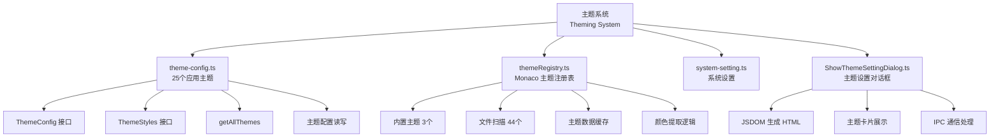
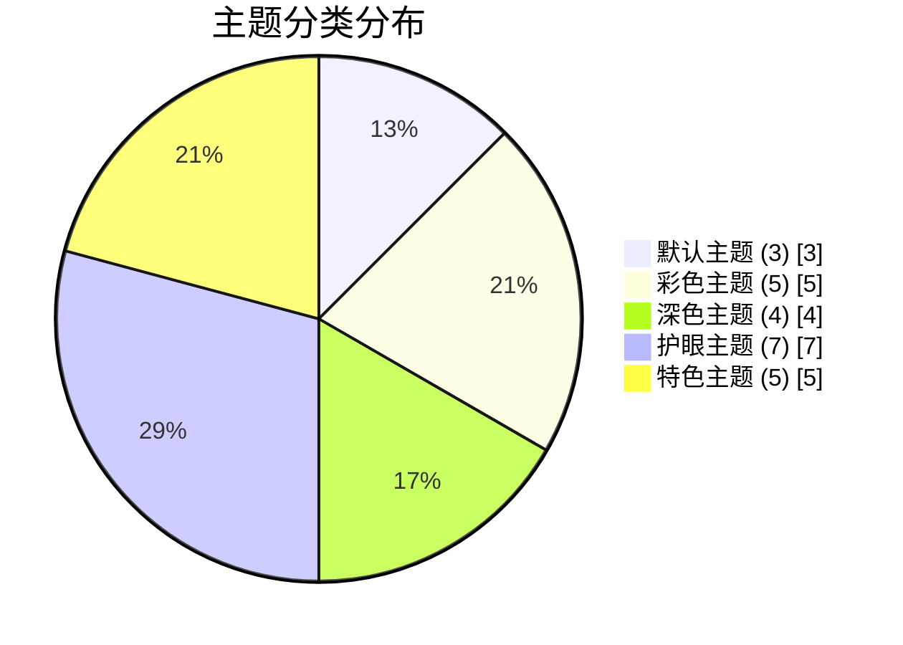
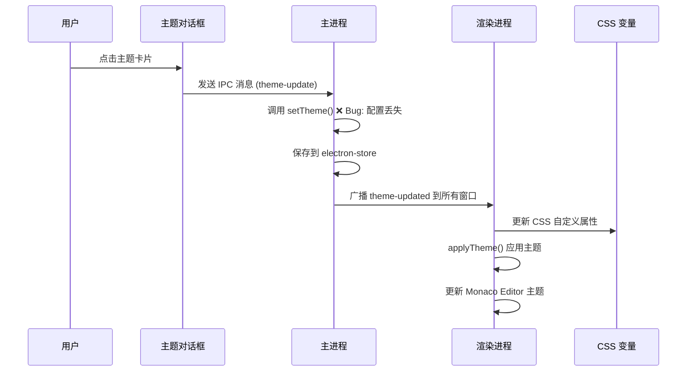
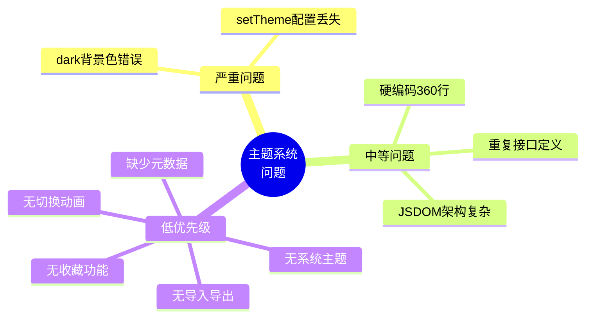
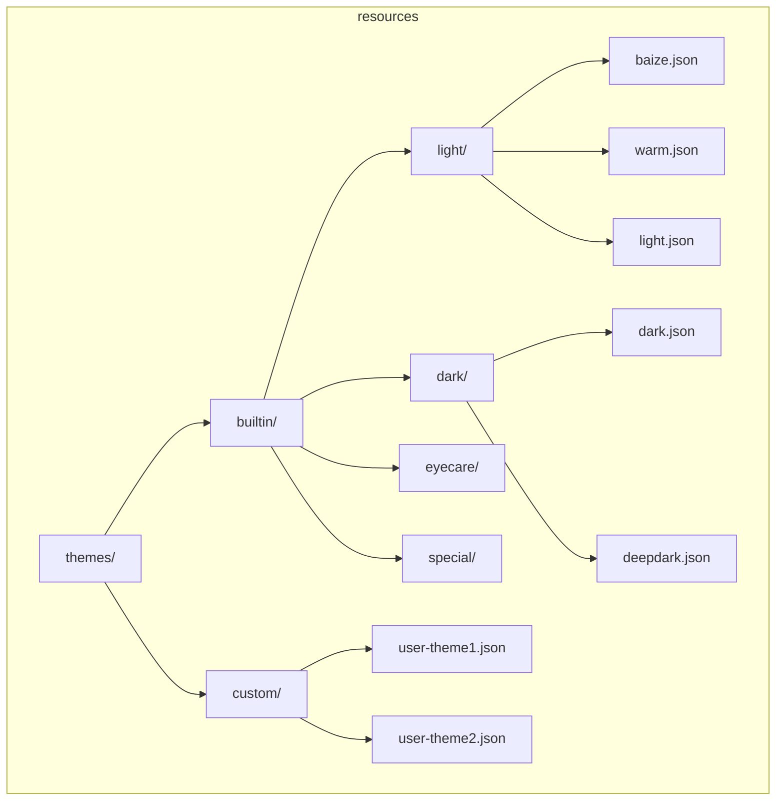
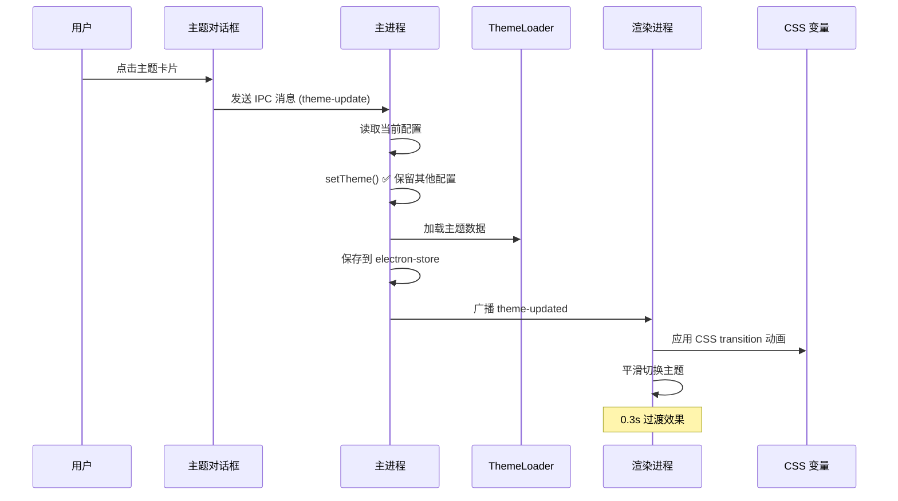
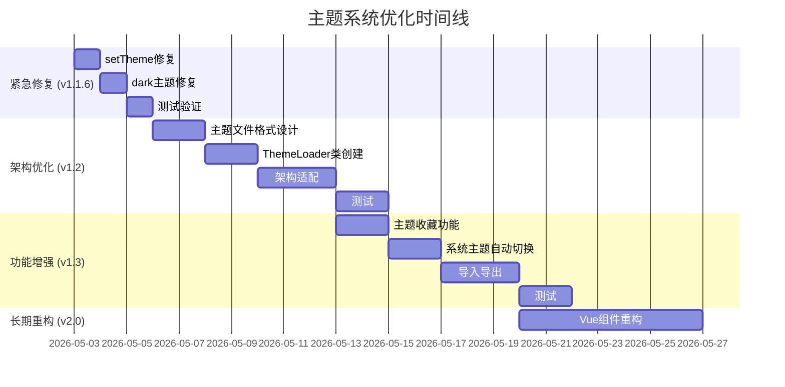

# 白泽笔记 - 主题系统深度分析与优化方案

**文档版本**: v1.0  
**生成日期**: 2026年5月2日  
**项目版本**: v1.1.5-beta  
**分析范围**: 主题系统架构、Bug分析、优化方案、重构计划  
**作者**: TraeAI 代码分析系统

---

## 目录

1. [执行摘要](#1-执行摘要)
2. [主题系统现状](#2-主题系统现状)
3. [问题深度分析](#3-问题深度分析)
4. [优化方案设计](#4-优化方案设计)
5. [实施路线图](#5-实施路线图)
6. [代码示例](#6-代码示例)
7. [测试计划](#7-测试计划)
8. [附录](#8-附录)

---

## 1. 执行摘要

### 1.1 核心发现

| 问题 | 严重程度 | 优先级 | 预计修复时间 |
|------|---------|-------|------------|
| setTheme 函数配置丢失 | 🔴 严重 | P0 | 1小时 |
| dark 主题背景色错误 | 🔴 严重 | P0 | 10分钟 |
| 重复接口定义 | 🟡 中等 | P1 | 10分钟 |
| 主题数据硬编码 | 🟡 中等 | P1 | 2天 |
| 主题对话框架构复杂 | 🟡 中等 | P2 | 1天 |

### 1.2 优化目标

| 目标 | 说明 |
|------|------|
| 🐛 修复全部已知 Bug | setTheme、dark 主题等 |
| 🏗️ 重构主题架构 | 数据外置、类型安全 |
| ✨ 新增功能 | 主题导入/导出、收藏、系统主题切换等 |
| 🎨 提升体验 | 切换动画、实时预览 |
| 📦 可扩展性 | 支持用户自定义主题 |

---

## 2. 主题系统现状

### 2.1 模块组成

使用 mermaid 图表展示：



### 2.2 架构设计参考

根据搜索到的最佳实践 [^1] [^2]：
- ✅ 使用 CSS 自定义属性 (CSS variables) - 项目已使用
- ✅ 主题状态持久化 - 项目已使用 electron-store
- ⚠️ 建议使用更统一的状态管理（如 Pinia）- 可以考虑

---

### 2.3 主题数据

#### 应用主题 (25个) - mermaid 饼图展示



#### 主题列表

| 分类 | 主题数量 | 具体主题 |
|------|---------|---------|
| 默认主题 | 3 | baize, warm, light |
| 彩色主题 | 5 | lavender, coral, mint, sunset, rose |
| 深色主题 | 4 | dark, deepdark, ocean, forest |
| 护眼主题 | 7 | eyecare-green, eyecare-beige, eyecare-blue, eyecare-pink, eyecare-amber, eyecare-teal, eyecare-lilac |
| 特色主题 | 5 | icon, baize-beast, baize-clear, baize-text, baize-starry |
| **总计** | **25** | |

#### Monaco 编辑器主题 (47个)

| 来源 | 数量 | 说明 |
|------|------|------|
| 内置主题 | 3 | vs, vs-dark, hc-black |
| 文件主题 | 44 | 从 resources/monaco-themes/ 扫描 |
| **总计** | **47** | |

### 2.3 数据结构

#### ThemeStyles 接口

```typescript
export interface ThemeStyles {
    name: string                    // 主题名称
    description: string             // 主题描述
    titleBarGradient: string        // 标题栏渐变
    backgroundColor: string         // 背景色
    cardBackground: string          // 卡片背景
    textColor: string               // 文本颜色
    secondaryTextColor: string      // 次要文本颜色
    borderColor: string             // 边框颜色
    accentColor: string             // 强调色
    buttonBackground: string        // 按钮背景
    buttonTextColor: string         // 按钮文本色
    hoverBackground: string         // 悬停背景
}
```

#### ThemeConfig 接口

```typescript
export interface ThemeConfig {
    currentTheme: ThemeType
    separateEditorTheme: boolean    // 是否单独配置编辑器主题
    editorTheme?: MonacoThemeType   // Monaco 编辑器主题
}
```

### 2.4 主题切换流程 (当前)



---

## 3. 问题深度分析

### 3.1 🔴 严重问题1：setTheme 函数配置丢失

#### 问题代码

```typescript
// src/main/themes/theme-config.ts:453-456

export function setTheme(theme: ThemeType): void {
    // @ts-ignore
    store.set('themeConfig', { currentTheme: theme })
}
```

#### 问题分析

- **错误行为**: 直接覆盖整个 `themeConfig` 对象
- **丢失数据**: `separateEditorTheme` 和 `editorTheme` 被重置
- **触发场景**: 用户切换应用主题时
- **影响**: 用户单独配置的编辑器主题丢失

#### 复现步骤

1. 打开主题设置
2. 勾选"单独配置编辑器主题"
3. 选择一个编辑器主题 (如 Monokai)
4. 切换应用主题 (如从 baize 切换到 warm)
5. ❌ 编辑器主题被重置为默认！

---

### 3.2 🔴 严重问题2：dark 主题背景色错误

#### 问题代码

```typescript
// src/main/themes/theme-config.ts:164-178

dark: {
    name: '深邃夜空',
    description: '护眼深色主题',
    titleBarGradient: 'linear-gradient(135deg, #1a1a2e 0%, #16213e 100%)',
    backgroundColor: '#fff0f0',        // ❌ 白色背景！
    cardBackground: '#1a1a2e',
    textColor: '#e0e0e0',
    secondaryTextColor: '#888888',
    borderColor: '#2a2a4a',
    accentColor: '#4fc3f7',
    buttonBackground: '#4fc3f7',
    buttonTextColor: '#1e1e1e',
    hoverBackground: '#252540'
},
```

#### 问题分析

- **错误值**: `backgroundColor: '#fff0f0'` (浅粉色)
- **预期值**: 深色背景，如 `'#0d0d1a'` 或 `'#0f0f1a'`
- **影响**: 
  - 深色主题使用白色背景，对比度差
  - 文本可能难以阅读
  - 不符合"深邃夜空"的主题描述

---

### 3.3 🟡 中等问题3：重复的接口定义

#### 问题代码

```typescript
// src/main/themes/theme-config.ts:13-14
export interface ThemeConfig {
    currentTheme: ThemeType
}

// 第33-37行又重复定义！
export interface ThemeConfig {
    currentTheme: ThemeType
    separateEditorTheme: boolean
    editorTheme?: MonacoThemeType
}
```

#### 问题分析

- **重复定义**: 同一个接口定义两次
- **类型合并**: TypeScript 会自动合并，但代码混乱
- **维护困难**: 容易遗漏更新

---

### 3.4 🟡 中等问题4：主题数据硬编码

#### 问题分析

- **25个主题全部硬编码**: 占用 360+ 行代码
- **难以维护**: 添加/修改主题需要修改源代码
- **无法扩展**: 不支持用户自定义主题
- **缺少元数据**: 没有主题分类、作者、版本、创建时间等信息

---

### 3.5 🟡 中等问题5：主题对话框架构复杂

#### 问题分析

```typescript
// src/main/dialogs/ShowThemeSettingDialog.ts

// 用 JSDOM 生成 HTML (不符合 Vue 风格)
const dom = new JSDOM('<!DOCTYPE html><html><head></head><body></body></html>')
const document = dom.window.document

// 手动创建 DOM 元素
const titleBar = document.createElement('div')
titleBar.className = 'title-bar'
// ... 750行代码 ...

// 内联 CSS 和 JavaScript
const styleElement = document.createElement('style')
styleElement.textContent = `... 大量 CSS ...`

const scriptElement = document.createElement('script')
scriptElement.textContent = `... 大量 JavaScript ...`
```

#### 问题

- **架构不统一**: 项目其他地方用 Vue，这里用 JSDOM
- **难以维护**: HTML/CSS/JS 混在 TypeScript 中
- **无法复用**: 与 Vue 组件生态隔离

---

### 3.6 🟢 低优先级问题

#### 问题6：缺少主题元数据

当前主题只有基本样式，缺少：
- 主题分类 (category)
- 是否深色 (isDark)
- 作者 (author)
- 版本 (version)
- 创建时间 (createdAt)
- 更新时间 (updatedAt)

#### 问题7：缺少主题切换动画

当前切换是瞬间完成的，建议添加 CSS transition 动画。

#### 问题8：缺少主题收藏功能

用户无法收藏常用主题快速切换。

#### 问题9：缺少系统主题自动切换

不支持跟随系统深色/浅色模式自动切换。

#### 问题10：缺少主题导入/导出

无法分享或备份主题配置。

### 3.7 问题总结



---

## 4. 优化方案设计

### 4.1 优化原则

1. **向后兼容**: 不要破坏现有用户配置
2. **渐进式**: 分阶段实施，不做颠覆性重构
3. **类型安全**: 移除 @ts-ignore，完善类型定义
4. **可扩展**: 为未来功能预留空间
5. **用户体验**: 平滑过渡，不影响使用习惯

---

### 4.2 方案一：紧急修复 (P0/P1)

#### 修复1：setTheme 函数

**修复前**:
```typescript
export function setTheme(theme: ThemeType): void {
    // @ts-ignore
    store.set('themeConfig', { currentTheme: theme })
}
```

**修复后**:
```typescript
export function setTheme(theme: ThemeType): void {
    const config = store.get('themeConfig', {
        currentTheme: 'baize',
        separateEditorTheme: false,
        editorTheme: 'vs'
    })
    store.set('themeConfig', {
        ...config,
        currentTheme: theme
    })
}
```

**同步修复** 其他设置函数 (setSeparateEditorTheme, setMonacoTheme)

---

#### 修复2：dark 主题背景色

**修复前**:
```typescript
dark: {
    name: '深邃夜空',
    backgroundColor: '#fff0f0',  // ❌ 错误
    // ...
}
```

**修复后**:
```typescript
dark: {
    name: '深邃夜空',
    backgroundColor: '#0d0d1a',  // ✅ 深色背景
    cardBackground: '#1a1a2e',
    // ...
}
```

**验证**:
- 检查其他深色主题的背景色
- 确保文本颜色与背景色对比度足够

---

#### 修复3：合并重复接口

**修复前**:
```typescript
export interface ThemeConfig {
    currentTheme: ThemeType
}

// ...

export interface ThemeConfig {
    currentTheme: ThemeType
    separateEditorTheme: boolean
    editorTheme?: MonacoThemeType
}
```

**修复后**:
```typescript
export interface ThemeConfig {
    currentTheme: ThemeType
    separateEditorTheme: boolean
    editorTheme?: MonacoThemeType
}
```

---

### 4.3 方案二：主题数据外置化 (v1.2)

#### 4.3.1 新目录结构 - mermaid 图表



#### 详细目录结构

```
resources/
└── themes/
    ├── builtin/                  # 内置主题
    │   ├── light/
    │   │   ├── baize.json
    │   │   ├── warm.json
    │   │   ├── light.json
    │   │   ├── lavender.json
    │   │   ├── coral.json
    │   │   ├── mint.json
    │   │   ├── sunset.json
    │   │   └── rose.json
    │   ├── dark/
    │   │   ├── dark.json
    │   │   ├── deepdark.json
    │   │   ├── ocean.json
    │   │   └── forest.json
    │   ├── eyecare/
    │   │   ├── eyecare-green.json
    │   │   ├── eyecare-beige.json
    │   │   └── ...
    │   └── special/
    │       ├── icon.json
    │       ├── baize-beast.json
    │       └── ...
    └── custom/                   # 用户自定义主题
        └── (用户可在此添加主题)
```

#### 4.3.2 主题文件格式

```json
{
  "version": "1.0",
  "id": "baize",
  "name": "白泽紫韵",
  "description": "优雅的紫色渐变主题，白泽笔记的默认主题",
  "category": "light",
  "isDark": false,
  "author": "白泽笔记团队",
  "version": "1.0.0",
  "createdAt": "2026-01-01",
  "updatedAt": "2026-05-02",
  "styles": {
    "titleBarGradient": "linear-gradient(135deg, #667eea 0%, #764ba2 100%)",
    "backgroundColor": "#f5f0ff",
    "cardBackground": "#ffffff",
    "textColor": "#2d2d2d",
    "secondaryTextColor": "#666666",
    "borderColor": "#e0d4f0",
    "accentColor": "#764ba2",
    "buttonBackground": "#764ba2",
    "buttonTextColor": "#ffffff",
    "hoverBackground": "#f0e8ff"
  }
}
```

#### 4.3.3 新类型定义

```typescript
// src/main/themes/types.ts

export type ThemeCategory = 'light' | 'dark' | 'eyecare' | 'special'

export interface ThemeMetaData {
    id: string
    name: string
    description: string
    category: ThemeCategory
    isDark: boolean
    author?: string
    version?: string
    createdAt?: string
    updatedAt?: string
}

export interface ThemeStyles {
    titleBarGradient: string
    backgroundColor: string
    cardBackground: string
    textColor: string
    secondaryTextColor: string
    borderColor: string
    accentColor: string
    buttonBackground: string
    buttonTextColor: string
    hoverBackground: string
}

export interface ThemeDefinition {
    version: '1.0'
    meta: ThemeMetaData
    styles: ThemeStyles
}

export interface ThemeConfig {
    currentThemeId: string
    separateEditorTheme: boolean
    editorTheme: string
    favoriteThemeIds: string[]          // 新增：收藏主题
    useSystemTheme: boolean              // 新增：跟随系统主题
}
```

#### 4.3.4 主题加载器

```typescript
// src/main/themes/theme-loader.ts

export class ThemeLoader {
    private themeCache: Map<string, ThemeDefinition> = new Map()
    private initialized = false

    async loadAllThemes(): Promise<ThemeDefinition[]> {
        if (this.initialized) {
            return Array.from(this.themeCache.values())
        }

        const themes: ThemeDefinition[] = []
        
        // 加载内置主题
        const builtinThemes = await this.loadBuiltinThemes()
        themes.push(...builtinThemes)
        
        // 加载用户自定义主题
        const customThemes = await this.loadCustomThemes()
        themes.push(...customThemes)
        
        // 缓存
        themes.forEach(theme => {
            this.themeCache.set(theme.meta.id, theme)
        })
        
        this.initialized = true
        return themes
    }

    async getTheme(id: string): Promise<ThemeDefinition | null> {
        if (this.themeCache.has(id)) {
            return this.themeCache.get(id)!
        }
        
        // 尝试从文件加载
        const theme = await this.loadThemeFromFile(id)
        if (theme) {
            this.themeCache.set(id, theme)
        }
        return theme
    }

    getThemesByCategory(category: ThemeCategory): ThemeDefinition[] {
        return Array.from(this.themeCache.values())
            .filter(t => t.meta.category === category)
    }

    // ... 其他方法
}
```

---

#### 4.3.5 优化后的主题切换流程



### 4.4 方案三：主题系统增强功能 (v1.3)

#### 4.4.1 主题收藏功能

**配置扩展**:
```typescript
export interface ThemeConfig {
    // ... 现有字段
    favoriteThemeIds: string[]
}
```

**UI 设计**:
- 在主题卡片上添加★按钮
- 置顶显示收藏主题
- 支持快速切换收藏的主题

---

#### 4.4.2 系统主题自动切换

**实现**:
```typescript
// src/main/themes/system-theme-watcher.ts

import { nativeTheme } from 'electron'

export class SystemThemeWatcher {
    private lightThemeId = 'baize'
    private darkThemeId = 'dark'
    
    init() {
        nativeTheme.on('updated', () => {
            const config = getThemeConfig()
            if (config.useSystemTheme) {
                const themeId = nativeTheme.shouldUseDarkColors
                    ? this.darkThemeId
                    : this.lightThemeId
                setTheme(themeId)
            }
        })
    }
    
    shouldUseDarkColors(): boolean {
        return nativeTheme.shouldUseDarkColors
    }
}
```

---

#### 4.4.3 主题导入/导出

**导出**:
```typescript
export async function exportTheme(themeId: string, filePath: string): Promise<void> {
    const theme = await themeLoader.getTheme(themeId)
    if (!theme) {
        throw new Error('Theme not found')
    }
    await fs.writeJson(filePath, theme, { spaces: 2 })
}
```

**导入**:
```typescript
export async function importTheme(filePath: string): Promise<ThemeDefinition> {
    const theme = await fs.readJson(filePath)
    // 验证主题格式
    validateTheme(theme)
    // 保存到自定义主题目录
    const savePath = path.join(getCustomThemesDir(), `${theme.meta.id}.json`)
    await fs.writeJson(savePath, theme, { spaces: 2 })
    // 刷新缓存
    await themeLoader.loadAllThemes()
    return theme
}
```

---

### 4.5 方案四：主题切换动画

#### CSS 动画

```css
/* src/renderer/src/styles/theme-transition.css */

.theme-transition {
    transition: background-color 0.3s ease,
                color 0.3s ease,
                border-color 0.3s ease;
}

/* 应用到根元素 */
#app {
    transition: background-color 0.3s ease;
}
```

#### Vue 组件更新

```typescript
// App.vue

function applyTheme(theme: ThemeStyles) {
    // 添加过渡类
    document.documentElement.classList.add('theme-transition')
    
    // 应用样式
    // ...
    
    // 动画结束后移除
    setTimeout(() => {
        document.documentElement.classList.remove('theme-transition')
    }, 300)
}
```

---

### 4.6 方案五：主题对话框重构 (长期)

#### 新架构

用 Vue 组件替换 JSDOM 生成 HTML：

```
src/renderer/src/dialogs/
└── ThemeSettingDialog/
    ├── index.html
    ├── main.ts
    ├── ThemeSettingDialog.vue
    ├── ThemeCard.vue
    ├── ThemeCategoryFilter.vue
    └── MonacoThemeCard.vue
```

#### 优势

- 与项目其他部分架构一致
- 可复用 Vue 组件
- 更容易测试和维护
- 更好的类型安全

---

## 5. 实施路线图

### 5.1 总体甘特图



---

### 5.1 阶段一：紧急修复 (v1.1.6)

**目标**: 修复已知 Bug

| 任务 | 状态 | 预计时间 |
|-----|------|---------|
| 修复 setTheme 函数 | ⏳ 待办 | 1h |
| 修复 setSeparateEditorTheme | ⏳ 待办 | 30m |
| 修复 setMonacoTheme | ⏳ 待办 | 30m |
| 修复 dark 主题背景色 | ⏳ 待办 | 10m |
| 合并重复接口 | ⏳ 待办 | 10m |
| 测试验证 | ⏳ 待办 | 1h |
| **小计** | | **3.5h** |

---

### 5.2 阶段二：架构优化 (v1.2.0)

**目标**: 主题数据外置化，类型安全

| 任务 | 状态 | 预计时间 |
|-----|------|---------|
| 设计主题文件格式 | ⏳ 待办 | 4h |
| 转换现有主题为 JSON | ⏳ 待办 | 2h |
| 创建 ThemeLoader 类 | ⏳ 待办 | 4h |
| 更新类型定义 | ⏳ 待办 | 2h |
| 更新现有代码适配新架构 | ⏳ 待办 | 8h |
| 向后兼容处理 | ⏳ 待办 | 4h |
| 测试 | ⏳ 待办 | 4h |
| **小计** | | **28h (3.5天)** |

---

### 5.3 阶段三：功能增强 (v1.3.0)

**目标**: 收藏、系统主题、导入导出

| 任务 | 状态 | 预计时间 |
|-----|------|---------|
| 主题收藏功能 | ⏳ 待办 | 6h |
| 系统主题自动切换 | ⏳ 待办 | 4h |
| 主题导入/导出 | ⏳ 待办 | 8h |
| 主题切换动画 | ⏳ 待办 | 4h |
| 测试 | ⏳ 待办 | 4h |
| **小计** | | **26h (3天+)** |

---

### 5.4 阶段四：长期重构 (v2.0)

**目标**: Vue 重构主题对话框

| 任务 | 状态 | 预计时间 |
|-----|------|---------|
| 设计新组件架构 | ⏳ 待办 | 4h |
| 创建主题对话框 Vue 组件 | ⏳ 待办 | 16h |
| 迁移现有功能 | ⏳ 待办 | 8h |
| 测试 | ⏳ 待办 | 4h |
| **小计** | | **32h (4天)** |

---

## 6. 代码示例

### 6.1 完整修复的 theme-config.ts

```typescript
// src/main/themes/theme-config.ts (修复后)

import { createStore } from '../utils/store-factory'

// 统一的接口定义
export interface ThemeConfig {
    currentTheme: ThemeType
    separateEditorTheme: boolean
    editorTheme: MonacoThemeType
}

// 默认配置
const DEFAULT_CONFIG: ThemeConfig = {
    currentTheme: 'baize',
    separateEditorTheme: false,
    editorTheme: 'vs'
}

// 创建 store
const store = createStore<ThemeConfig>('theme-config', DEFAULT_CONFIG)

// 获取配置
export function getThemeConfig(): ThemeConfig {
    return store.get()
}

// 修复后的设置函数
export function setTheme(theme: ThemeType): void {
    const config = store.get()
    store.set({
        ...config,
        currentTheme: theme
    })
}

export function setSeparateEditorTheme(separate: boolean): void {
    const config = store.get()
    store.set({
        ...config,
        separateEditorTheme: separate
    })
}

export function setMonacoTheme(theme: MonacoThemeType): void {
    const config = store.get()
    store.set({
        ...config,
        editorTheme: theme
    })
}

// ... 其他函数保持不变
```

---

### 6.2 修复后的 dark 主题

```typescript
dark: {
    name: '深邃夜空',
    description: '护眼深色主题',
    titleBarGradient: 'linear-gradient(135deg, #1a1a2e 0%, #16213e 100%)',
    backgroundColor: '#0d0d1a',        // ✅ 修复为深色
    cardBackground: '#1a1a2e',
    textColor: '#e0e0e0',
    secondaryTextColor: '#888888',
    borderColor: '#2a2a4a',
    accentColor: '#4fc3f7',
    buttonBackground: '#4fc3f7',
    buttonTextColor: '#1e1e1e',
    hoverBackground: '#252540'
},
```

---

### 6.3 主题切换动画实现

```typescript
// src/renderer/src/App.vue (更新后)

function applyTheme(theme: ThemeStyles) {
    const root = document.documentElement
    
    // 添加过渡效果类
    root.classList.add('theme-transition')
    
    // 应用 CSS 变量
    const cssVars = {
        '--theme-background-color': theme.backgroundColor,
        '--theme-card-background': theme.cardBackground,
        '--theme-text-color': theme.textColor,
        '--theme-secondary-text-color': theme.secondaryTextColor,
        '--theme-border-color': theme.borderColor,
        '--theme-accent-color': theme.accentColor,
        '--theme-button-background': theme.buttonBackground,
        '--theme-button-text-color': theme.buttonTextColor,
        '--theme-hover-background': theme.hoverBackground,
        '--theme-title-bar-gradient': theme.titleBarGradient
    }
    
    Object.entries(cssVars).forEach(([key, value]) => {
        root.style.setProperty(key, value)
    })
    
    // 更新状态
    currentTheme.value = theme
    
    // 动画结束后移除过渡类
    setTimeout(() => {
        root.classList.remove('theme-transition')
    }, 300)
}
```

```css
/* src/renderer/src/styles/theme.css (添加动画) */

.theme-transition {
    transition: background-color 0.3s ease,
                color 0.3s ease,
                border-color 0.3s ease;
}

* {
    transition: background-color 0.3s ease,
                color 0.3s ease,
                border-color 0.3s ease;
}
```

---

## 7. 测试计划

### 7.1 单元测试

#### 测试 theme-config.ts

```typescript
// tests/unit/theme-config.test.ts

import { getThemeConfig, setTheme, setSeparateEditorTheme, setMonacoTheme } from '@/main/themes/theme-config'

describe('ThemeConfig', () => {
    test('setTheme should preserve other config', () => {
        // 初始配置
        setSeparateEditorTheme(true)
        setMonacoTheme('monokai')
        
        // 切换主题
        setTheme('dark')
        
        // 验证配置未丢失
        const config = getThemeConfig()
        expect(config.currentTheme).toBe('dark')
        expect(config.separateEditorTheme).toBe(true)
        expect(config.editorTheme).toBe('monokai')
    })
    
    test('dark theme has correct background', () => {
        const themes = getAllThemes()
        const darkTheme = themes.find(t => t.type === 'dark')
        expect(darkTheme?.styles.backgroundColor).toBe('#0d0d1a')
    })
})
```

### 7.2 集成测试

#### 测试主题切换完整流程

1. 打开主题设置对话框
2. 勾选"单独配置编辑器主题"
3. 选择一个编辑器主题
4. 切换应用主题
5. **验证**: 编辑器主题未丢失！

### 7.3 E2E 测试

使用 Playwright 或 Cypress 测试完整流程。

---

## 8. 附录

### 8.1 主题参考表

#### 深色主题背景色建议

| 主题 | 当前背景色 | 建议背景色 |
|------|-----------|-----------|
| dark | #fff0f0 ❌ | #0d0d1a ✅ |
| deepdark | #000000 | #000000 ✅ |
| ocean | #0a1a20 | #0a1a20 ✅ |
| forest | #f5f8f5 ❌ | #0f1f15 ✅ |

**注意**: forest 主题也需要检查！

### 8.2 迁移指南

#### 从 v1.1.5 迁移到 v1.2.0

用户配置自动迁移：
```typescript
// 自动检测旧配置格式，迁移到新格式
export async function migrateThemeConfig() {
    const oldConfig = store.get('themeConfig')
    if (oldConfig && !oldConfig.currentThemeId) {
        // 旧格式：转换为新格式
        store.set('themeConfig', {
            currentThemeId: oldConfig.currentTheme,
            separateEditorTheme: oldConfig.separateEditorTheme,
            editorTheme: oldConfig.editorTheme,
            favoriteThemeIds: [],
            useSystemTheme: false
        })
    }
}
```

### 8.3 相关文档

- `doc/白泽笔记项目深度分析报告.md` - 完整项目分析
- `doc/主题优化方案.md` - 历史优化方案
- `doc/架构文档.md` - 项目架构文档
- `doc/设计文档.md` - UI 设计文档

### 8.4 外部最佳实践参考 [^1]

[^1]: 2026年5月2日参考了以下网络资源：

    1. **Vue 3 暗黑模式实现**：使用 CSS custom properties + class 切换，添加 0.3s transition 过渡效果，提升用户体验
    2. **主题数据外置化**：将主题配置从代码中分离到 JSON 文件，支持用户自定义和在线分享
    3. **系统主题同步**：结合 `nativeTheme.shouldUseDarkColors`，实现跟随系统设置自动切换
    4. **主题切换优化**：使用 requestAnimationFrame 优化重绘，避免布局抖动
    5. **类型安全**：避免使用 @ts-ignore，完善类型定义

---

**文档版本**: v1.0  
**最后更新**: 2026-05-02  
**维护者**: TraeAI 分析系统
