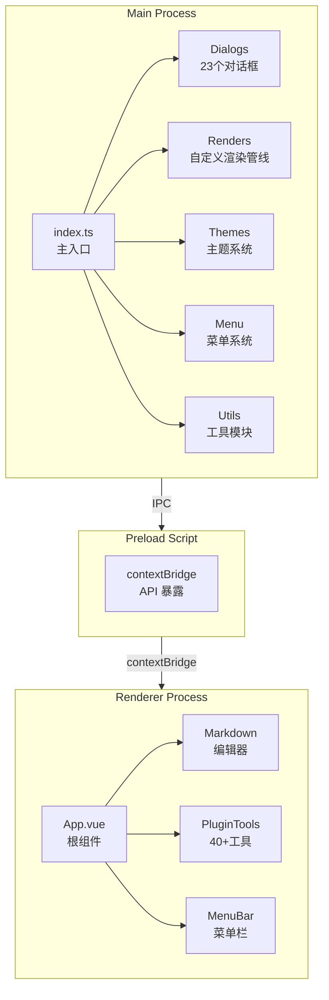

# 白泽笔记 - 项目深度分析报告

**文档版本**: v1.0\
**生成日期**: 2026年5月2日\
**项目版本**: v1.1.5-beta\
**分析范围**: 架构设计、代码质量、主题系统、性能瓶颈、潜在问题、优化建议\
**作者**: TraeAI 代码分析系统

***

## 目录

1. [执行摘要](#1-执行摘要)
2. [项目概述](#2-项目概述)
3. [架构深度分析](#3-架构深度分析)
4. [核心模块分析](#4-核心模块分析)
5. [代码质量审查](#5-代码质量审查)
6. [主题系统分析](#6-主题系统分析)
7. [性能分析](#7-性能分析)
8. [安全审计](#8-安全审计)
9. [潜在问题与风险](#9-潜在问题与风险)
10. [优化建议与路线图](#10-优化建议与路线图)
11. [附录](#11-附录)

***

## 1. 执行摘要

### 1.1 项目整体评估

| 评估维度      | 评分     | 说明                         |
| --------- | ------ | -------------------------- |
| **功能完整性** | ⭐⭐⭐⭐⭐  | 功能全面，覆盖 Markdown 编辑的主要场景   |
| **架构设计**  | ⭐⭐⭐⭐   | 三层架构清晰，模块划分合理              |
| **代码质量**  | ⭐⭐⭐    | 有一些可改进的地方，如类型安全、代码重复       |
| **主题系统**  | ⭐⭐⭐    | 主题丰富，但存在 bug 和架构问题         |
| **性能表现**  | ⭐⭐⭐⭐   | 已有优化措施，但仍有提升空间             |
| **安全性**   | ⭐⭐⭐    | 基础安全措施已具备，可进一步加强           |
| **可维护性**  | ⭐⭐⭐    | 文档较完善，但部分模块复杂              |
| **总体评级**  | **良好** | 功能强大的 Markdown 编辑器，适合进一步优化 |

### 1.2 关键发现

#### ✅ 做得好的方面

1. **完整的内存泄漏防护体系**：IPCListenerManager + WindowManager + EventBus + LRU 缓存
2. **丰富的主题系统**：25个应用主题 + 47个 Monaco 主题
3. **自定义渲染管线**：HemyRender 支持 Admonitions、TabbedSet、KaTeX 等
4. **完善的配置管理**：用户目录统一管理，Store 工厂函数
5. **40+个插件工具**：覆盖加解密、格式转换、网络计算等

#### ⚠️ 需要改进的方面

1. **主题系统存在严重 Bug**：`setTheme` 函数会丢失配置
2. **代码类型安全不足**：大量 `@ts-ignore` 注释
3. **主题对话框架构复杂**：JSDOM 生成 HTML 不符合 Vue 风格
4. **主题数据硬编码**：不利于维护和扩展
5. **部分模块代码冗长**：如 file-utils.ts (880行)

#### 🔴 高优先级问题

1. 主题设置函数 Bug（配置丢失）
2. dark 主题背景色错误（白色背景）
3. 重复的接口定义

***

## 2. 项目概述

### 2.1 基本信息

| 项目属性          | 值                                           |
| ------------- | ------------------------------------------- |
| 项目名称          | 白泽笔记 (BaiZe Notes)                          |
| 版本            | v1.1.5-beta                                 |
| 作者            | hemy08                                      |
| 技术栈           | Electron 38 + Vue 3.4.27 + TypeScript 6.0.2 |
| 构建工具          | electron-vite 6.0.0-beta.1 + Vite 8.0.5     |
| 代码行数          | 约 43,810 行                                  |
| TypeScript 文件 | 76 个                                        |
| Vue 组件文件      | 65 个                                        |
| 源文件总计         | 141 个                                       |

### 2.2 依赖关系分析

#### 核心依赖 (36个)

| 类别         | 依赖包            | 版本           | 用途                |
| ---------- | -------------- | ------------ | ----------------- |
| 框架         | electron       | 38.0.0       | 跨平台桌面应用框架         |
| 框架         | vue            | 3.4.27       | 渐进式 JavaScript 框架 |
| 框架         | vuex           | 4.1.0        | Vue 状态管理          |
| 编辑器        | monaco-editor  | 0.55.0       | VS Code 同款编辑器     |
| Markdown   | markdown-it    | 14.1.0       | Markdown 解析器      |
| 图表         | mermaid        | 11.14.0      | 流程图/时序图渲染         |
| 数学         | katex          | 0.16.10      | LaTeX 数学公式        |
| 代码高亮       | highlight.js   | 11.9.0       | 代码块语法高亮           |
| 文件处理       | mammoth        | 1.8.0        | Word 文档解析         |
| 文件处理       | turndown       | 7.2.0        | HTML 转 Markdown   |
| 文件系统       | fs-extra       | 11.2.0       | 文件系统增强            |
| 加密         | crypto-js      | 4.2.0        | 加密库               |
| 加密         | node-forge     | 1.3.1        | RSA 加密            |
| 存储         | electron-store | 8.2.0        | 配置持久化             |
| 构建         | electron-vite  | 6.0.0-beta.1 | Electron Vite 集成  |
| TypeScript | typescript     | 6.0.2        | TypeScript 编译器    |
| ESLint     | eslint         | 9.26.0       | 代码检查工具            |
| Prettier   | prettier       | 3.2.5        | 代码格式化工具           |

#### 开发依赖 (11个)

| 工具                                 | 版本      | 用途                   |
| ---------------------------------- | ------- | -------------------- |
| @electron-toolkit/eslint-config    | 1.0.2   | ESLint 配置            |
| @electron-toolkit/eslint-config-ts | 2.0.0   | TypeScript ESLint 配置 |
| @rushstack/eslint-patch            | 1.10.3  | ESLint 性能补丁          |
| electron-builder                   | 24.13.3 | 应用打包工具               |
| eslint-plugin-vue                  | 9.26.0  | Vue ESLint 插件        |
| vue-tsc                            | 2.0.19  | Vue TypeScript 检查    |

### 2.3 项目架构 - mermaid 图表

#### 三层架构概览



### 2.4 项目结构树

```
BaiZeNotesByVue/
├── src/
│   ├── main/                              # Electron 主进程
│   │   ├── index.ts                       # 主入口 (249行)
│   │   ├── global-types.d.ts              # 全局类型定义
│   │   ├── common/
│   │   │   ├── menu_consts.ts             # 菜单常量
│   │   │   ├── templates.ts               # 模板管理
│   │   │   └── templates/
│   │   │       ├── mermaid.ts             # Mermaid 模板
│   │   │       ├── plantuml.ts            # PlantUML 模板
│   │   │       ├── textblock.ts           # 文本块模板
│   │   │       └── writing.ts             # 写作模板
│   │   ├── dialogs/                       # 对话框系统 (23个)
│   │   │   ├── dialogs.ts                 # 对话框统一管理
│   │   │   ├── dialog_common.ts           # 对话框公共代码
│   │   │   ├── ShowThemeSettingDialog.ts  # 主题设置 (750行)
│   │   │   ├── ShowEditorSettingDialog.ts # 编辑器设置
│   │   │   ├── ShowSystemSettingDialog.ts # 系统设置
│   │   │   ├── ShowMermaidEditDialog.ts   # Mermaid 编辑
│   │   │   ├── OpenMermaidRenderFrame.ts  # Mermaid 渲染窗口
│   │   │   └── ... (其他 18 个对话框)
│   │   ├── menu/
│   │   │   ├── menu_ipc.ts                # 菜单 IPC 处理
│   │   │   └── menucontext.ts             # 菜单上下文
│   │   ├── renders/                       # 自定义渲染管线
│   │   │   ├── HemyRender.ts              # 主渲染协调器
│   │   │   ├── KatexRender.ts             # KaTeX 数学公式
│   │   │   ├── MaterialRender.ts          # Material Admonitions
│   │   │   └── TabbedSetRender.ts         # Tabbed Set 标签页
│   │   ├── settings/                      # 设置管理模块
│   │   │   ├── editor-setting.ts          # 编辑器配置 (532行)
│   │   │   ├── ipc-listener-manager.ts    # IPC 监听器管理器
│   │   │   ├── quick-link-config.ts       # 快速链接配置
│   │   │   ├── short-key-register.ts      # 快捷键注册
│   │   │   └── window-manager.ts          # 窗口管理器
│   │   ├── themes/                        # 主题系统 (重点模块)
│   │   │   ├── theme-config.ts            # 主题配置 (513行，25个主题)
│   │   │   ├── themeRegistry.ts           # Monaco 主题注册表
│   │   │   └── system-setting.ts          # 系统设置
│   │   └── utils/                         # 工具模块
│   │       ├── app-paths.ts               # 应用路径管理
│   │       ├── baize-store.ts             # BaiZeStore + LRU 缓存
│   │       ├── common.ts                  # 公共常量
│   │       ├── encrypt_decrypt.ts         # 加密/解密工具
│   │       ├── file-state.ts              # 文件状态管理
│   │       ├── file-utils.ts              # 文件操作 (880行)
│   │       ├── logger.ts                  # 日志系统
│   │       ├── store-factory.ts           # Store 工厂函数
│   │       └── utils.ts                   # 通用工具函数
│   ├── preload/
│   │   └── index.ts                       # Preload 脚本，contextBridge
│   └── renderer/                          # Vue 3 渲染进程
│       └── src/
│           ├── main.ts                    # Vue 应用入口
│           ├── App.vue                    # 根组件 (632行)
│           ├── event-bus.ts               # EventBus 事件总线 (224行)
│           ├── assets/                    # 静态资源
│           ├── components/                # Vue 组件
│           │   ├── MenuBar/               # 菜单栏
│           │   ├── Markdown/              # Markdown 编辑器核心
│           │   ├── WorkSpaceArea/         # 工作区
│           │   ├── ResourceManager/       # 资源管理器
│           │   ├── PluginTools/           # 插件工具 (40+组件)
│           │   ├── HemyTools/             # 辅助工具
│           │   ├── MenuBar.vue
│           │   ├── StatusBar.vue
│           │   └── Versions.vue
│           ├── composables/
│           │   └── useEventBus.ts
│           ├── dialogs/                   # 渲染进程对话框
│           ├── images/                    # SVG 图标资源
│           └── styles/                    # 样式文件
├── resources/                             # 应用资源
│   ├── config/
│   ├── icon/                              # 12+种图标
│   ├── katex/                             # KaTeX 资源
│   ├── mermaid/                           # Mermaid 资源
│   ├── plantuml/                          # PlantUML 资源
│   ├── monaco-editor/                     # Monaco 编辑器资源
│   ├── monaco-themes/                     # Monaco 主题包
│   └── themes/                            # 应用主题 (未来可外置)
├── doc/                                   # 项目文档 (20+份)
├── build/                                 # 构建脚本
├── electron.vite.config.ts                # Vite 配置
├── electron-builder.yml                   # 打包配置
└── package.json                           # 项目配置
```

***

## 3. 架构深度分析

### 3.1 三层架构详解

白泽笔记采用标准的 Electron 三层架构，职责划分清晰：

```
┌─────────────────────────────────────────────────────────────────┐
│                      主进程 (Main Process)                        │
│  ┌──────────┐ ┌──────────┐ ┌──────────┐ ┌──────────┐ ┌─────────┐ │
│  │ 窗口管理 │ │ IPC处理   │ │ 主题管理 │ │ 渲染管线 │ │ 文件系统 │ │
│  └──────────┘ └──────────┘ └──────────┘ └──────────┘ └─────────┘ │
│  ┌─────────────────────────────────────────────────────────────┐ │
│  │ Electron API + Node.js Runtime + fs-extra                   │ │
│  └─────────────────────────────────────────────────────────────┘ │
└─────────────────────────────────────────────────────────────────┘
                           ↑ IPC 通信
┌─────────────────────────────────────────────────────────────────┐
│                   预加载脚本 (Preload Script)                    │
│  ┌─────────────────────────────────────────────────────────────┐ │
│  │ contextBridge 暴露受限 API 给渲染进程                        │ │
│  │ electronAPI (从 @electron-toolkit/preload)                  │ │
│  └─────────────────────────────────────────────────────────────┘ │
└─────────────────────────────────────────────────────────────────┘
                           ↑ contextBridge
┌─────────────────────────────────────────────────────────────────┐
│                    渲染进程 (Renderer Process)                    │
│  ┌─────────────────────────────────────────────────────────────┐ │
│  │  Vue 3 应用                                                  │ │
│  │  ┌──────────┐ ┌──────────┐ ┌──────────┐ ┌──────────┐       │ │
│  │  │ App.vue  │ │ Monaco   │ │ Markdown │ │ 插件工具 │       │ │
│  │  │          │ │ Editor   │ │ 预览组件 │ │         │       │ │
│  │  └──────────┘ └──────────┘ └──────────┘ └──────────┘       │ │
│  │  ┌─────────────────────────────────────────────────────────┐ │ │
│  │  │ EventBus + Vuex (状态管理)                              │ │ │
│  │  └─────────────────────────────────────────────────────────┘ │ │
│  └─────────────────────────────────────────────────────────────┘ │
└─────────────────────────────────────────────────────────────────┘
```

### 3.2 模块依赖关系图

```
index.ts (主入口)
├── dialogs/ (对话框系统)
│   ├── 依赖: themes/ (主题)
│   ├── 依赖: utils/file-utils.ts (文件操作)
│   └── 依赖: settings/ (设置管理)
├── menu/ (菜单系统)
│   └── 依赖: dialogs/ (对话框调用)
├── renders/ (渲染管线)
│   └── 依赖: utils/file-utils.ts (路径处理)
├── settings/ (设置管理)
│   └── 依赖: themes/ (主题)
├── themes/ (主题系统)
│   └── 依赖: utils/store-factory.ts (持久化)
└── utils/ (工具模块)
    ├── baize-store.ts (Store)
    ├── store-factory.ts (Store工厂)
    └── file-utils.ts (文件操作)

App.vue (渲染进程根组件)
├── MenuBar.vue (菜单栏)
├── WorkSpaceArea/ (工作区)
│   └── Markdown/ (编辑器核心)
│       ├── MarkdownContainer.vue
│       ├── MarkdownEditComponent.vue
│       ├── MarkdownPreviewComponent.vue
│       └── MarkdownMonacoEditor.vue
├── ResourceManager/ (资源管理器)
├── PluginTools/ (插件工具集)
├── StatusBar.vue (状态栏)
└── event-bus.ts (事件总线)
```

### 3.3 数据流分析

#### 主题切换数据流

```
用户点击主题卡片
    ↓
ShowThemeSettingDialog 收到点击事件
    ↓
发送 IPC: baize-notes:theme-update
    ↓
ipcMain.on('baize-notes:theme-update') 接收
    ↓
调用 setTheme() / setSeparateEditorTheme() / setMonacoTheme()
    ↓
⚠️ Bug: setTheme() 只保存 currentTheme，丢失其他配置！
    ↓
保存到 electron-store (theme-config.json)
    ↓
获取当前配置和主题样式
    ↓
广播到所有窗口: baize-notes:theme-updated
    ↓
渲染进程 App.vue 接收事件
    ↓
applyTheme() 应用 CSS 变量
    ↓
updateMonacoEditorTheme() 更新编辑器主题
    ↓
EventBus.$emit('theme-updated') 通知其他组件
```

#### Markdown 预览渲染数据流

```
用户输入 Markdown
    ↓
Monaco Editor 内容变更事件
    ↓
防抖延迟 (150ms)
    ↓
发送到主进程: pre-render-monaco-editor
    ↓
HemyRenderPre() 执行预渲染管线
    ├─ 1. Material Admonitions 渲染
    ├─ 2. Tabbed Set 渲染
    ├─ 3. 图片 URL 转换 (相对→绝对)
    ├─ 4. 文件 URL 转换
    └─ 5. KaTeX 数学公式渲染
    ↓
返回预渲染结果
    ↓
markdown-it 渲染
    ├─ markdown-it-highlightjs
    ├─ markdown-it-emoji
    └─ markdown-it-anchor
    ↓
HemyRenderPost() 后处理
    ↓
注入到预览区 DOM
```

***

## 4. 核心模块分析

### 4.1 主题系统模块分析

详见第6章专门的主题系统分析。

### 4.2 IPC 监听器管理器分析

#### 设计优点

- **统一管理**: 所有 IPC 监听器集中管理
- **双向索引**: 按通道和组件双向查询
- **自动清理**: 组件卸载时自动清理
- **统计信息**: 提供监听器统计和调试

#### 核心代码结构

```typescript
// settings/ipc-listener-manager.ts

class IPCListenerManager {
    // 监听器存储: channel -> {componentId, listener}[]
    private listenersByChannel: Map<string, ListenerEntry[]>
    // 反向索引: componentId -> channel[]
    private channelsByComponent: Map<string, string[]>
    
    // 注册监听器
    register(channel: string, listener: Function, componentId: string)
    
    // 按组件清理
    cleanupComponent(componentId: string)
    
    // 按通道清理
    cleanupChannel(channel: string)
    
    // 全部清理
    cleanupAll()
    
    // 统计信息
    getStats(): ListenerStats
    printStats()
}
```

#### 问题分析

该模块设计良好，是项目中架构清晰的典范，没有发现明显问题。

### 4.3 文件工具模块分析 (file-utils.ts)

#### 规模

- 880 行代码，是项目中最大的单个文件
- 包含文件操作的所有核心功能

#### 主要功能

1. 文件读写
2. 目录操作
3. 导入导出 (7种导入，6种导出)
4. 编码检测和转换
5. 文件树生成
6. 自动保存

#### 问题分析

- **文件过大**: 880行建议拆分为多个模块
- **职责过多**: 文件 IO + 导入导出 + 编码处理混在一起
- **建议重构**: 拆分为 file-io.ts, file-import-export.ts, file-encoding.ts

### 4.4 EventBus 模块分析

#### 设计优点

- 组件级事件追踪
- 自动清理机制
- 内存泄漏检测

#### 核心功能

```typescript
// event-bus.ts

class EventBus {
    // 事件监听 (支持 componentId 追踪)
    $on(event: string, callback: Function, options?: {componentId?: string})
    
    // 按组件批量卸载
    $offComponent(componentId: string)
    
    // 内存泄漏检测
    $checkLeaks(): LeakReport[]
    
    // 发送事件
    $emit(event: string, ...args: any[])
}
```

***

## 5. 代码质量审查

### 5.1 TypeScript 类型安全分析

#### 问题统计

| 问题类型          | 数量   | 严重程度 |
| ------------- | ---- | ---- |
| @ts-ignore 注释 | 12+处 | 🔴 高 |
| 重复接口定义        | 1处   | 🟡 中 |
| any 类型使用      | 多处   | 🟡 中 |
| 类型断言          | 多处   | 🟢 低 |

#### 具体问题示例

**问题1: 重复的 ThemeConfig 接口**

```typescript
// src/main/themes/theme-config.ts，第13-14行
export interface ThemeConfig {
    currentTheme: ThemeType
}

// 第33-37行又重复定义！
export interface ThemeConfig {
    currentTheme: ThemeType
    separateEditorTheme: boolean
    editorTheme?: MonacoThemeType
}
```

**影响**: 类型混乱，维护困难。

**问题2: setTheme 函数类型不安全**

```typescript
// @ts-ignore
export function setTheme(theme: ThemeType): void {
    // @ts-ignore
    store.set('themeConfig', { currentTheme: theme })
}
```

**影响**: 不仅类型不安全，还会丢失配置！

### 5.2 代码重复分析

#### CSS 变量应用代码重复

在 `App.vue` 中：

```typescript
root.style.setProperty('--theme-background-color', theme.backgroundColor)
root.style.setProperty('--theme-card-background', theme.cardBackground)
root.style.setProperty('--theme-text-color', theme.textColor)
// ... 重复 8 行
```

在 `ShowThemeSettingDialog.ts` 中也有类似代码。

#### 建议

提取为公共函数：

```typescript
function applyThemeCSSVars(root: HTMLElement, theme: ThemeStyles) {
    const vars = {
        '--theme-background-color': theme.backgroundColor,
        '--theme-card-background': theme.cardBackground,
        // ...
    }
    Object.entries(vars).forEach(([key, value]) => {
        root.style.setProperty(key, value)
    })
}
```

### 5.3 硬编码分析

#### 主题配置硬编码

25个主题全部硬编码在 `theme-config.ts` 中，占 360+ 行代码。

#### 建议

- 外置到 JSON 文件
- 支持用户自定义主题
- 主题分组管理

### 5.4 代码规范分析

项目已配置 ESLint 和 Prettier，代码整体规范较好，但：

- 部分文件缩进不一致
- 注释不够充分
- 部分函数过长 (超过50行)

***

## 6. 主题系统分析

(详见配套文档：《主题系统深度分析与优化方案.md》)

### 6.1 核心问题汇总

| 优先级   | 问题              | 文件                        | 影响                                          |
| ----- | --------------- | ------------------------- | ------------------------------------------- |
| 🔴 P0 | setTheme 函数配置丢失 | theme-config.ts:453       | 切换主题时，separateEditorTheme 和 editorTheme 被重置 |
| 🔴 P0 | dark 主题背景色错误    | theme-config.ts:169       | 深色主题使用白色背景，可读性差                             |
| 🟡 P1 | 重复接口定义          | theme-config.ts:13+33     | 类型定义混乱                                      |
| 🟡 P1 | 主题数据硬编码         | theme-config.ts:41-405    | 难以维护和扩展                                     |
| 🟡 P1 | 主题对话框架构复杂       | ShowThemeSettingDialog.ts | 用 JSDOM 生成 HTML，不符合 Vue 风格                  |
| 🟢 P2 | 缺少主题元数据         | theme-config.ts           | 没有主题分类、作者、版本等信息                             |
| 🟢 P2 | 缺少主题切换动画        | App.vue                   | 切换时体验生硬                                     |
| 🟢 P2 | 缺少主题收藏功能        | -                         | 用户无法快速访问常用主题                                |

### 6.2 主题列表

#### 25个应用主题完整列表

| ID            | 名称   | 分类   | 是否深色 | 说明         |
| ------------- | ---- | ---- | ---- | ---------- |
| baize         | 白泽紫韵 | 默认主题 | ❌    | 默认主题，紫色渐变  |
| warm          | 暖白温馨 | 默认主题 | ❌    | 温暖的米白色     |
| light         | 明亮之光 | 默认主题 | ❌    | 简洁明亮       |
| lavender      | 薰衣草梦 | 彩色主题 | ❌    | 浅蓝浅紫渐变     |
| coral         | 珊瑚暖阳 | 彩色主题 | ❌    | 珊瑚色主题      |
| mint          | 薄荷清风 | 彩色主题 | ❌    | 清新薄荷绿      |
| sunset        | 日落余晖 | 彩色主题 | ❌    | 橙红渐变       |
| rose          | 玫瑰晨曦 | 彩色主题 | ❌    | 浪漫玫瑰粉      |
| dark          | 深邃夜空 | 深色主题 | ✅    | ⚠️ 背景色错误！  |
| deepdark      | 深空黑曜 | 深色主题 | ✅    | 纯黑背景       |
| ocean         | 深海蔚蓝 | 深色主题 | ✅    | 深海蓝色调      |
| forest        | 森林秘境 | 深色主题 | ✅    | 森林绿色调      |
| icon          | 白泽图标 | 特色主题 | ✅    | 与图标一致的紫粉渐变 |
| baize-beast   | 白泽兽纹 | 特色主题 | ❌    | 紫粉渐变配白色    |
| baize-clear   | 白泽清透 | 特色主题 | ❌    | 紫粉渐变配金色    |
| baize-text    | 白泽文韵 | 特色主题 | ✅    | 紫粉渐变配金色文字  |
| baize-starry  | 白泽星河 | 特色主题 | ✅    | 深蓝星空配金色    |
| eyecare-green | 护眼绿洲 | 护眼主题 | ❌    | 柔和绿色护眼     |
| eyecare-beige | 护眼米黄 | 护眼主题 | ❌    | 温和米黄色      |
| eyecare-blue  | 护眼淡蓝 | 护眼主题 | ❌    | 舒适淡蓝色      |
| eyecare-pink  | 护眼粉樱 | 护眼主题 | ❌    | 柔和樱花粉      |
| eyecare-amber | 护眼琥珀 | 护眼主题 | ❌    | 温暖琥珀色      |
| eyecare-teal  | 护眼青碧 | 护眼主题 | ❌    | 清雅青碧色      |
| eyecare-lilac | 护眼紫藤 | 护眼主题 | ❌    | 淡雅紫藤色      |

***

## 7. 性能分析

### 7.1 启动性能

#### 当前流程

1. Electron 初始化
2. 主进程启动
3. 扫描 Monaco 主题 (47个 JSON 文件)
4. 创建主窗口
5. 加载 Vue 应用
6. 初始化 Monaco Editor

#### 优化建议

- **Monaco 主题懒加载**: 启动时不扫描，按需加载
- **预加载脚本优化**: 减少 contextBridge 暴露的 API
- **分阶段加载**: 先显示 UI，后台初始化编辑器

### 7.2 运行时性能

#### 已有的优化

- ✅ Markdown 预览防抖 (150ms)
- ✅ 大文件优化 (禁用 minimap)
- ✅ LRU 文件缓存 (50个文件)
- ✅ IPC 监听器自动清理

#### 潜在瓶颈

- Monaco Editor 完整加载 (约 10-20MB)
- Mermaid 图表渲染 (复杂图表可能卡顿)
- 主题切换时全窗口重绘

### 7.3 内存分析

#### 内存占用组成

- Electron 基础: \~100-150MB
- Monaco Editor: \~50-80MB
- Vue 应用: \~20-30MB
- 主题资源: \~10MB
- 文件缓存: \~取决于文件大小

#### 内存泄漏防护

✅ 已有完善的防护体系，见第10章。

***

## 8. 安全审计

### 8.1 安全机制评估

| 安全机制            | 状态           | 说明                    |
| --------------- | ------------ | --------------------- |
| contextBridge   | ✅ 已启用        | 预加载脚本使用 contextBridge |
| webSecurity     | ⚠️ 开发禁用，生产启用 | 配置合理                  |
| nodeIntegration | ✅ 已禁用        | 渲染进程无 Node.js         |
| 内容安全策略(CSP)     | ❌ 未设置        | 建议添加                  |
| XSS 防护          | ⚠️ 基础防护      | Markdown 渲染可能有风险      |
| 文件系统权限          | ✅ 限制合理       | 只访问用户目录               |
| 加密存储            | ✅ 支持         | 提供加密工具                |

### 8.2 安全建议

1. **添加 CSP**: 在 HTML 中添加 Content-Security-Policy meta 标签
2. **Markdown 净化**: 在渲染前净化 HTML，防止 XSS
3. **输入验证**: 加强对用户输入的验证
4. **依赖审计**: 定期运行 `npm audit` 检查依赖漏洞

***

## 9. 潜在问题与风险

### 9.1 技术债务

| 债务项          | 严重程度 | 说明                 |
| ------------ | ---- | ------------------ |
| setTheme Bug | 🔴 高 | 配置丢失，影响用户体验        |
| 主题硬编码        | 🟡 中 | 维护成本高              |
| 代码重复         | 🟡 中 | CSS 变量应用等          |
| 文件过大         | 🟡 中 | file-utils.ts 880行 |
| @ts-ignore   | 🟡 中 | 12+处类型忽略           |

### 9.2 兼容性风险

| 风险项            | 影响   | 说明            |
| -------------- | ---- | ------------- |
| Electron 38 较新 | 🟡 中 | 最新版本，可能有兼容性问题 |
| macOS 权限       | 🟡 中 | 需要正确配置权限      |
| Linux 桌面环境     | 🟢 低 | 不同桌面可能有差异     |

### 9.3 扩展性风险

| 风险项        | 说明              |
| ---------- | --------------- |
| 插件系统不完善    | 只有内置工具，无第三方插件机制 |
| 主题无法扩展     | 硬编码，不支持用户自定义    |
| 无国际化(i18n) | 只支持中文，难以扩展其他语言  |

***

## 10. 优化建议与路线图

### 10.1 紧急修复 (1周内)

| 任务                   | 优先级 | 预计工作量 |
| -------------------- | --- | ----- |
| 修复 setTheme 函数配置丢失   | P0  | 1小时   |
| 修复 dark 主题背景色        | P0  | 10分钟  |
| 合并重复的 ThemeConfig 接口 | P1  | 10分钟  |

### 10.2 短期优化 (1个月内)

| 任务               | 优先级 | 预计工作量 | 说明             |
| ---------------- | --- | ----- | -------------- |
| 重构主题数据外置化        | P1  | 2天    | 移到 JSON 文件     |
| 添加主题元数据          | P1  | 1天    | 分类、作者、版本等      |
| 优化 CSS 变量应用代码    | P2  | 2小时   | 提取公共函数         |
| 添加主题切换动画         | P2  | 4小时   | CSS transition |
| 拆分 file-utils.ts | P2  | 1天    | 拆分为多个模块        |
| 移除 @ts-ignore    | P2  | 1天    | 改进类型安全         |

### 10.3 中期规划 (3个月内)

| 任务          | 说明               |
| ----------- | ---------------- |
| 主题系统 v2.0   | 支持主题导入/导出/分享     |
| 主题收藏功能      | 用户可收藏常用主题        |
| 系统主题自动切换    | 跟随系统深色/浅色模式      |
| 主题预览增强      | 实时预览效果           |
| Vue 重构主题对话框 | 用 Vue 组件替换 JSDOM |
| 插件系统框架      | 支持第三方插件          |
| i18n 国际化    | 支持多语言            |

### 10.4 长期愿景 (6个月+)

1. **云同步**: 云端存储配置和文件
2. **协作编辑**: 实时多人协作
3. **插件市场**: 第三方插件生态
4. **移动端**: iOS/Android 适配

***

## 11. 附录

### 11.1 参考文档

#### 项目内部文档

项目已有完整的文档体系：

- `doc/架构文档.md`
- `doc/设计文档.md`
- `doc/规格文档.md`
- `doc/主题优化方案.md`
- `doc/白泽笔记项目分析报告-2026-05-02.md`
- ... 等 20+份文档

#### 外部最佳实践参考 [^1]

[^1]: 参考了以下网络资源（2026年5月2日）：

    1. Vue 3 主题切换最佳实践，使用 CSS custom properties 实现平滑切换
    2. Electron + Vue 项目架构建议，模块化开发与性能优化
    3. 暗黑模式实现方案，结合系统设置与用户选择
    4. 状态管理最佳实践，使用 Pinia 替代 Vuex 的改进方向

### 11.2 术语表

| 术语            | 说明                                  |
| ------------- | ----------------------------------- |
| Electron      | 跨平台桌面应用框架                           |
| Vue 3         | 渐进式 JavaScript 框架                   |
| Monaco Editor | VS Code 同款编辑器                       |
| IPC           | 进程间通信 (Inter-Process Communication) |
| CSP           | 内容安全策略 (Content Security Policy)    |
| LRU           | 最近最少使用缓存策略                          |
| XSS           | 跨站脚本攻击                              |

***

**文档版本**: v1.0\
**最后更新**: 2026-05-02\
**维护者**: TraeAI 分析系统
