# 主题设置详细方案

## 1. 概述

### 1.1 方案目标

本方案详细描述了 BaiZeNotes 应用的主题设置功能的完整实现方案，包括业务流程、代码架构、模块设计、通信机制等方面。主题设置功能允许用户：

1. 选择应用主题（29 个预设主题）
2. 选择 Monaco 编辑器主题（60+ 个主题）
3. 单独配置编辑区主题（可选）
4. 实时预览主题效果
5. 持久化主题配置

### 1.2 技术栈

- **前端框架**: Vue 3 + TypeScript
- **桌面框架**: Electron
- **编辑器**: Monaco Editor 0.55.0
- **状态管理**: Composition API
- **持久化**: electron-store
- **进程通信**: IPC (Inter-Process Communication)

## 2. 业务流程分析

### 2.1 主题设置业务流程图

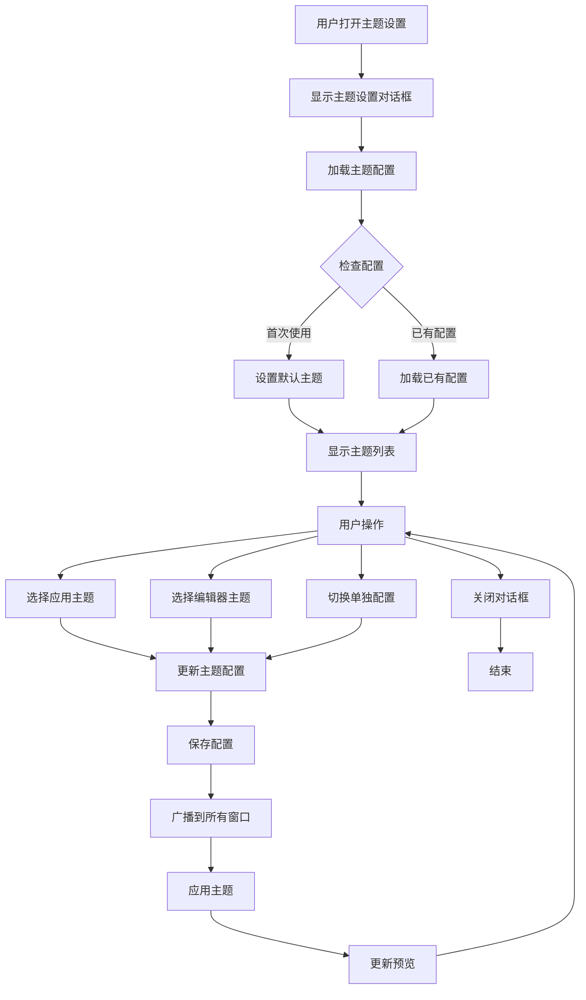

### 2.2 主题切换详细流程

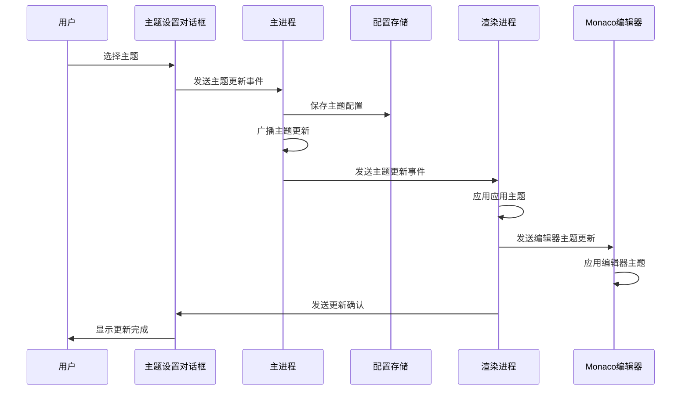

### 2.3 主题配置初始化流程

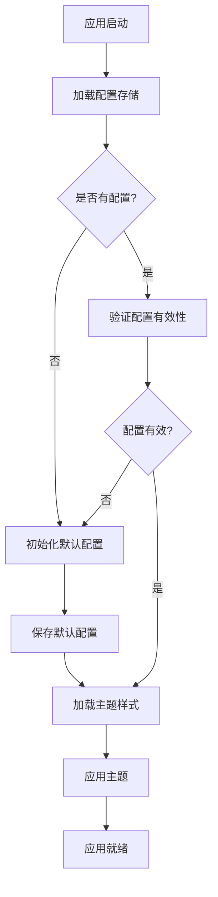

## 3. 代码架构设计

### 3.1 整体架构图

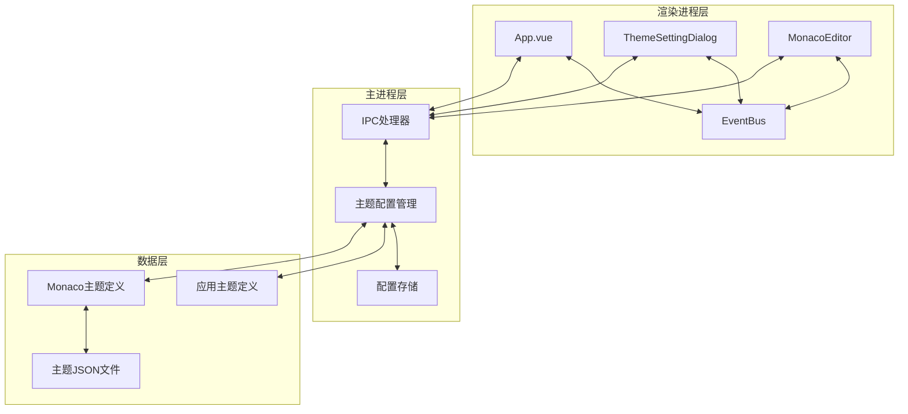

### 3.2 模块分层架构

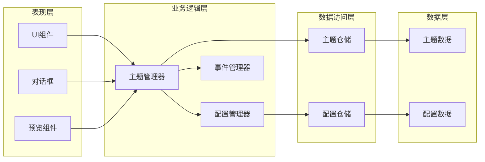

### 3.3 目录结构

```
src/
├── main/                          # 主进程
│   ├── themes/                    # 主题管理模块
│   │   ├── theme-config.ts        # 主题配置管理
│   │   ├── theme-css-generator.ts # 主题CSS生成器
│   │   └── themes.ts              # 应用主题定义
│   ├── dialogs/                   # 对话框模块
│   │   └── ShowThemeSettingDialog.ts # 主题设置对话框
│   └── utils/                     # 工具模块
│       └── utils.ts               # 通用工具
├── renderer/                      # 渲染进程
│   └── src/
│       ├── App.vue                # 应用主组件
│       ├── components/            # 组件模块
│       │   ├── Markdown/          # Markdown相关组件
│       │   │   └── MarkdownMonacoEditor.vue # Monaco编辑器组件
│       │   └── Theme/             # 主题相关组件
│       │       └── ThemePreview.vue # 主题预览组件
│       ├── lib/                   # 第三方库
│       │   └── monaco-themes/     # Monaco主题库
│       │       └── themes/        # 主题JSON文件
│       └── utils/                 # 工具模块
│           ├── event-bus.ts       # 事件总线
│           └── theme-utils.ts     # 主题工具
└── preload/                       # 预加载脚本
    └── index.ts                   # 预加载入口
```

## 4. 模块/组件设计

### 4.1 核心模块设计

#### 4.1.1 主题配置管理模块 (theme-config.ts)

**职责**:
- 管理应用主题和 Monaco 编辑器主题
- 提供主题配置的增删改查接口
- 处理主题持久化存储

**核心接口**:

```typescript
// 主题类型定义
export type ThemeType = 'baize' | 'warm' | 'light' | ... // 19个应用主题
export type MonacoThemeType = 'vs' | 'vs-dark' | 'hc-black' | ... // 60+个Monaco主题

// 主题配置接口
export interface ThemeConfig {
    currentTheme: ThemeType
    separateEditorTheme: boolean
    editorTheme?: MonacoThemeType
}

// 主题样式接口
export interface ThemeStyles {
    name: string
    description: string
    titleBarGradient: string
    backgroundColor: string
    cardBackground: string
    textColor: string
    secondaryTextColor: string
    borderColor: string
    accentColor: string
    buttonBackground: string
    buttonTextColor: string
    hoverBackground: string
}

// Monaco主题配置接口
export interface MonacoThemeConfig {
    name: string
    description: string
    isDark: boolean
    backgroundColor?: string
    foregroundColor?: string
    cardBackground?: string
    borderColor?: string
}
```

**核心功能**:

1. **主题获取**:
   - `getCurrentTheme()`: 获取当前应用主题
   - `getMonacoTheme()`: 获取当前 Monaco 编辑器主题
   - `getSeparateEditorTheme()`: 获取是否单独配置编辑器主题

2. **主题设置**:
   - `setTheme(theme: ThemeType)`: 设置应用主题
   - `setMonacoTheme(theme: MonacoThemeType)`: 设置 Monaco 编辑器主题
   - `setSeparateEditorTheme(separate: boolean)`: 设置是否单独配置编辑器主题

3. **主题查询**:
   - `getAllThemes()`: 获取所有应用主题
   - `getAllMonacoThemes()`: 获取所有 Monaco 编辑器主题
   - `getCurrentThemeStyles()`: 获取当前主题样式

4. **主题重置**:
   - `resetToDefaultTheme()`: 重置为默认主题

#### 4.1.2 主题设置对话框模块 (ShowThemeSettingDialog.ts)

**职责**:
- 创建和管理主题设置对话框窗口
- 处理用户交互和主题选择
- 协调主题配置的更新和通知

**核心功能**:

1. **对话框管理**:
   - 创建无边框对话框窗口
   - 管理窗口生命周期
   - 处理窗口关闭事件

2. **UI 生成**:
   - 动态生成对话框 HTML 内容
   - 创建侧边栏导航
   - 生成主题卡片列表

3. **事件处理**:
   - 处理主题选择事件
   - 处理复选框状态变化
   - 处理侧边栏切换事件

4. **IPC 通信**:
   - 监听主题更新事件
   - 发送主题配置更新请求
   - 接收主题更新确认

#### 4.1.3 Monaco 编辑器模块 (MarkdownMonacoEditor.vue)

**职责**:
- 集成 Monaco 编辑器
- 处理编辑器主题切换
- 管理编辑器配置和选项

**核心功能**:

1. **编辑器初始化**:
   - 创建 Monaco 编辑器实例
   - 配置编辑器选项
   - 加载语言特性

2. **主题管理**:
   - 监听主题更新事件
   - 应用编辑器主题
   - 处理主题样式变更

3. **内容管理**:
   - 管理编辑器内容
   - 处理内容变更事件
   - 提供内容访问接口

### 4.2 组件设计

#### 4.2.1 主题卡片组件

**组件结构**:

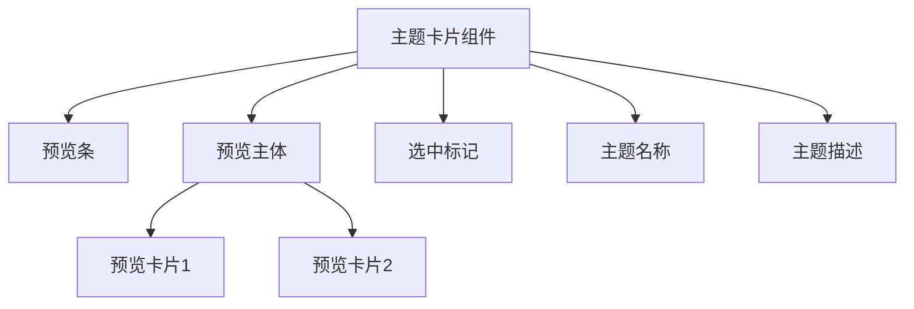

**组件状态**:

```typescript
interface ThemeCardState {
    themeType: string
    isSelected: boolean
    isEnabled: boolean
    themeStyles: ThemeStyles | MonacoThemeConfig
}
```

**组件事件**:

```typescript
interface ThemeCardEvents {
    select: (themeType: string) => void
    hover: (themeType: string) => void
    leave: (themeType: string) => void
}
```

#### 4.2.2 主题预览组件

**组件职责**:
- 实时预览主题效果
- 显示主题配色方案
- 展示主题元素样式

**组件结构**:

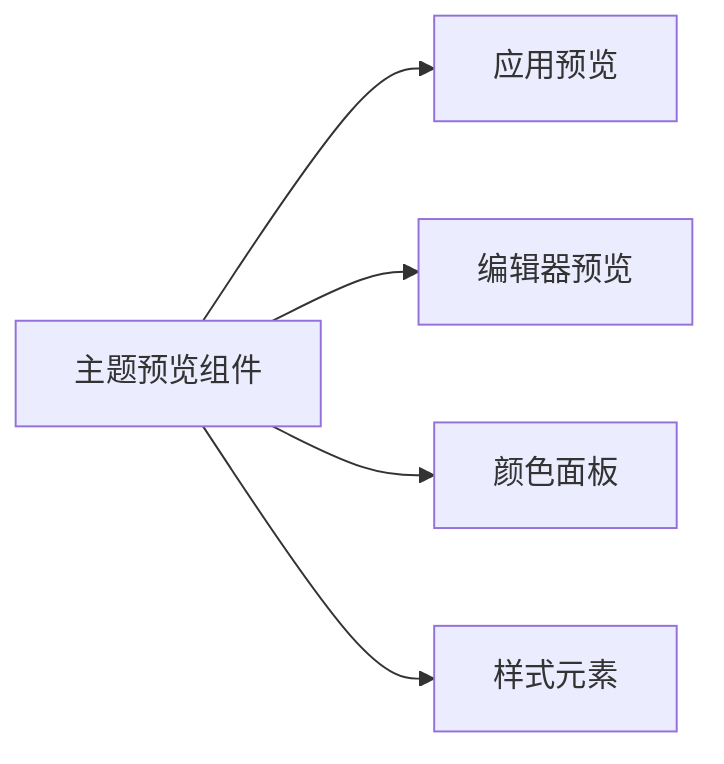

## 5. 设计思路

### 5.1 主题管理设计思路

#### 5.1.1 主题配置分离

将主题配置分为三个层次：

1. **应用主题**: 控制整个应用的 UI 样式
2. **编辑器主题**: 控制 Monaco 编辑器的样式
3. **混合模式**: 允许应用主题和编辑器主题独立配置

**设计优势**:
- 提供更灵活的主题定制能力
- 支持不同的应用和编辑器主题组合
- 满足不同用户的个性化需求

#### 5.1.2 主题样式定义

采用统一的主题样式接口，确保所有主题具有一致的属性：

```typescript
export interface ThemeStyles {
    // 基础颜色
    backgroundColor: string      // 背景色
    textColor: string            // 文字颜色
    cardBackground: string       // 卡片背景色
    
    // 交互颜色
    accentColor: string          // 强调色
    hoverBackground: string      // 悬停背景色
    borderColor: string          // 边框颜色
    
    // 特殊元素颜色
    titleBarGradient: string     // 标题栏渐变
    secondaryTextColor: string   // 次要文字颜色
    buttonBackground: string     // 按钮背景色
    buttonTextColor: string      // 按钮文字颜色
}
```

#### 5.1.3 主题持久化策略

使用 electron-store 进行配置持久化：

```typescript
const store = new Store()

// 配置结构
interface StoredConfig {
    themeConfig: {
        currentTheme: ThemeType
        separateEditorTheme: boolean
        editorTheme?: MonacoThemeType
    }
}
```

**持久化时机**:
- 用户选择主题时立即保存
- 应用启动时加载配置
- 配置变更时同步更新

### 5.2 UI 设计思路

#### 5.2.1 对话框布局

采用 IDEA 风格的侧边栏布局：

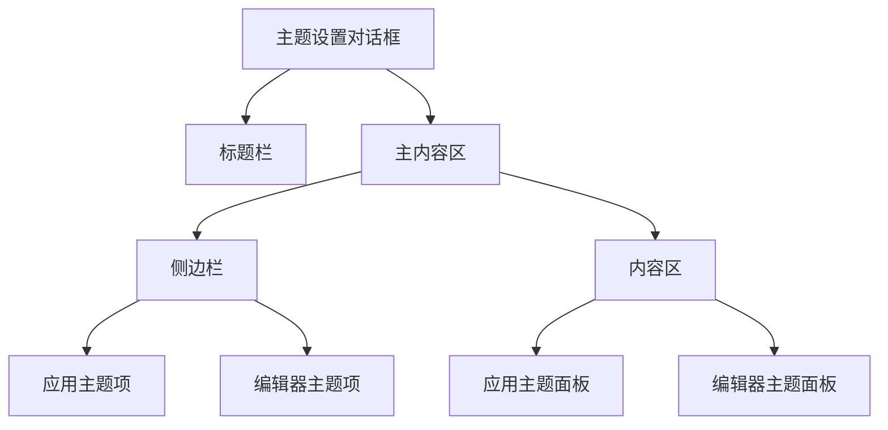

**布局特点**:
- 标题栏固定在顶部，关闭按钮始终可见
- 侧边栏固定宽度，支持独立滚动
- 内容区域自适应，支持独立滚动
- 响应式设计，适配不同窗口尺寸

#### 5.2.2 主题卡片设计

采用卡片式布局展示主题：

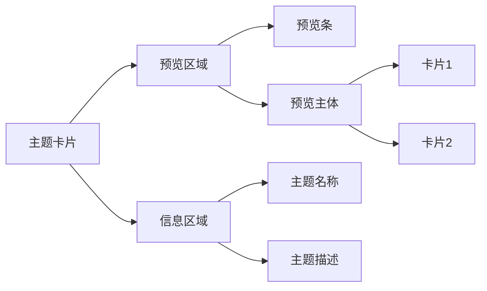

**视觉元素**:
- 预览条：显示主题的标题栏渐变色
- 预览主体：显示主题的卡片样式
- 选中标记：圆形勾选图标
- 主题信息：名称和描述

**交互效果**:
- 悬停效果：边框高亮 + 阴影
- 选中效果：边框高亮 + 背景色变化
- 禁用效果：半透明 + 禁用光标
- 过渡动画：平滑的颜色和位置过渡

### 5.3 通信架构设计

#### 5.3.1 多进程通信架构

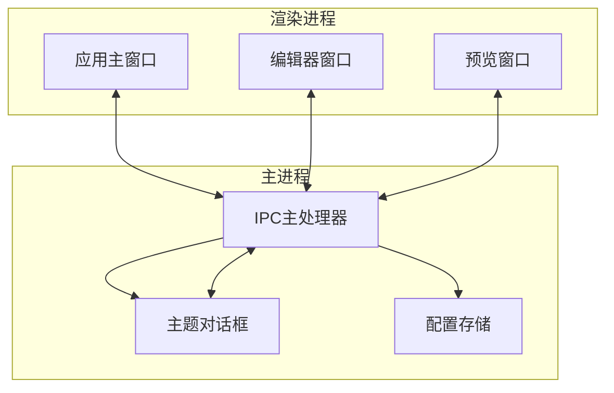

#### 5.3.2 事件通信机制

采用事件驱动的通信机制：

```typescript
// 主进程事件
ipcMain.on('baize-notes:theme-update', handler)
ipcMain.on('baize-notes:get-theme-config', handler)
ipcMain.on('baize-notes:set-theme-config', handler)

// 渲染进程事件
ipcRenderer.on('baize-notes:theme-updated', handler)
ipcRenderer.on('baize-notes:init-theme-styles', handler)

// 发送事件
ipcRenderer.send('baize-notes:theme-update', data)
```

**事件类型**:

1. **主题更新事件** (`baize-notes:theme-update`)
   - 触发条件：用户选择主题、切换配置选项
   - 数据结构：`{ themeType, separateEditorTheme, monacoTheme }`
   - 处理流程：保存配置 → 广播通知 → 应用主题

2. **主题更新完成事件** (`baize-notes:theme-updated`)
   - 触发条件：主进程完成主题更新
   - 数据结构：`{ themeType, separateEditorTheme, monacoTheme, themeStyles }`
   - 处理流程：接收通知 → 更新UI → 刷新预览

3. **初始化主题样式事件** (`baize-notes:init-theme-styles`)
   - 触发条件：对话框加载完成
   - 数据结构：`{ theme, separateEditorTheme, monacoTheme }`
   - 处理流程：接收配置 → 初始化UI → 应用样式

#### 5.3.3 通信时序图

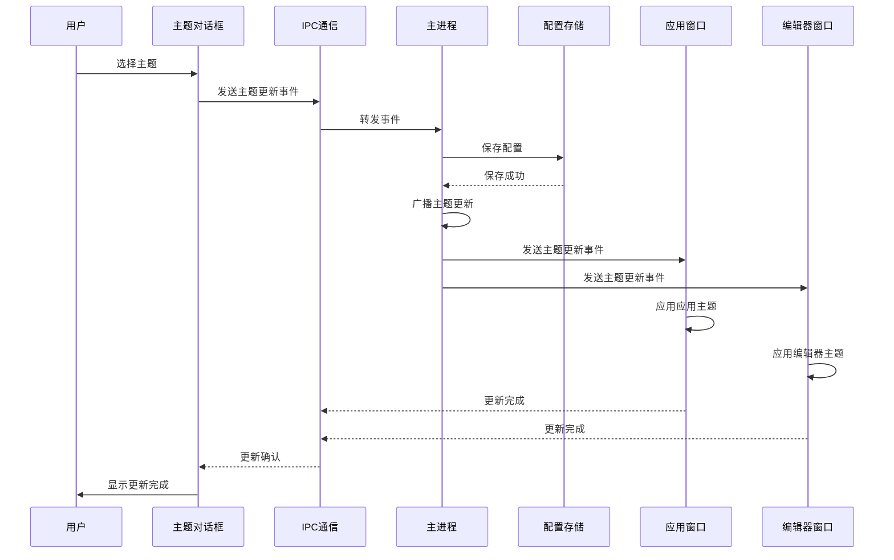

## 6. 可优化点

### 6.1 性能优化

#### 6.1.1 主题预览优化

**当前问题**:
- 每次打开对话框都重新生成主题卡片
- 主题样式计算在主线程执行
- 大量主题时渲染性能较差

**优化方案**:

1. **主题卡片缓存**:
```typescript
// 缓存已生成的主题卡片
const themeCardCache = new Map<string, HTMLElement>()

function getCachedThemeCard(themeType: string): HTMLElement {
    if (!themeCardCache.has(themeType)) {
        const card = createThemeCard(themeType)
        themeCardCache.set(themeType, card)
    }
    return themeCardCache.get(themeType)
}
```

2. **虚拟滚动**:
```typescript
// 只渲染可见区域的主题卡片
const visibleThemes = useMemo(() => {
    const start = Math.floor(scrollTop / itemHeight)
    const end = Math.ceil((scrollTop + containerHeight) / itemHeight)
    return allThemes.slice(start, end)
}, [scrollTop, containerHeight])
```

3. **Web Worker 计算**:
```typescript
// 在 Worker 中计算主题样式
const themeWorker = new Worker('theme-worker.js')
themeWorker.postMessage({ themeType })
themeWorker.onmessage = (e) => {
    const themeStyles = e.data
    applyThemeStyles(themeStyles)
}
```

#### 6.1.2 主题切换优化

**当前问题**:
- 主题切换时重新加载所有样式
- Monaco 编辑器主题切换较慢
- 缺少过渡动画

**优化方案**:

1. **样式增量更新**:
```typescript
// 只更新变化的样式属性
function updateThemeStyles(oldTheme: ThemeStyles, newTheme: ThemeStyles) {
    const changedProps = getChangedProperties(oldTheme, newTheme)
    changedProps.forEach(prop => {
        document.documentElement.style.setProperty(prop, newTheme[prop])
    })
}
```

2. **Monaco 主题预加载**:
```typescript
// 预加载常用的 Monaco 主题
const preloadThemes = ['vs', 'vs-dark', 'dracula', 'github-dark']
preloadThemes.forEach(theme => {
    monaco.editor.setTheme(theme)
})
```

3. **CSS 过渡动画**:
```css
:root {
    --transition-duration: 0.3s;
    --transition-timing: ease-in-out;
}

* {
    transition: background-color var(--transition-duration) var(--transition-timing),
                color var(--transition-duration) var(--transition-timing),
                border-color var(--transition-duration) var(--transition-timing);
}
```

### 6.2 用户体验优化

#### 6.2.1 主题预览增强

**优化方案**:

1. **实时预览**:
```typescript
// 鼠标悬停时显示主题预览
function showThemePreview(themeType: string) {
    const previewWindow = createPreviewWindow()
    previewWindow.loadURL(createPreviewURL(themeType))
}
```

2. **主题对比**:
```typescript
// 支持两个主题的对比展示
function compareThemes(theme1: ThemeType, theme2: ThemeType) {
    const comparison = compareThemeStyles(theme1, theme2)
    displayComparison(comparison)
}
```

3. **主题推荐**:
```typescript
// 根据使用习惯推荐主题
function recommendThemes(userPreferences: UserPreferences): ThemeType[] {
    const recommendations = analyzeUserPreferences(userPreferences)
    return recommendations
}
```

#### 6.2.2 主题搜索和过滤

**优化方案**:

1. **主题搜索**:
```typescript
// 支持按名称和描述搜索主题
function searchThemes(query: string): ThemeType[] {
    const results = allThemes.filter(theme => 
        theme.name.toLowerCase().includes(query.toLowerCase()) ||
        theme.description.toLowerCase().includes(query.toLowerCase())
    )
    return results
}
```

2. **主题分类**:
```typescript
// 按主题特征分类
function categorizeThemes(): Map<string, ThemeType[]> {
    const categories = new Map()
    allThemes.forEach(theme => {
        const category = classifyTheme(theme)
        if (!categories.has(category)) {
            categories.set(category, [])
        }
        categories.get(category).push(theme)
    })
    return categories
}
```

3. **主题筛选**:
```typescript
// 按颜色深浅、风格筛选主题
function filterThemes(filters: ThemeFilters): ThemeType[] {
    let results = allThemes
    if (filters.isDark !== undefined) {
        results = results.filter(theme => theme.isDark === filters.isDark)
    }
    if (filters.style) {
        results = results.filter(theme => theme.style === filters.style)
    }
    return results
}
```

### 6.3 代码质量优化

#### 6.3.1 类型安全

**当前问题**:
- 部分代码使用 `@ts-ignore` 绕过类型检查
- 类型定义不够精确

**优化方案**:

1. **精确类型定义**:
```typescript
// 使用联合类型替代字符串
export type ThemeType = 
    | 'baize' 
    | 'warm' 
    | 'light'
    | ... // 其他主题类型

// 使用枚举定义状态
enum ThemeState {
    Loading = 'loading',
    Ready = 'ready',
    Error = 'error'
}
```

2. **泛型约束**:
```typescript
// 使用泛型约束函数参数
function getThemeConfig<T extends ThemeType>(theme: T): ThemeConfig<T> {
    return themeConfigs[theme]
}
```

3. **类型守卫**:
```typescript
// 使用类型守卫确保类型安全
function isAppTheme(theme: string): theme is ThemeType {
    return appThemeTypes.includes(theme as ThemeType)
}

function isMonacoTheme(theme: string): theme is MonacoThemeType {
    return monacoThemeTypes.includes(theme as MonacoThemeType)
}
```

#### 6.3.2 错误处理

**当前问题**:
- 缺少完善的错误处理机制
- 错误信息不够友好

**优化方案**:

1. **错误边界**:
```typescript
// 在组件中使用错误边界
class ThemeErrorBoundary extends React.Component {
    componentDidCatch(error: Error, errorInfo: ErrorInfo) {
        logThemeError(error, errorInfo)
        showErrorMessage('主题加载失败，请重试')
    }
}
```

2. **错误恢复**:
```typescript
// 提供错误恢复机制
function recoverFromThemeError(error: ThemeError): void {
    switch (error.type) {
        case 'ThemeLoadError':
            resetToDefaultTheme()
            break
        case 'ConfigError':
            clearInvalidConfig()
            break
        default:
            logError(error)
    }
}
```

3. **错误日志**:
```typescript
// 记录详细的错误信息
function logThemeError(error: Error, context: any): void {
    const errorLog = {
        timestamp: new Date().toISOString(),
        error: {
            message: error.message,
            stack: error.stack,
            name: error.name
        },
        context: context
    }
    saveErrorLog(errorLog)
}
```

## 7. 后续改进方向

### 7.1 功能扩展

#### 7.1.1 自定义主题

**目标**: 允许用户创建和编辑自定义主题

**实现方案**:

1. **主题编辑器**:
```typescript
interface ThemeEditor {
    createTheme(): CustomTheme
    editTheme(theme: CustomTheme): CustomTheme
    deleteTheme(theme: CustomTheme): void
    exportTheme(theme: CustomTheme): string
    importTheme(data: string): CustomTheme
}
```

2. **主题模板**:
```typescript
interface ThemeTemplate {
    name: string
    baseTheme: ThemeType
    customColors: Partial<ThemeStyles>
    customFonts: FontConfig
}
```

3. **主题分享**:
```typescript
interface ThemeSharing {
    publishTheme(theme: CustomTheme): string
    downloadTheme(id: string): CustomTheme
    rateTheme(id: string, rating: number): void
    commentTheme(id: string, comment: string): void
}
```

#### 7.1.2 主题同步

**目标**: 支持主题配置的云端同步

**实现方案**:

1. **云存储集成**:
```typescript
interface CloudSync {
    syncThemes(): Promise<void>
    uploadTheme(theme: CustomTheme): Promise<string>
    downloadTheme(id: string): Promise<CustomTheme>
    resolveConflict(local: ThemeConfig, remote: ThemeConfig): ThemeConfig
}
```

2. **多设备同步**:
```typescript
interface DeviceSync {
    registerDevice(device: DeviceInfo): Promise<string>
    syncAcrossDevices(): Promise<void>
    getSyncStatus(): SyncStatus
}
```

#### 7.1.3 主题插件系统

**目标**: 支持第三方主题插件

**实现方案**:

1. **插件接口**:
```typescript
interface ThemePlugin {
    name: string
    version: string
    themes: ThemeDefinition[]
    install(): Promise<void>
    uninstall(): Promise<void>
    activate(): void
    deactivate(): void
}
```

2. **插件管理器**:
```typescript
interface PluginManager {
    installPlugin(plugin: ThemePlugin): Promise<void>
    uninstallPlugin(pluginId: string): Promise<void>
    listPlugins(): ThemePlugin[]
    getPlugin(pluginId: string): ThemePlugin | undefined
}
```

### 7.2 技术改进

#### 7.2.1 性能优化

1. **懒加载**:
```typescript
// 按需加载主题资源
const loadTheme = async (themeType: ThemeType): Promise<ThemeStyles> => {
    if (!loadedThemes.has(themeType)) {
        const styles = await import(`./themes/${themeType}.json`)
        loadedThemes.set(themeType, styles.default)
    }
    return loadedThemes.get(themeType)
}
```

2. **WebAssembly 优化**:
```typescript
// 使用 WebAssembly 加速主题计算
const themeCalculator = await WebAssembly.instantiateStreaming(
    fetch('theme-calculator.wasm')
)
```

3. **Service Worker 缓存**:
```typescript
// 缓存主题资源
self.addEventListener('fetch', (event) => {
    if (event.request.url.includes('themes/')) {
        event.respondWith(
            caches.match(event.request).then(response => {
                return response || fetch(event.request)
            })
        )
    }
})
```

#### 7.2.2 架构优化

1. **模块化重构**:
```typescript
// 将主题功能拆分为独立模块
export * from './modules/theme-core'
export * from './modules/theme-manager'
export * from './modules/theme-ui'
export * from './modules/theme-sync'
```

2. **依赖注入**:
```typescript
// 使用依赖注入提高可测试性
interface ThemeContainer {
    themeManager: IThemeManager
    configStore: IConfigStore
    eventBus: IEventBus
}
```

3. **状态管理优化**:
```typescript
// 使用 Pinia 进行状态管理
export const useThemeStore = defineStore('theme', {
    state: () => ({
        currentTheme: 'baize',
        separateEditorTheme: false,
        editorTheme: 'vs'
    }),
    actions: {
        async setTheme(theme: ThemeType) {
            this.currentTheme = theme
            await this.saveConfig()
            this.broadcastUpdate()
        }
    }
})
```

### 7.3 用户体验改进

#### 7.3.1 智能推荐

1. **基于时间的主题切换**:
```typescript
// 根据时间自动切换主题
function scheduleThemeSwitch() {
    const now = new Date()
    const hour = now.getHours()
    
    if (hour >= 6 && hour < 18) {
        setLightTheme()
    } else {
        setDarkTheme()
    }
}
```

2. **基于使用习惯的主题推荐**:
```typescript
// 分析用户使用习惯推荐主题
function analyzeUserHabits(): ThemeRecommendation[] {
    const usageData = getUsageData()
    const preferences = analyzePreferences(usageData)
    return generateRecommendations(preferences)
}
```

#### 7.3.2 无障碍支持

1. **键盘导航**:
```typescript
// 完整的键盘导航支持
function handleKeyboardNavigation(event: KeyboardEvent) {
    switch (event.key) {
        case 'ArrowUp':
            navigateToPreviousTheme()
            break
        case 'ArrowDown':
            navigateToNextTheme()
            break
        case 'Enter':
            selectCurrentTheme()
            break
    }
}
```

2. **屏幕阅读器支持**:
```html
<!-- 添加 ARIA 标签 -->
<div role="listbox" aria-label="主题列表">
    <div 
        role="option" 
        aria-selected={isSelected}
        tabindex={0}
    >
        {theme.name}
    </div>
</div>
```

3. **高对比度模式**:
```typescript
// 支持高对比度主题
function enableHighContrastMode() {
    document.body.classList.add('high-contrast')
    const highContrastTheme = getHighContrastTheme()
    applyTheme(highContrastTheme)
}
```

## 8. 4+1 视图

### 8.1 逻辑视图

逻辑视图描述系统的功能分解和模块间的关系。

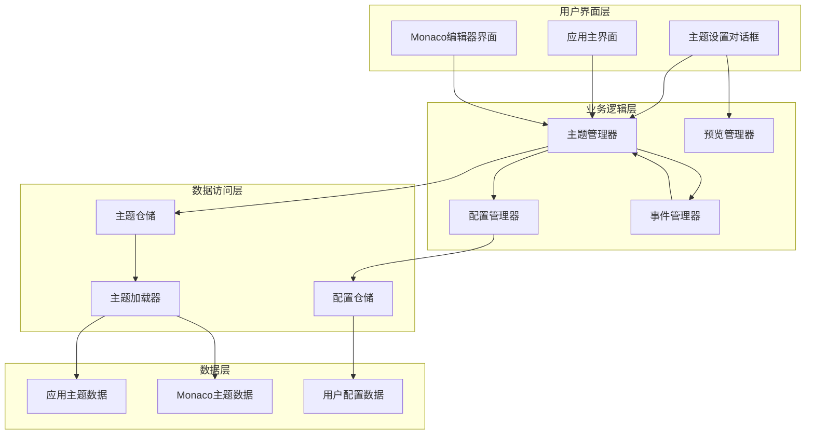

**模块职责**:

1. **用户界面层**:
   - 负责用户交互和界面展示
   - 处理用户输入和显示反馈

2. **业务逻辑层**:
   - 实现主题管理的核心逻辑
   - 协调各模块间的交互
   - 处理业务规则和约束

3. **数据访问层**:
   - 提供数据访问接口
   - 处理数据持久化
   - 管理数据缓存

4. **数据层**:
   - 存储主题定义和配置
   - 提供数据源接口

### 8.2 开发视图

开发视图描述系统的模块组织、依赖关系和构建配置。

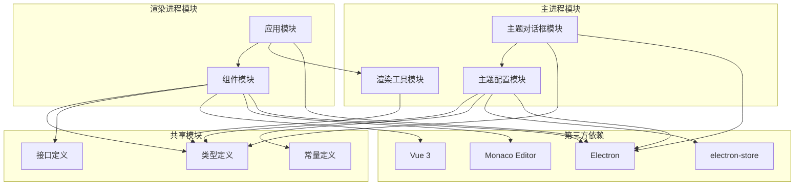

**模块依赖关系**:

1. **主进程模块**:
   - `theme-config.ts`: 主题配置管理
   - `ShowThemeSettingDialog.ts`: 主题设置对话框
   - `utils.ts`: 通用工具函数

2. **渲染进程模块**:
   - `App.vue`: 应用主组件
   - `MarkdownMonacoEditor.vue`: Monaco 编辑器组件
   - `event-bus.ts`: 事件总线

3. **共享模块**:
   - 类型定义文件
   - 常量定义文件
   - 接口定义文件

**构建配置**:

```typescript
// 主进程构建配置
{
    "compilerOptions": {
        "target": "ES2020",
        "module": "CommonJS",
        "outDir": "./dist/main",
        "rootDir": "./src/main"
    }
}

// 渲染进程构建配置
{
    "compilerOptions": {
        "target": "ES2020",
        "module": "ESNext",
        "jsx": "preserve",
        "outDir": "./dist/renderer",
        "rootDir": "./src/renderer"
    }
}
```

### 8.3 进程视图

进程视图描述系统的运行时进程和线程结构。

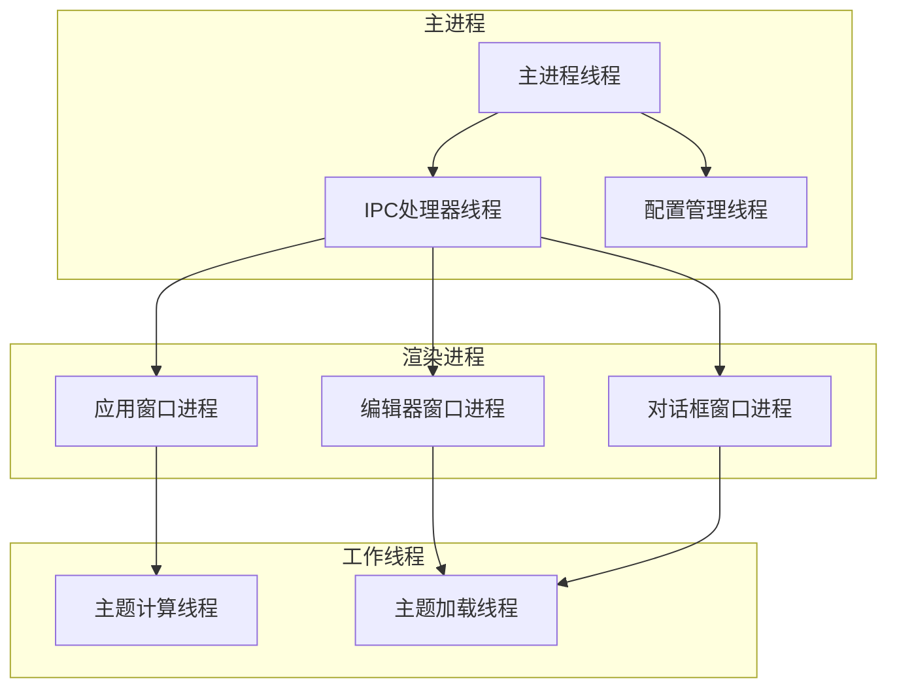

**进程职责**:

1. **主进程**:
   - 管理应用生命周期
   - 处理 IPC 通信
   - 管理窗口创建和销毁
   - 处理文件系统访问

2. **渲染进程**:
   - 渲染用户界面
   - 处理用户交互
   - 运行 JavaScript 代码
   - 集成 Monaco 编辑器

3. **工作线程**:
   - 执行耗时的主题计算
   - 加载主题资源
   - 处理主题样式生成

### 8.4 部署视图

部署视图描述系统的物理部署架构。

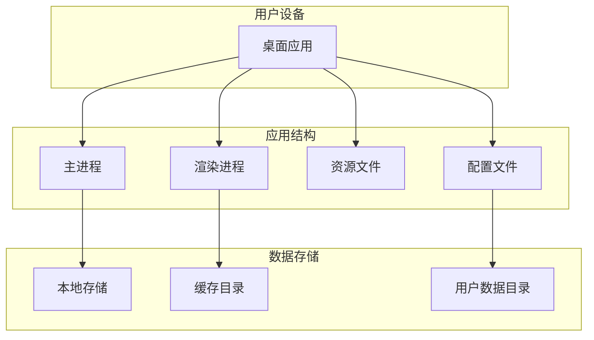

**部署组件**:

1. **应用结构**:
   - 主进程可执行文件
   - 渲染进程打包文件
   - 静态资源文件
   - 配置文件

2. **数据存储**:
   - 本地存储：应用配置
   - 缓存目录：主题资源缓存
   - 用户数据目录：用户自定义主题

**部署环境**:

- **开发环境**: 本地开发、热重载、调试工具
- **测试环境**: 自动化测试、性能测试、兼容性测试
- **生产环境**: 代码压缩、资源优化、错误监控

### 8.5 场景视图

场景视图描述系统的典型使用场景和交互流程。

#### 8.5.1 场景一：首次使用主题设置

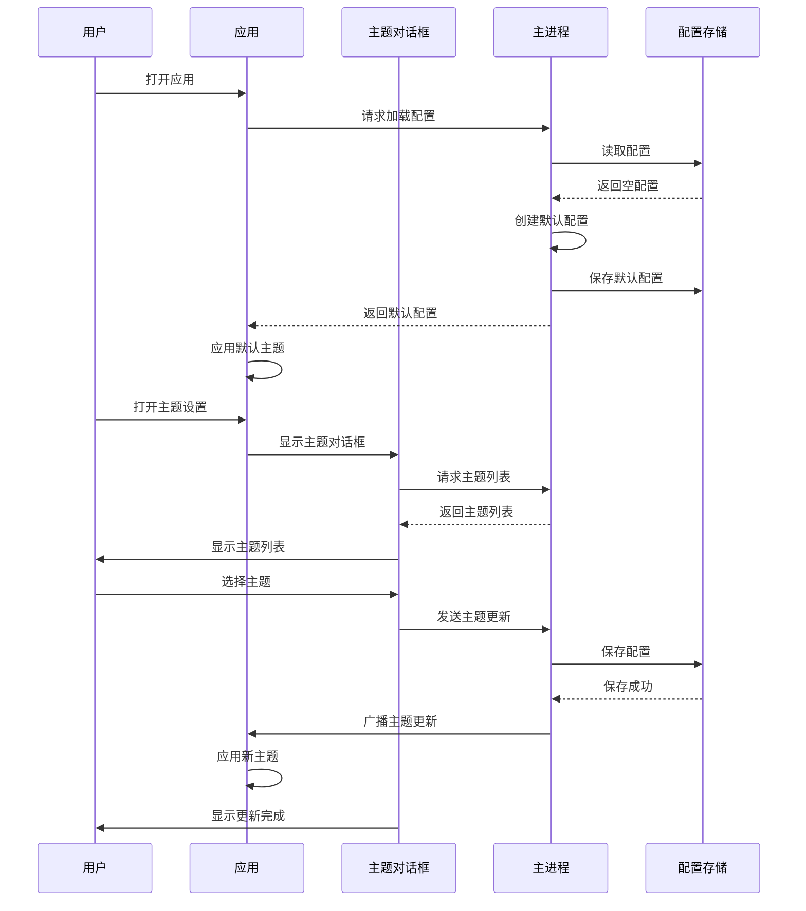

#### 8.5.2 场景二：切换编辑器主题

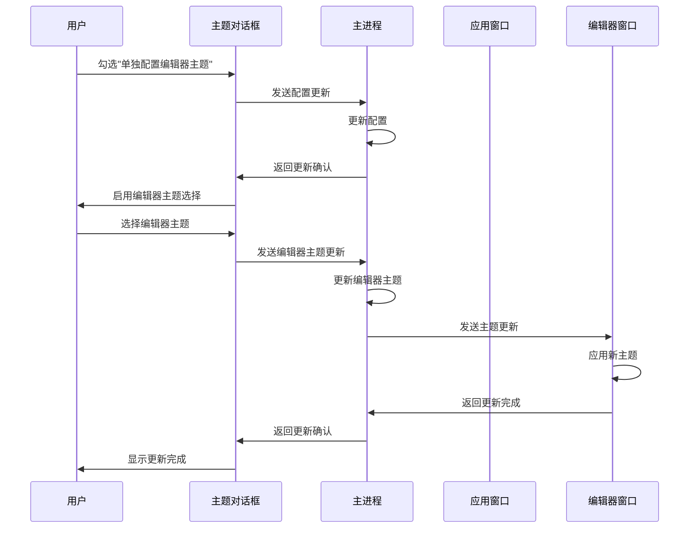

#### 8.5.3 场景三：主题配置同步

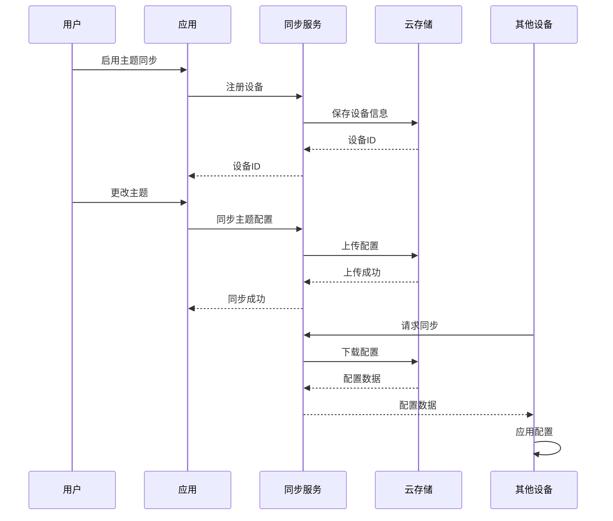

## 9. 总结

### 9.1 方案特点

1. **模块化设计**: 将主题功能拆分为独立的模块，便于维护和扩展
2. **类型安全**: 使用 TypeScript 确保代码的类型安全
3. **事件驱动**: 采用事件驱动的架构，解耦模块间依赖
4. **用户友好**: 提供直观的 UI 和良好的用户体验
5. **可扩展性**: 支持自定义主题和主题插件

### 9.2 技术亮点

1. **多进程架构**: 利用 Electron 的多进程特性，提高应用稳定性
2. **IPC 通信**: 采用高效的 IPC 通信机制，确保数据同步
3. **主题预览**: 实时预览主题效果，提升用户体验
4. **配置持久化**: 使用 electron-store 进行配置持久化
5. **Monaco 集成**: 深度集成 Monaco 编辑器，支持丰富的编辑器主题

### 9.3 后续规划

1. **功能完善**: 实现自定义主题、主题同步等功能
2. **性能优化**: 优化主题切换性能，减少延迟
3. **用户体验**: 增强主题预览和推荐功能
4. **生态建设**: 建立主题分享和插件系统
5. **持续改进**: 根据用户反馈不断优化和完善

本方案为 BaiZeNotes 应用的主题设置功能提供了完整的设计和实现指导，涵盖了从业务流程到技术实现的各个方面，为后续的开发和维护提供了坚实的基础。
