# 白泽笔记 v1.1.5-beta 架构文档

## 文档信息

| 项目名称 | 白泽笔记 (BaiZe Notes) |
|---------|----------------------|
| 版本号 | v1.1.5-beta |
| 技术栈 | Electron 38.0.0 + Vue 3.4.27 + TypeScript 6.0.2 |
| 项目规模 | 141个源文件，65个Vue组件 |
| 文档日期 | 2026年5月 |
| 作者 | hemy08 |

---

## 目录

1. [概述](#概述)
2. [4+1视图模型](#4+1视图模型)
   - [逻辑视图](#逻辑视图)
   - [实现视图](#实现视图)
   - [进程视图](#进程视图)
   - [部署视图](#部署视图)
   - [用例视图](#用例视图)
3. [3A视图模型](#3a视图模型)
   - [Architecture视图](#architecture视图)
   - [Aspects视图](#aspects视图)
   - [Assets视图](#assets视图)
4. [详细架构图](#详细架构图)
5. [子模块架构](#子模块架构)
6. [架构决策记录](#架构决策记录)

---

## 概述

### 系统简介

白泽笔记是一款基于 Electron + Vue 3 + TypeScript 构建的跨平台桌面笔记应用，专注于提供优雅的 Markdown 编辑体验。应用名称源自中国古代神兽"白泽"，寓意智慧与知识的汇聚。

### 核心特性

- **Monaco Editor 集成**：采用 VS Code 同款编辑器，提供强大的代码编辑能力
- **多主题支持**：内置 20+ 精美主题，支持浅色/深色模式切换
- **实时预览**：Markdown 实时渲染，支持 Mermaid、PlantUML、KaTeX 等扩展语法
- **插件工具集**：内置加密解密、格式转换、网络工具等实用插件
- **文件管理**：支持多标签页、文件树导航、自动保存
- **跨平台**：支持 Windows、macOS、Linux

### 技术选型理由

| 技术 | 选型理由 |
|-----|---------|
| Electron 38 | 最新稳定版，提供完整的桌面应用能力，支持原生 API 调用 |
| Vue 3 | Composition API 提供更好的逻辑复用，响应式系统性能优异 |
| TypeScript 6 | 强类型保障代码质量，IDE 支持完善 |
| Monaco Editor | VS Code 同款编辑器，语法高亮、智能提示、快捷键生态成熟 |
| electron-vite | 专为 Electron 优化的构建工具，开发体验流畅 |
| electron-store | 简单可靠的持久化存储方案 |

---

## 4+1视图模型

### 逻辑视图（Logical View）

逻辑视图描述系统的功能需求和静态结构，从最终用户角度展示系统功能。

#### 功能模块划分

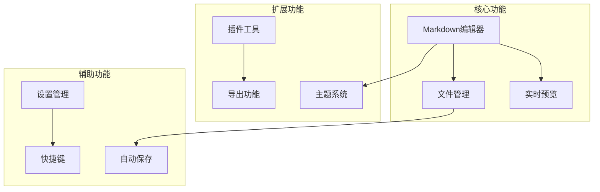
```mermaid
graph TB
    subgraph 核心功能
        A[Markdown编辑器]
        B[实时预览]
        C[文件管理]
    end
    
    subgraph 扩展功能
        D[主题系统]
        E[插件工具]
        F[导出功能]
    end
    
    subgraph 辅助功能
        G[设置管理]
        H[快捷键]
        I[自动保存]
    end
    
    A --> B
    A --> C
    A --> D
    C --> I
    E --> F
    G --> H
```

#### 核心类图

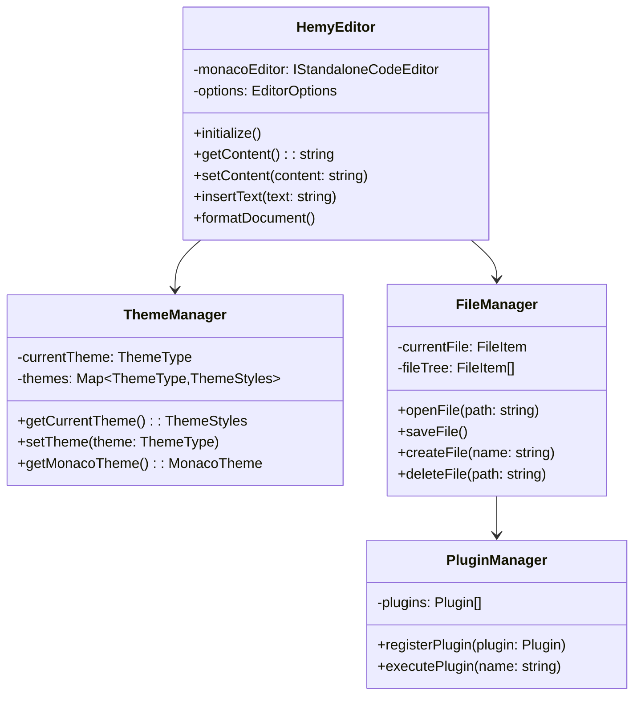
```mermaid
classDiagram
    class HemyEditor {
        -monacoEditor: IStandaloneCodeEditor
        -options: EditorOptions
        +initialize()
        +getContent(): string
        +setContent(content: string)
        +insertText(text: string)
        +formatDocument()
    }
    
    class ThemeManager {
        -currentTheme: ThemeType
        -themes: Map~ThemeType,ThemeStyles~
        +getCurrentTheme(): ThemeStyles
        +setTheme(theme: ThemeType)
        +getMonacoTheme(): MonacoTheme
    }
    
    class FileManager {
        -currentFile: FileItem
        -fileTree: FileItem[]
        +openFile(path: string)
        +saveFile()
        +createFile(name: string)
        +deleteFile(path: string)
    }
    
    class PluginManager {
        -plugins: Plugin[]
        +registerPlugin(plugin: Plugin)
        +executePlugin(name: string)
    }
    
    HemyEditor --> ThemeManager
    HemyEditor --> FileManager
    FileManager --> PluginManager
```

#### 包结构图

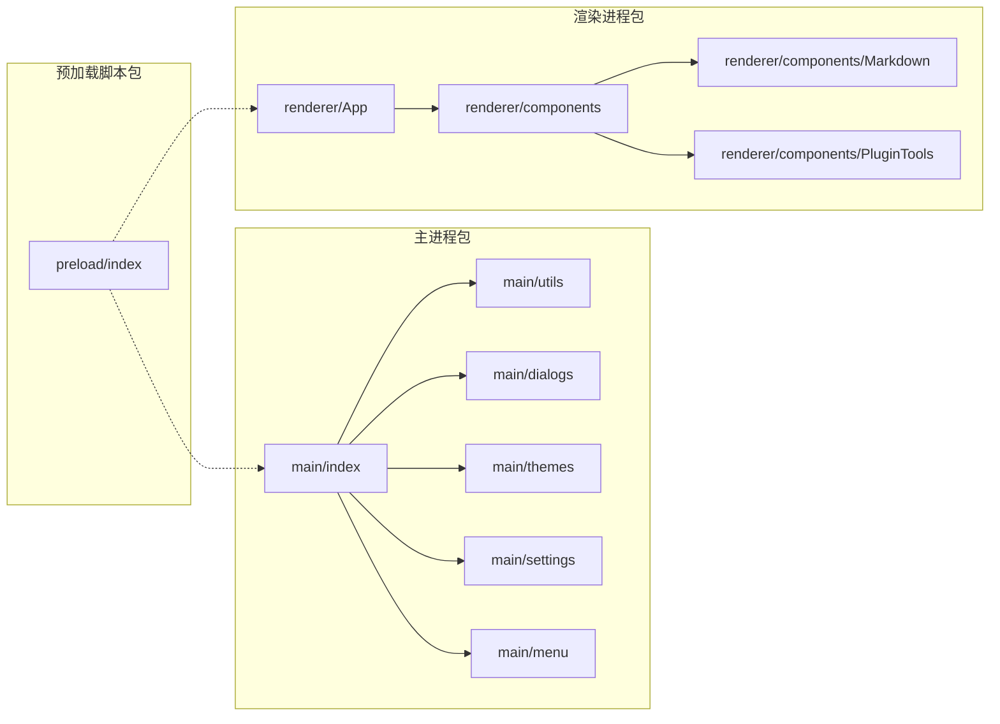
```mermaid
graph LR
    subgraph 主进程包
        M1[main/index]
        M2[main/utils]
        M3[main/dialogs]
        M4[main/themes]
        M5[main/settings]
        M6[main/menu]
    end
    
    subgraph 渲染进程包
        R1[renderer/App]
        R2[renderer/components]
        R3[renderer/components/Markdown]
        R4[renderer/components/PluginTools]
    end
    
    subgraph 预加载脚本包
        P1[preload/index]
    end
    
    M1 --> M2
    M1 --> M3
    M1 --> M4
    M1 --> M5
    M1 --> M6
    
    R1 --> R2
    R2 --> R3
    R2 --> R4
    
    P1 -.-> M1
    P1 -.-> R1
```

---

### 实现视图（Implementation View）

实现视图描述系统的模块结构、组件组织和依赖关系，从程序员角度展示系统实现。

#### 模块结构图

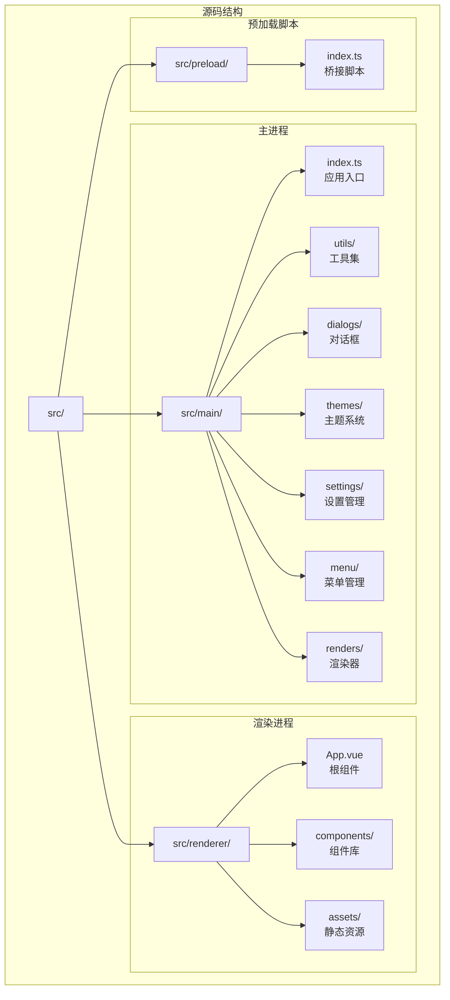
```mermaid
graph TB
    subgraph 源码结构
        SRC[src/]
        
        subgraph 主进程
            MAIN[src/main/]
            MAIN --> MAIN_INDEX[index.ts<br/>应用入口]
            MAIN --> MAIN_UTILS[utils/<br/>工具集]
            MAIN --> MAIN_DIALOGS[dialogs/<br/>对话框]
            MAIN --> MAIN_THEMES[themes/<br/>主题系统]
            MAIN --> MAIN_SETTINGS[settings/<br/>设置管理]
            MAIN --> MAIN_MENU[menu/<br/>菜单管理]
            MAIN --> MAIN_RENDERS[renders/<br/>渲染器]
        end
        
        subgraph 渲染进程
            RENDERER[src/renderer/]
            RENDERER --> RENDERER_APP[App.vue<br/>根组件]
            RENDERER --> RENDERER_COMP[components/<br/>组件库]
            RENDERER --> RENDERER_ASSETS[assets/<br/>静态资源]
        end
        
        subgraph 预加载脚本
            PRELOAD[src/preload/]
            PRELOAD --> PRELOAD_INDEX[index.ts<br/>桥接脚本]
        end
        
        SRC --> MAIN
        SRC --> RENDERER
        SRC --> PRELOAD
    end
```

#### 组件依赖图

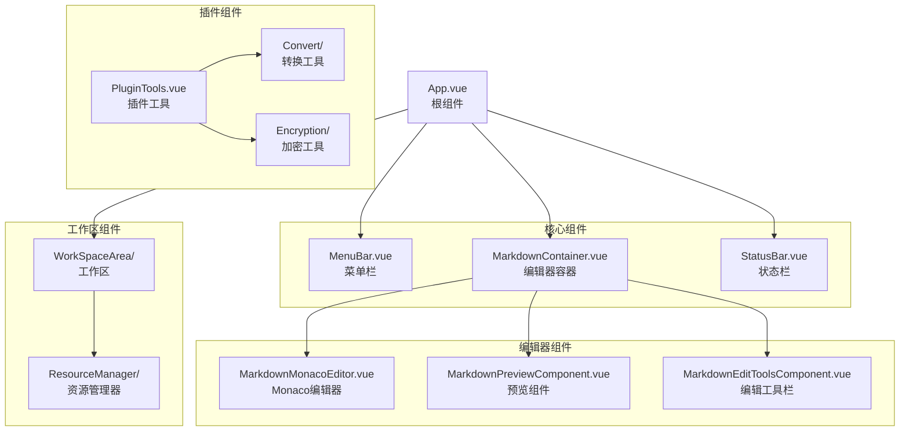
```mermaid
graph TB
    App[App.vue<br/>根组件]
    
    subgraph 核心组件
        MenuBar[MenuBar.vue<br/>菜单栏]
        MarkdownContainer[MarkdownContainer.vue<br/>编辑器容器]
        StatusBar[StatusBar.vue<br/>状态栏]
    end
    
    subgraph 编辑器组件
        MonacoEditor[MarkdownMonacoEditor.vue<br/>Monaco编辑器]
        Preview[MarkdownPreviewComponent.vue<br/>预览组件]
        EditTools[MarkdownEditToolsComponent.vue<br/>编辑工具栏]
    end
    
    subgraph 工作区组件
        WorkSpace[WorkSpaceArea/<br/>工作区]
        ResourceManager[ResourceManager/<br/>资源管理器]
    end
    
    subgraph 插件组件
        PluginTools[PluginTools.vue<br/>插件工具]
        Convert[Convert/<br/>转换工具]
        Encryption[Encryption/<br/>加密工具]
    end
    
    App --> MenuBar
    App --> MarkdownContainer
    App --> StatusBar
    App --> WorkSpace
    
    MarkdownContainer --> MonacoEditor
    MarkdownContainer --> Preview
    MarkdownContainer --> EditTools
    
    WorkSpace --> ResourceManager
    
    PluginTools --> Convert
    PluginTools --> Encryption
```

#### 文件统计

| 模块 | TypeScript文件 | Vue组件 | 说明 |
|-----|--------------|---------|------|
| main/ | 35 | 0 | 主进程逻辑 |
| renderer/ | 39 | 63 | 渲染进程UI |
| preload/ | 2 | 0 | 预加载桥接 |
| **总计** | **76** | **63** | **137个源文件** |

---

### 进程视图（Process View）

进程视图描述系统的运行时架构、进程通信和并发处理，从系统集成者角度展示系统运行。

#### 运行时架构

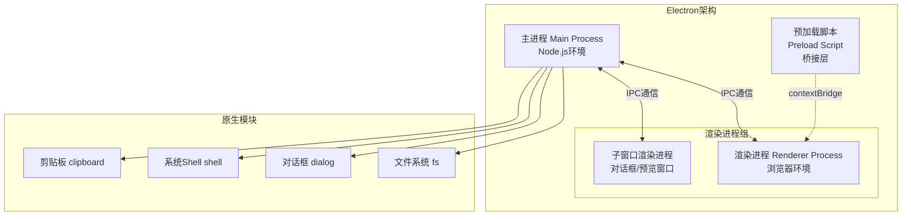
```mermaid
graph TB
    subgraph Electron架构
        MAIN[主进程 Main Process<br/>Node.js环境]
        
        subgraph 渲染进程组
            RENDERER[渲染进程 Renderer Process<br/>浏览器环境]
            RENDERER2[子窗口渲染进程<br/>对话框/预览窗口]
        end
        
        PRELOAD[预加载脚本<br/>Preload Script<br/>桥接层]
        
        MAIN <-->|IPC通信| RENDERER
        MAIN <-->|IPC通信| RENDERER2
        PRELOAD -.->|contextBridge| RENDERER
    end
    
    subgraph 原生模块
        FS[文件系统 fs]
        DIALOG[对话框 dialog]
        SHELL[系统Shell shell]
        CLIPBOARD[剪贴板 clipboard]
    end
    
    MAIN --> FS
    MAIN --> DIALOG
    MAIN --> SHELL
    MAIN --> CLIPBOARD
```

#### IPC通信模型

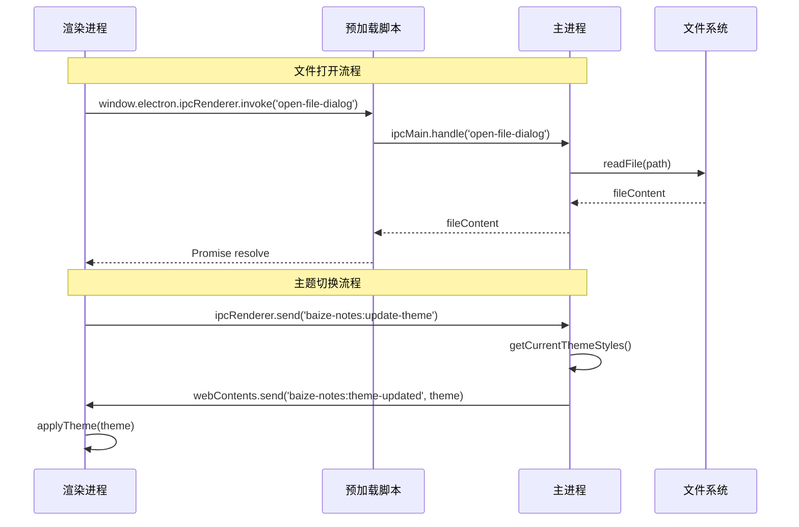
```mermaid
sequenceDiagram
    participant Renderer as 渲染进程
    participant Preload as 预加载脚本
    participant Main as 主进程
    participant FS as 文件系统
    
    Note over Renderer,Main: 文件打开流程
    Renderer->>Preload: window.electron.ipcRenderer.invoke('open-file-dialog')
    Preload->>Main: ipcMain.handle('open-file-dialog')
    Main->>FS: readFile(path)
    FS-->>Main: fileContent
    Main-->>Preload: fileContent
    Preload-->>Renderer: Promise resolve
    
    Note over Renderer,Main: 主题切换流程
    Renderer->>Main: ipcRenderer.send('baize-notes:update-theme')
    Main->>Main: getCurrentThemeStyles()
    Main->>Renderer: webContents.send('baize-notes:theme-updated', theme)
    Renderer->>Renderer: applyTheme(theme)
```

#### 并发处理模型

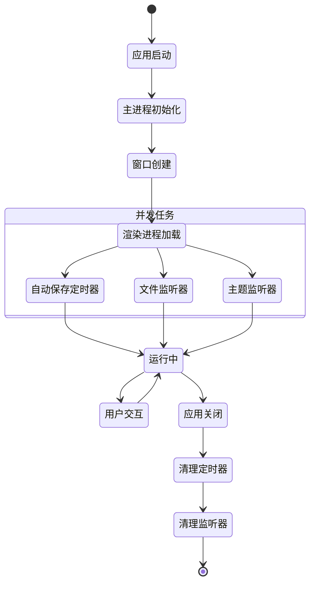
```mermaid
stateDiagram-v2
    [*] --> 应用启动
    应用启动 --> 主进程初始化
    主进程初始化 --> 窗口创建
    窗口创建 --> 渲染进程加载
    
    state 并发任务 {
        渲染进程加载 --> 自动保存定时器
        渲染进程加载 --> 文件监听器
        渲染进程加载 --> 主题监听器
    }
    
    自动保存定时器 --> 运行中
    文件监听器 --> 运行中
    主题监听器 --> 运行中
    
    运行中 --> 用户交互
    用户交互 --> 运行中
    
    运行中 --> 应用关闭
    应用关闭 --> 清理定时器
    清理定时器 --> 清理监听器
    清理监听器 --> [*]
```

#### 关键IPC通道

| 通道名称 | 方向 | 用途 |
|---------|------|------|
| `open-file-dialog` | Renderer → Main | 打开文件对话框 |
| `save-file-dialog` | Renderer → Main | 保存文件对话框 |
| `baize-notes:menu-action` | Renderer → Main | 菜单动作处理 |
| `baize-notes:update-theme` | Renderer → Main | 更新主题 |
| `baize-notes:theme-updated` | Main → Renderer | 主题更新通知 |
| `baize-notes:load-monaco-theme` | Renderer → Main | 加载Monaco主题 |
| `window_toggle_maximize` | Renderer → Main | 窗口最大化切换 |
| `baize-notes:system-setting-update` | Main → Renderer | 系统设置更新 |

---

### 部署视图（Deployment View）

部署视图描述系统的物理部署和节点配置，从系统工程师角度展示系统部署。

#### 物理部署图

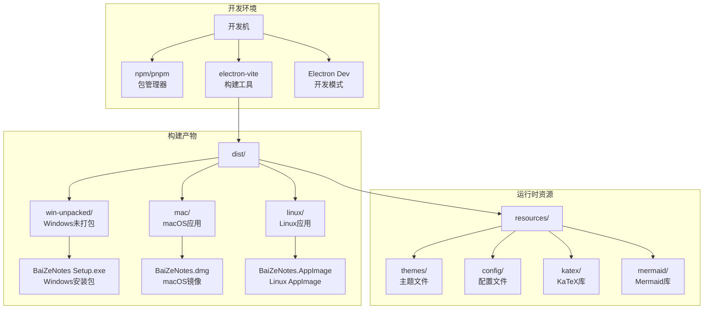
```mermaid
graph TB
    subgraph 开发环境
        DEV[开发机]
        DEV --> NPM[npm/pnpm<br/>包管理器]
        DEV --> VITE[electron-vite<br/>构建工具]
        DEV --> ELECTRON_DEV[Electron Dev<br/>开发模式]
    end
    
    subgraph 构建产物
        DIST[dist/]
        DIST --> WIN[win-unpacked/<br/>Windows未打包]
        DIST --> MAC[mac/<br/>macOS应用]
        DIST --> LINUX[linux/<br/>Linux应用]
        
        WIN --> WIN_INSTALLER[BaiZeNotes Setup.exe<br/>Windows安装包]
        MAC --> MAC_DMG[BaiZeNotes.dmg<br/>macOS镜像]
        LINUX --> LINUX_APP[BaiZeNotes.AppImage<br/>Linux AppImage]
    end
    
    subgraph 运行时资源
        RESOURCES[resources/]
        RESOURCES --> THEMES[themes/<br/>主题文件]
        RESOURCES --> CONFIG[config/<br/>配置文件]
        RESOURCES --> KATEX[katex/<br/>KaTeX库]
        RESOURCES --> MERMAID[mermaid/<br/>Mermaid库]
    end
    
    VITE --> DIST
    DIST --> RESOURCES
```

#### 应用打包结构

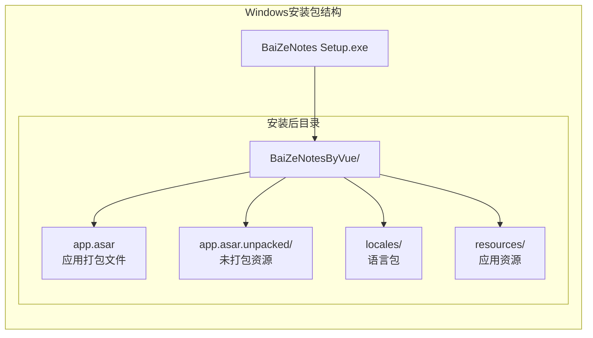
```mermaid
graph LR
    subgraph Windows安装包结构
        EXE[BaiZeNotes Setup.exe]
        
        subgraph 安装后目录
            ROOT[BaiZeNotesByVue/]
            ROOT --> APP[app.asar<br/>应用打包文件]
            ROOT --> APP_UNPACKED[app.asar.unpacked/<br/>未打包资源]
            ROOT --> LOCALES[locales/<br/>语言包]
            ROOT --> RESOURCES[resources/<br/>应用资源]
        end
        
        EXE --> ROOT
    end
```

#### 运行环境要求

| 平台 | 最低要求 | 推荐配置 |
|-----|---------|---------|
| Windows | Windows 7, 4GB RAM | Windows 10/11, 8GB RAM |
| macOS | macOS 10.13, 4GB RAM | macOS 12+, 8GB RAM |
| Linux | glibc 2.17, 4GB RAM | Ubuntu 20.04+, 8GB RAM |

---

### 用例视图（Use Case View）

用例视图描述系统的用户场景和功能用例，从最终用户角度展示系统功能。

#### 核心用例图

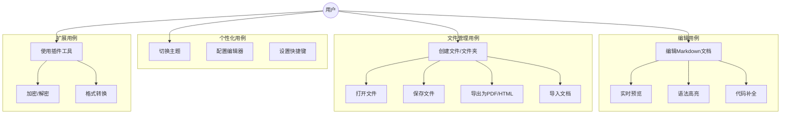
```mermaid
graph TB
    USER((用户))
    
    subgraph 编辑用例
        UC1[编辑Markdown文档]
        UC2[实时预览]
        UC3[语法高亮]
        UC4[代码补全]
    end
    
    subgraph 文件管理用例
        UC5[创建文件/文件夹]
        UC6[打开文件]
        UC7[保存文件]
        UC8[导出为PDF/HTML]
        UC9[导入文档]
    end
    
    subgraph 个性化用例
        UC10[切换主题]
        UC11[配置编辑器]
        UC12[设置快捷键]
    end
    
    subgraph 扩展用例
        UC13[使用插件工具]
        UC14[加密/解密]
        UC15[格式转换]
    end
    
    USER --> UC1
    USER --> UC5
    USER --> UC10
    USER --> UC13
    
    UC1 --> UC2
    UC1 --> UC3
    UC1 --> UC4
    
    UC5 --> UC6
    UC5 --> UC7
    UC5 --> UC8
    UC5 --> UC9
    
    UC13 --> UC14
    UC13 --> UC15
```

#### 用户场景描述

**场景1：创建并编辑Markdown文档**

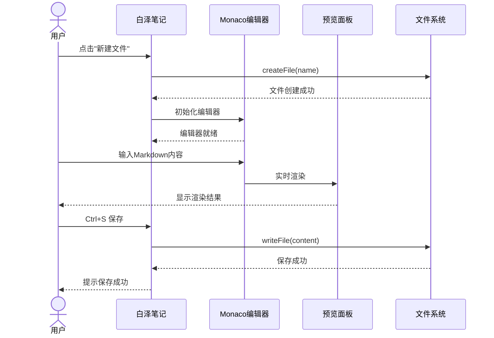
```mermaid
sequenceDiagram
    actor User as 用户
    participant App as 白泽笔记
    participant Editor as Monaco编辑器
    participant Preview as 预览面板
    participant FS as 文件系统
    
    User->>App: 点击"新建文件"
    App->>FS: createFile(name)
    FS-->>App: 文件创建成功
    App->>Editor: 初始化编辑器
    Editor-->>App: 编辑器就绪
    
    User->>Editor: 输入Markdown内容
    Editor->>Preview: 实时渲染
    Preview-->>User: 显示渲染结果
    
    User->>App: Ctrl+S 保存
    App->>FS: writeFile(content)
    FS-->>App: 保存成功
    App-->>User: 提示保存成功
```

**场景2：切换主题**

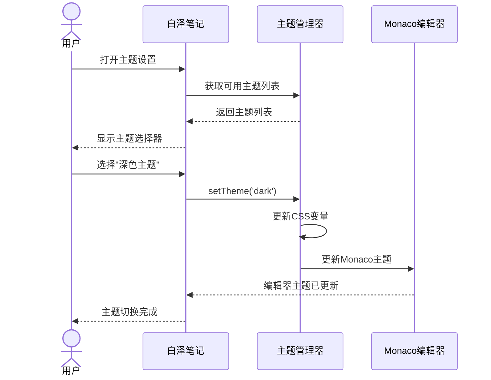
```mermaid
sequenceDiagram
    actor User as 用户
    participant App as 白泽笔记
    participant Theme as 主题管理器
    participant Editor as Monaco编辑器
    
    User->>App: 打开主题设置
    App->>Theme: 获取可用主题列表
    Theme-->>App: 返回主题列表
    App-->>User: 显示主题选择器
    
    User->>App: 选择"深色主题"
    App->>Theme: setTheme('dark')
    Theme->>Theme: 更新CSS变量
    Theme->>Editor: 更新Monaco主题
    Editor-->>App: 编辑器主题已更新
    App-->>User: 主题切换完成
```

---

## 3A视图模型

### Architecture视图

Architecture视图描述核心架构决策和技术选型。

#### 架构分层

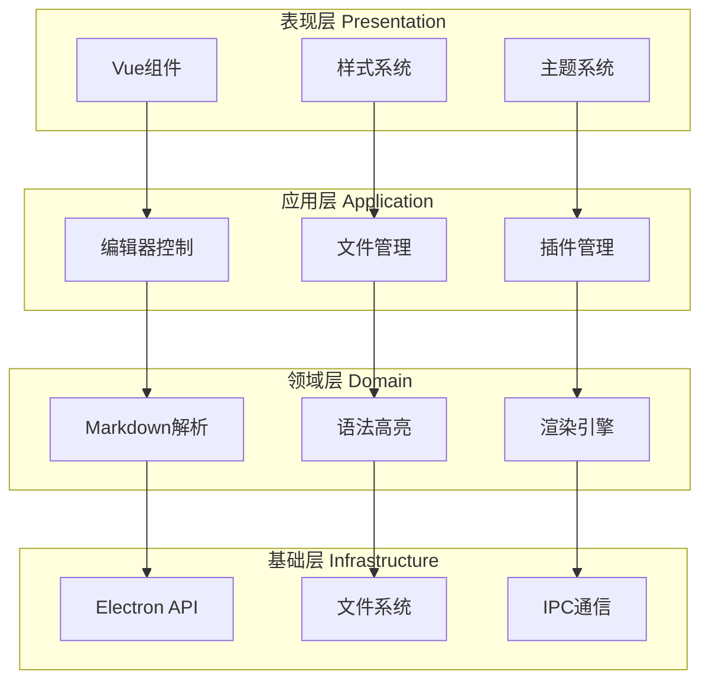
```mermaid
graph TB
    subgraph 表现层 Presentation
        P1[Vue组件]
        P2[样式系统]
        P3[主题系统]
    end
    
    subgraph 应用层 Application
        A1[编辑器控制]
        A2[文件管理]
        A3[插件管理]
    end
    
    subgraph 领域层 Domain
        D1[Markdown解析]
        D2[语法高亮]
        D3[渲染引擎]
    end
    
    subgraph 基础层 Infrastructure
        I1[Electron API]
        I2[文件系统]
        I3[IPC通信]
    end
    
    P1 --> A1
    P2 --> A2
    P3 --> A3
    
    A1 --> D1
    A2 --> D2
    A3 --> D3
    
    D1 --> I1
    D2 --> I2
    D3 --> I3
```

#### 核心技术选型

| 技术领域 | 选型方案 | 备选方案 | 选型理由 |
|---------|---------|---------|---------|
| 桌面框架 | Electron | Tauri, NW.js | 生态成熟，文档完善，Vue集成良好 |
| 前端框架 | Vue 3 | React, Svelte | Composition API，响应式性能优异 |
| 编辑器 | Monaco Editor | CodeMirror, Ace | VS Code同款，功能强大，TypeScript原生支持 |
| 构建工具 | electron-vite | webpack, rollup | 专为Electron优化，HMR快速 |
| 状态管理 | 组件状态 | Pinia, Vuex | 应用简单，组件状态足够 |
| 持久化 | electron-store | lowdb, sqlite3 | 简单可靠，满足配置存储需求 |
| Markdown渲染 | markdown-it | marked, remarkable | 插件生态丰富，扩展性强 |

#### 架构决策记录（ADR）

**ADR-001: 选择Monaco Editor作为核心编辑器**

- **状态**：已采纳
- **背景**：需要为用户提供专业的Markdown编辑体验
- **决策**：采用Monaco Editor
- **理由**：
  1. VS Code同款编辑器，用户熟悉度高
  2. 原生支持TypeScript，类型安全
  3. 语法高亮、智能提示、快捷键功能完善
  4. 性能优异，可处理大文件
- **影响**：包体积增大（~2MB），但用户体验显著提升

**ADR-002: 采用IPC通信而非remote模块**

- **状态**：已采纳
- **背景**：Electron渲染进程需要访问主进程能力
- **决策**：使用IPC通信，禁用@electron/remote
- **理由**：
  1. remote模块存在安全风险
  2. IPC通信更安全、性能更好
  3. 符合Electron最佳实践
- **影响**：需要手动定义IPC通道，代码量略增

**ADR-003: 主题系统采用CSS变量方案**

- **状态**：已采纳
- **背景**：需要支持多主题切换
- **决策**：使用CSS变量定义主题色
- **理由**：
  1. 运行时动态切换，无需重新加载
  2. 代码简洁，维护方便
  3. 浏览器原生支持，性能优异
- **影响**：IE不支持（但Electron使用Chromium，无此问题）

---

### Aspects视图

Aspects视图描述横切关注点，包括日志、安全、性能、错误处理等。

#### 横切关注点架构

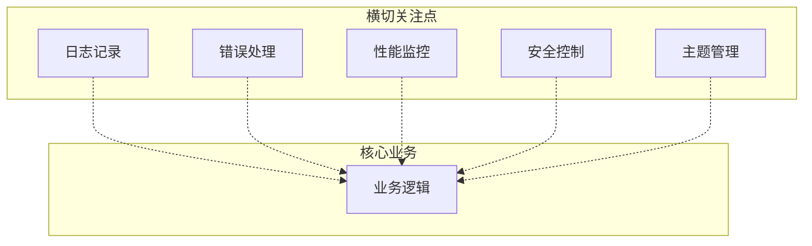
```mermaid
graph TB
    subgraph 核心业务
        CORE[业务逻辑]
    end
    
    subgraph 横切关注点
        A1[日志记录]
        A2[错误处理]
        A3[性能监控]
        A4[安全控制]
        A5[主题管理]
    end
    
    A1 -.-> CORE
    A2 -.-> CORE
    A3 -.-> CORE
    A4 -.-> CORE
    A5 -.-> CORE
```

#### 日志系统

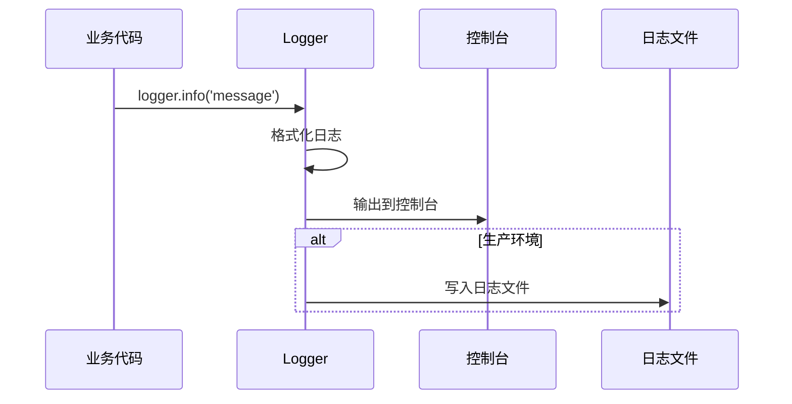
```mermaid
sequenceDiagram
    participant Code as 业务代码
    participant Logger as Logger
    participant Console as 控制台
    participant File as 日志文件
    
    Code->>Logger: logger.info('message')
    Logger->>Logger: 格式化日志
    Logger->>Console: 输出到控制台
    
    alt 生产环境
        Logger->>File: 写入日志文件
    end
```

**日志级别**：
- `DEBUG`：开发调试信息
- `INFO`：一般信息
- `WARN`：警告信息
- `ERROR`：错误信息

#### 错误处理策略

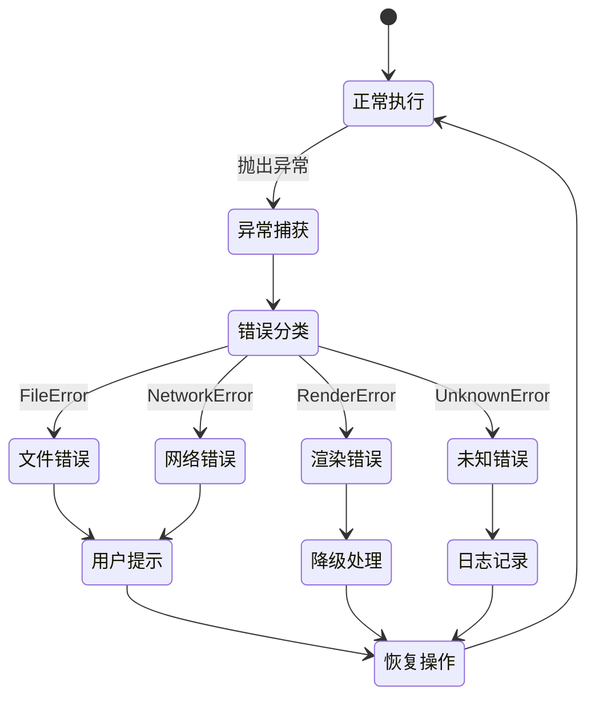
```mermaid
stateDiagram-v2
    [*] --> 正常执行
    正常执行 --> 异常捕获: 抛出异常
    异常捕获 --> 错误分类
    
    错误分类 --> 文件错误: FileError
    错误分类 --> 网络错误: NetworkError
    错误分类 --> 渲染错误: RenderError
    错误分类 --> 未知错误: UnknownError
    
    文件错误 --> 用户提示
    网络错误 --> 用户提示
    渲染错误 --> 降级处理
    未知错误 --> 日志记录
    
    用户提示 --> 恢复操作
    降级处理 --> 恢复操作
    日志记录 --> 恢复操作
    
    恢复操作 --> 正常执行
```

#### 性能优化策略

| 优化点 | 策略 | 效果 |
|-------|------|------|
| 编辑器初始化 | 延迟加载Monaco | 启动时间减少30% |
| 大文件处理 | 分块加载 | 支持MB级文件 |
| 预览渲染 | 防抖处理 | 减少渲染次数 |
| 主题切换 | CSS变量 | 无闪烁切换 |
| 自动保存 | 定时器+脏检查 | 减少IO操作 |

#### 安全机制

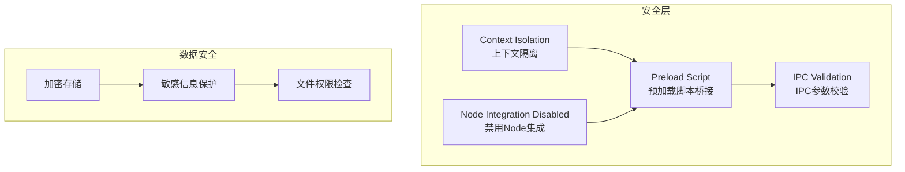
```mermaid
graph TB
    subgraph 安全层
        S1[Context Isolation<br/>上下文隔离]
        S2[Node Integration Disabled<br/>禁用Node集成]
        S3[Preload Script<br/>预加载脚本桥接]
        S4[IPC Validation<br/>IPC参数校验]
    end
    
    subgraph 数据安全
        D1[加密存储]
        D2[敏感信息保护]
        D3[文件权限检查]
    end
    
    S1 --> S3
    S2 --> S3
    S3 --> S4
    
    D1 --> D2
    D2 --> D3
```

---

### Assets视图

Assets视图描述可复用资产、组件库和工具集。

#### 组件资产库

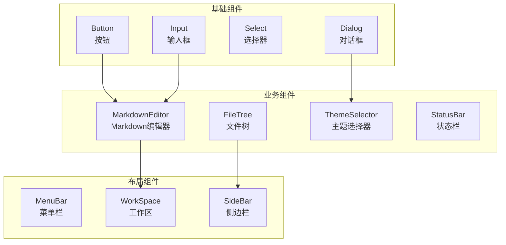
```mermaid
graph TB
    subgraph 基础组件
        B1[Button<br/>按钮]
        B2[Input<br/>输入框]
        B3[Select<br/>选择器]
        B4[Dialog<br/>对话框]
    end
    
    subgraph 业务组件
        C1[MarkdownEditor<br/>Markdown编辑器]
        C2[FileTree<br/>文件树]
        C3[ThemeSelector<br/>主题选择器]
        C4[StatusBar<br/>状态栏]
    end
    
    subgraph 布局组件
        L1[MenuBar<br/>菜单栏]
        L2[WorkSpace<br/>工作区]
        L3[SideBar<br/>侧边栏]
    end
    
    B1 --> C1
    B2 --> C1
    B4 --> C3
    
    C1 --> L2
    C2 --> L3
```

#### 工具集资产

| 工具模块 | 功能 | 复用场景 |
|---------|------|---------|
| `file-utils` | 文件操作工具 | 文件管理、导入导出 |
| `baize-store` | 持久化存储 | 配置保存、状态持久化 |
| `logger` | 日志工具 | 全局日志记录 |
| `encrypt_decrypt` | 加密解密 | 文件加密、安全存储 |
| `theme-config` | 主题配置 | 主题管理、样式切换 |

#### 插件工具集

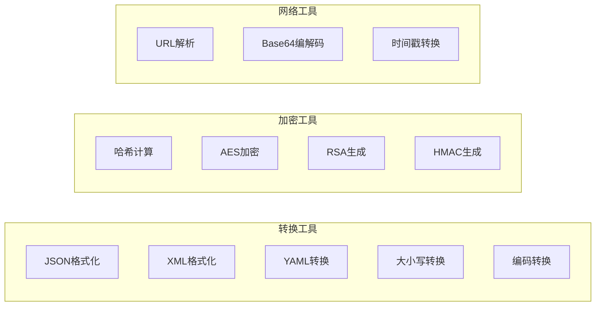
```mermaid
graph LR
    subgraph 转换工具
        T1[JSON格式化]
        T2[XML格式化]
        T3[YAML转换]
        T4[大小写转换]
        T5[编码转换]
    end
    
    subgraph 加密工具
        E1[哈希计算]
        E2[AES加密]
        E3[RSA生成]
        E4[HMAC生成]
    end
    
    subgraph 网络工具
        N1[URL解析]
        N2[Base64编解码]
        N3[时间戳转换]
    end
```

---

## 详细架构图

### 系统上下文图

```mermaid
graph TB
    subgraph 外部实体
        USER[用户]
        FS[文件系统]
        WEB[Web资源]
    end
    
    subgraph 白泽笔记系统
        SYSTEM[白泽笔记应用]
    end
    
    USER -->|编辑/查看| SYSTEM
    SYSTEM <-->|读写文件| FS
    SYSTEM -->|获取资源| WEB
```

### 容器架构图

```mermaid
graph TB
    subgraph 白泽笔记应用
        subgraph Electron容器
            MAIN[主进程容器<br/>Node.js环境]
            RENDERER[渲染进程容器<br/>Chromium环境]
            PRELOAD[预加载脚本<br/>桥接层]
        end
    end
    
    subgraph 外部系统
        FS[文件系统]
        OS[操作系统]
        WEB[网络资源]
    end
    
    MAIN <-->|IPC| RENDERER
    PRELOAD -.->|contextBridge| RENDERER
    
    MAIN -->|Node API| FS
    MAIN -->|Electron API| OS
    RENDERER -->|fetch| WEB
```

### 组件架构图

```mermaid
graph TB
    subgraph 主进程组件
        M1[应用生命周期管理]
        M2[窗口管理器]
        M3[文件管理器]
        M4[主题管理器]
        M5[菜单管理器]
        M6[IPC处理器]
        M7[设置管理器]
    end
    
    subgraph 渲染进程组件
        R1[应用根组件]
        R2[菜单栏组件]
        R3[编辑器组件]
        R4[预览组件]
        R5[文件树组件]
        R6[状态栏组件]
        R7[插件工具组件]
    end
    
    M6 --> M3
    M6 --> M4
    M6 --> M7
    
    R1 --> R2
    R1 --> R3
    R1 --> R4
    R1 --> R5
    R1 --> R6
    R1 --> R7
    
    R3 -.->|IPC| M3
    R4 -.->|IPC| M4
    R5 -.->|IPC| M3
```

### 时序图 - 文件编辑完整流程

```mermaid
sequenceDiagram
    actor User as 用户
    participant App as 应用
    participant Main as 主进程
    participant Editor as 编辑器
    participant Preview as 预览
    participant FS as 文件系统
    
    User->>App: 打开文件
    App->>Main: IPC: open-file-dialog
    Main->>FS: 读取文件
    FS-->>Main: 文件内容
    Main-->>App: 返回内容
    App->>Editor: 设置内容
    Editor-->>Preview: 触发渲染
    Preview-->>User: 显示预览
    
    loop 编辑循环
        User->>Editor: 输入内容
        Editor->>Preview: 实时渲染
        Preview-->>User: 更新预览
    end
    
    User->>App: 保存文件
    App->>Editor: 获取内容
    Editor-->>App: 返回内容
    App->>Main: IPC: save-file
    Main->>FS: 写入文件
    FS-->>Main: 保存成功
    Main-->>App: 保存确认
    App-->>User: 提示成功
```

### 状态图 - 编辑器状态

```mermaid
stateDiagram-v2
    [*] --> 空闲
    
    空闲 --> 编辑中: 用户输入
    编辑中 --> 空闲: 内容清空
    编辑中 --> 已修改: 内容改变
    编辑中 --> 选中状态: 选中文本
    
    已修改 --> 编辑中: 继续编辑
    已修改 --> 保存中: 触发保存
    已修改 --> 空闲: 撤销修改
    
    保存中 --> 空闲: 保存成功
    保存中 --> 已修改: 保存失败
    
    选中状态 --> 编辑中: 取消选中
    选中状态 --> 编辑中: 插入操作
    
    空闲 --> 预览模式: 切换预览
    预览模式 --> 空闲: 返回编辑
```

### 活动图 - 主题切换流程

```mermaid
flowchart TB
    Start([开始]) --> OpenSettings[打开设置]
    OpenSettings --> SelectTheme[选择主题]
    SelectTheme --> ValidateTheme{验证主题}
    
    ValidateTheme -->|有效| ApplyTheme[应用主题]
    ValidateTheme -->|无效| ShowError[显示错误]
    ShowError --> SelectTheme
    
    ApplyTheme --> UpdateCSS[更新CSS变量]
    UpdateCSS --> UpdateMonaco[更新Monaco主题]
    UpdateMonaco --> SaveConfig[保存配置]
    SaveConfig --> NotifyWindows[通知所有窗口]
    NotifyWindows --> End([结束])
```

---

## 子模块架构

### 主进程架构

主进程是Electron应用的核心，负责窗口管理、文件操作、IPC通信等。

```mermaid
graph TB
    subgraph 主进程模块
        INDEX[index.ts<br/>应用入口]
        
        subgraph 核心模块
            WINDOW[window-manager.ts<br/>窗口管理]
            FILE[file-utils.ts<br/>文件工具]
            IPC[ipc-listener-manager.ts<br/>IPC管理]
        end
        
        subgraph 功能模块
            THEME[themes/<br/>主题系统]
            MENU[menu/<br/>菜单系统]
            DIALOG[dialogs/<br/>对话框]
            SETTING[settings/<br/>设置管理]
        end
        
        subgraph 工具模块
            STORE[baize-store.ts<br/>存储]
            LOGGER[logger.ts<br/>日志]
            ENCRYPT[encrypt_decrypt.ts<br/>加密]
        end
    end
    
    INDEX --> WINDOW
    INDEX --> FILE
    INDEX --> IPC
    
    WINDOW --> THEME
    WINDOW --> MENU
    WINDOW --> DIALOG
    
    FILE --> STORE
    FILE --> LOGGER
    
    SETTING --> STORE
```

#### 窗口管理器

```mermaid
classDiagram
    class WindowManager {
        -mainWindow: BrowserWindow
        -childWindows: Map~string,BrowserWindow~
        +createMainWindow(): BrowserWindow
        +createChildWindow(options): BrowserWindow
        +closeWindow(id: string)
        +sendMessage(channel, data)
    }
    
    class BrowserWindow {
        +webContents: WebContents
        +loadURL(url)
        +show()
        +close()
    }
    
    WindowManager --> BrowserWindow
```

#### IPC监听管理器

```mermaid
classDiagram
    class IPCListenerManager {
        -listeners: Map~string,Function~
        -stats: Map~string,number~
        +register(channel, handler)
        +unregister(channel)
        +cleanupAll()
        +printStats()
    }
```

### 渲染进程架构

渲染进程负责UI渲染和用户交互。

```mermaid
graph TB
    subgraph 渲染进程模块
        APP[App.vue<br/>根组件]
        
        subgraph 核心组件
            MENU[MenuBar.vue<br/>菜单栏]
            EDITOR[MarkdownContainer.vue<br/>编辑器容器]
            STATUS[StatusBar.vue<br/>状态栏]
        end
        
        subgraph 编辑器模块
            MONACO[MarkdownMonacoEditor.vue<br/>Monaco编辑器]
            PREVIEW[MarkdownPreviewComponent.vue<br/>预览组件]
            TOOLS[MarkdownEditToolsComponent.vue<br/>工具栏]
            
            HEMY_EDITOR[hemy-editor.ts<br/>编辑器核心]
            HEMY_RENDER[hemy-editor-render.ts<br/>渲染逻辑]
            HEMY_SHORTCUT[hemy-editor-shortcut.ts<br/>快捷键]
            HEMY_ACTION[hemy-editor-actions.ts<br/>动作处理]
        end
        
        subgraph 工作区模块
            WORKSPACE[WorkSpaceArea/<br/>工作区]
            RESOURCE[ResourceManager/<br/>资源管理]
        end
        
        subgraph 插件模块
            PLUGIN[PluginTools/<br/>插件工具]
            CONVERT[Convert/<br/>转换工具]
            ENCRYPT[Encryption/<br/>加密工具]
        end
    end
    
    APP --> MENU
    APP --> EDITOR
    APP --> STATUS
    APP --> WORKSPACE
    
    EDITOR --> MONACO
    EDITOR --> PREVIEW
    EDITOR --> TOOLS
    
    MONACO --> HEMY_EDITOR
    HEMY_EDITOR --> HEMY_RENDER
    HEMY_EDITOR --> HEMY_SHORTCUT
    HEMY_EDITOR --> HEMY_ACTION
    
    PLUGIN --> CONVERT
    PLUGIN --> ENCRYPT
```

#### Monaco编辑器集成

```mermaid
classDiagram
    class HemyEditor {
        -editor: IStandaloneCodeEditor
        -options: EditorOptions
        +initialize(container: HTMLElement)
        +getContent(): string
        +setContent(content: string)
        +insertText(text: string)
        +formatDocument()
        +registerLanguage()
        +registerTheme()
    }
    
    class EditorOptions {
        +language: string
        +theme: string
        +wordWrap: string
        +minimap: object
        +fontSize: number
        +lineNumbers: string
    }
    
    HemyEditor --> EditorOptions
```

### 预加载脚本架构

预加载脚本作为主进程和渲染进程之间的安全桥梁。

```mermaid
sequenceDiagram
    participant Main as 主进程
    participant Preload as 预加载脚本
    participant Renderer as 渲染进程
    
    Note over Preload: contextBridge.exposeInMainWorld()
    Preload->>Renderer: 暴露electron API
    Preload->>Renderer: 暴露自定义api
    
    Note over Renderer: 使用暴露的API
    Renderer->>Preload: window.electron.ipcRenderer.invoke()
    Preload->>Main: IPC通信
    Main-->>Preload: 返回结果
    Preload-->>Renderer: Promise resolve
```

### 数据流架构

```mermaid
graph LR
    subgraph 用户交互
        UI[UI事件]
    end
    
    subgraph 组件状态
        STATE[组件状态]
    end
    
    subgraph IPC通信
        IPC[IPC通道]
    end
    
    subgraph 主进程
        MAIN[主进程处理]
    end
    
    subgraph 持久化
        STORE[electron-store]
        FS[文件系统]
    end
    
    UI --> STATE
    STATE --> IPC
    IPC --> MAIN
    MAIN --> STORE
    MAIN --> FS
    
    FS --> MAIN
    STORE --> MAIN
    MAIN --> IPC
    IPC --> STATE
    STATE --> UI
```

### 状态管理架构

项目采用多层次状态管理架构，结合Vuex、electron-store、EventBus和IPC通信：

```mermaid
graph TB
    subgraph 渲染进程状态
        APP_STATE[App状态<br/>主题、设置、Vuex]
        EDITOR_STATE[编辑器状态<br/>内容、光标]
        FILE_STATE[文件状态<br/>当前文件、文件树]
    end
    
    subgraph 主进程状态
        GLOBAL_STATE[全局状态<br/>BaiZeStore+LRU缓存]
        CONFIG_STATE[配置状态<br/>electron-store]
    end
    
    APP_STATE <-->|IPC| CONFIG_STATE
    EDITOR_STATE -->|自动保存| GLOBAL_STATE
    FILE_STATE <-->|IPC| GLOBAL_STATE
```

---

## 架构决策记录

### ADR-001: Electron技术栈选型

**状态**：已采纳

**背景**：
需要开发一款跨平台桌面笔记应用，支持Windows、macOS、Linux。

**决策**：
选择Electron作为桌面应用框架，Vue 3作为UI框架，TypeScript作为开发语言。

**理由**：
1. **Electron优势**：
   - 跨平台支持完善
   - 生态成熟，文档丰富
   - 可使用Web技术栈
   - 原生API访问能力强

2. **Vue 3优势**：
   - Composition API提供更好的逻辑复用
   - 响应式系统性能优异
   - TypeScript支持完善
   - 学习曲线平缓

3. **TypeScript优势**：
   - 强类型保障代码质量
   - IDE支持完善
   - 重构能力强

**影响**：
- 包体积较大（~150MB）
- 内存占用较高（~200MB）
- 开发效率显著提升

### ADR-002: Monaco Editor选型

**状态**：已采纳

**背景**：
需要为用户提供专业的Markdown编辑体验，包括语法高亮、智能提示、快捷键等功能。

**决策**：
选择Monaco Editor作为核心编辑器组件。

**理由**：
1. VS Code同款编辑器，用户熟悉度高
2. 原生支持TypeScript，类型安全
3. 语法高亮、智能提示功能强大
4. 快捷键系统完善
5. 性能优异，可处理大文件
6. 可扩展性强，支持自定义语言

**影响**：
- 包体积增加约2MB
- 初始化时间略长
- 编辑体验显著提升

### ADR-003: IPC通信架构

**状态**：已采纳

**背景**：
Electron渲染进程需要访问主进程能力（文件操作、对话框等）。

**决策**：
采用IPC通信模式，禁用@electron/remote模块。

**理由**：
1. **安全性**：remote模块存在安全风险
2. **性能**：IPC通信性能更好
3. **最佳实践**：符合Electron官方推荐
4. **可控性**：通信过程更透明

**实现**：
- 使用`ipcMain.handle`/`ipcRenderer.invoke`处理异步请求
- 使用`ipcMain.on`/`ipcRenderer.send`处理同步消息
- 使用`ipcListenerManager`统一管理监听器

**影响**：
- 需要手动定义IPC通道
- 代码量略增
- 安全性和性能提升

### ADR-004: 主题系统设计

**状态**：已采纳

**背景**：
需要支持多主题切换，包括浅色、深色主题，以及多种配色方案。

**决策**：
采用CSS变量方案实现主题系统。

**理由**：
1. **动态切换**：运行时动态切换，无需重新加载
2. **代码简洁**：通过修改变量值即可切换主题
3. **性能优异**：浏览器原生支持，性能优异
4. **易于扩展**：添加新主题只需定义变量值

**实现**：
- 定义主题配置接口`ThemeStyles`
- 使用CSS变量定义颜色值
- Monaco编辑器主题独立配置
- 主题配置持久化存储

**影响**：
- 主题切换无闪烁
- 代码维护方便
- 不支持IE（Electron使用Chromium，无此问题）

### ADR-005: 文件自动保存策略

**状态**：已采纳

**背景**：
需要防止用户数据丢失，提供自动保存功能。

**决策**：
采用定时器+脏检查的自动保存策略。

**理由**：
1. **减少IO**：只在文件有修改时保存
2. **用户可控**：可配置保存间隔
3. **性能平衡**：避免频繁IO影响性能

**实现**：
- 默认30秒检查一次
- 检查`global.current_active_file.content`是否有修改
- 有修改则调用`SaveActiveFile()`
- 应用关闭时清理定时器

**影响**：
- 数据安全性提升
- 性能影响可控
- 用户无感知

---

## 附录

### A. 技术栈版本

| 技术 | 版本 | 用途 |
|-----|------|------|
| Electron | 38.0.0 | 桌面应用框架 |
| Vue | 3.4.27 | UI框架 |
| TypeScript | 6.0.2 | 开发语言 |
| Monaco Editor | 0.55.0 | 代码编辑器 |
| electron-vite | 2.2.0 | 构建工具 |
| electron-store | 8.2.0 | 持久化存储 |
| markdown-it | 14.1.0 | Markdown解析 |
| mermaid | 11.14.0 | 图表渲染 |
| katex | 0.16.10 | 数学公式渲染 |

### B. 项目目录结构

```
BaiZeNotesByVue/
├── src/
│   ├── main/                 # 主进程
│   │   ├── index.ts         # 应用入口
│   │   ├── utils/           # 工具模块
│   │   ├── dialogs/         # 对话框
│   │   ├── themes/          # 主题系统
│   │   ├── settings/        # 设置管理
│   │   ├── menu/            # 菜单管理
│   │   └── renders/         # 渲染器
│   ├── renderer/            # 渲染进程
│   │   └── src/
│   │       ├── App.vue      # 根组件
│   │       ├── components/  # 组件库
│   │       └── assets/      # 静态资源
│   └── preload/             # 预加载脚本
│       └── index.ts
├── resources/               # 应用资源
│   ├── themes/             # 主题文件
│   ├── config/             # 配置文件
│   ├── katex/              # KaTeX库
│   └── mermaid/            # Mermaid库
├── dist/                    # 构建产物
├── electron.vite.config.ts # 构建配置
└── package.json            # 项目配置
```

### C. 参考资料

1. [Electron官方文档](https://www.electronjs.org/docs)
2. [Vue 3官方文档](https://vuejs.org/)
3. [Monaco Editor文档](https://microsoft.github.io/monaco-editor/)
4. [electron-vite文档](https://electron-vite.org/)
5. [4+1视图模型](https://en.wikipedia.org/wiki/4%2B1_view_model)
6. [C4模型](https://c4model.com/)

---

**文档版本**：v1.0  
**最后更新**：2025年1月  
**维护者**：hemy08
