# 白泽笔记 - 架构文档

## 1. 架构概述

### 1.1 系统架构定义
白泽笔记采用Electron多进程架构，结合Vue 3响应式框架，构建了一个现代化的桌面Markdown编辑器应用。系统架构遵循关注点分离原则，将应用分为三个主要层次：主进程层、渲染进程层和预加载脚本层。

### 1.2 架构目标
- **高性能**: 利用Electron的多进程特性，确保UI响应和数据处理的性能
- **可扩展**: 模块化设计，支持插件和模板扩展
- **可维护**: 清晰的架构分层，便于理解和维护
- **安全性**: 通过预加载脚本和上下文隔离，确保应用安全
- **跨平台**: 基于Electron，实现一次开发，多平台运行

### 1.3 架构原则
- **单一职责原则**: 每个模块专注于单一功能
- **开闭原则**: 对扩展开放，对修改关闭
- **依赖倒置原则**: 依赖抽象而非具体实现
- **接口隔离原则**: 使用小而专一的接口
- **最少知识原则**: 模块间最小化依赖

## 2. 系统架构

### 2.1 整体架构图

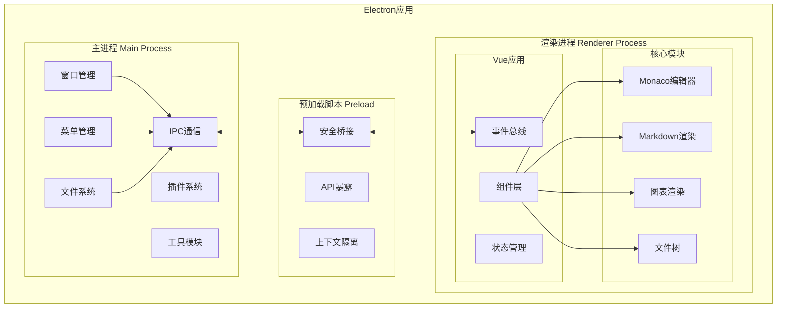
```mermaid
graph TB
    subgraph "Electron应用"
        subgraph "主进程 Main Process"
            A1[窗口管理]
            A2[菜单管理]
            A3[文件系统]
            A4[IPC通信]
            A5[插件系统]
            A6[工具模块]
        end

        subgraph "预加载脚本 Preload"
            B1[安全桥接]
            B2[API暴露]
            B3[上下文隔离]
        end

        subgraph "渲染进程 Renderer Process"
            subgraph "Vue应用"
                C1[组件层]
                C2[状态管理]
                C3[事件总线]
            end

            subgraph "核心模块"
                D1[Monaco编辑器]
                D2[Markdown渲染]
                D3[图表渲染]
                D4[文件树]
            end
        end
    end

    A4 <--> B1
    B1 <--> C3
    A1 --> A4
    A2 --> A4
    A3 --> A4
    C1 --> D1
    C1 --> D2
    C1 --> D3
    C1 --> D4
```

### 2.2 进程架构

#### 2.2.1 主进程 (Main Process)
**职责**:
- 创建和管理应用窗口
- 管理应用生命周期
- 处理原生菜单
- 文件系统操作
- IPC通信协调
- 插件加载和管理

**核心模块**:
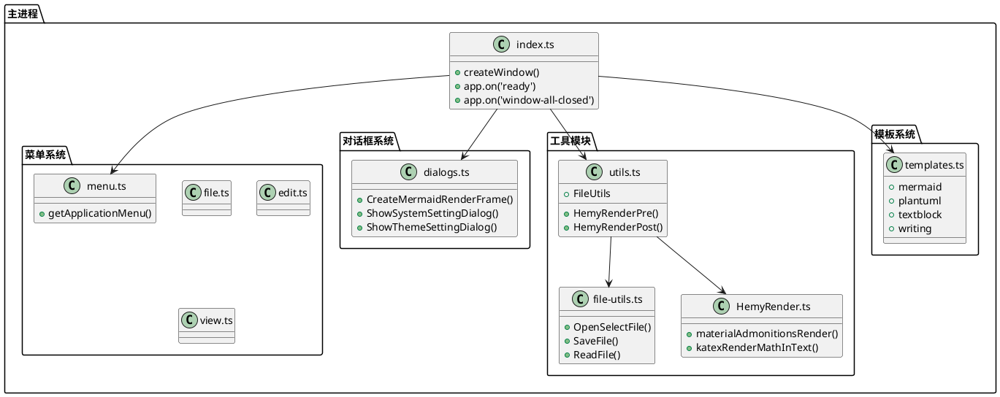
```plantuml
@startuml
package "主进程" {
    class "index.ts" as Main {
        + createWindow()
        + app.on('ready')
        + app.on('window-all-closed')
    }

    package "菜单系统" {
        class "menu.ts" as Menu {
            + getApplicationMenu()
        }
        class "file.ts" as FileMenu
        class "edit.ts" as EditMenu
        class "view.ts" as ViewMenu
    }

    package "对话框系统" {
        class "dialogs.ts" as Dialogs {
            + CreateMermaidRenderFrame()
            + ShowSystemSettingDialog()
            + ShowThemeSettingDialog()
        }
    }

    package "工具模块" {
        class "utils.ts" as Utils {
            + FileUtils
            + HemyRenderPre()
            + HemyRenderPost()
        }
        class "file-utils.ts" as FileUtils {
            + OpenSelectFile()
            + SaveFile()
            + ReadFile()
        }
        class "HemyRender.ts" as Render {
            + materialAdmonitionsRender()
            + katexRenderMathInText()
        }
    }

    package "模板系统" {
        class "templates.ts" as Templates {
            + mermaid
            + plantuml
            + textblock
            + writing
        }
    }
}

Main --> Menu
Main --> Dialogs
Main --> Utils
Utils --> FileUtils
Utils --> Render
Main --> Templates
@enduml
```

#### 2.2.2 渲染进程 (Renderer Process)
**职责**:
- 渲染用户界面
- 处理用户交互
- 编辑器功能实现
- Markdown渲染
- 图表渲染

**核心模块**:
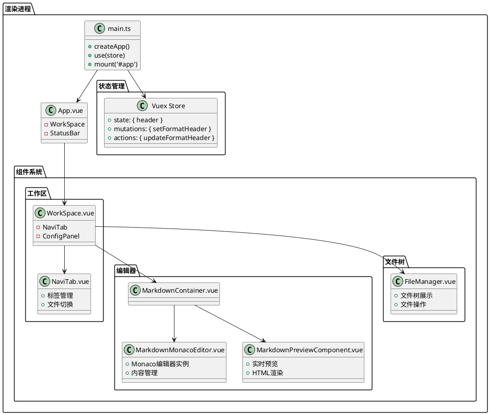
```plantuml
@startuml
package "渲染进程" {
    class "main.ts" as Main {
        + createApp()
        + use(store)
        + mount('#app')
    }

    class "App.vue" as App {
        - WorkSpace
        - StatusBar
    }

    package "组件系统" {
        package "工作区" {
            class "WorkSpace.vue" as WorkSpace {
                - NaviTab
                - ConfigPanel
            }
            class "NaviTab.vue" as NaviTab {
                + 标签管理
                + 文件切换
            }
        }

        package "编辑器" {
            class "MarkdownContainer.vue" as Container
            class "MarkdownMonacoEditor.vue" as Editor {
                + Monaco编辑器实例
                + 内容管理
            }
            class "MarkdownPreviewComponent.vue" as Preview {
                + 实时预览
                + HTML渲染
            }
        }

        package "文件树" {
            class "FileManager.vue" as FileManager {
                + 文件树展示
                + 文件操作
            }
        }
    }

    package "状态管理" {
        class "Vuex Store" as Store {
            + state: { header }
            + mutations: { setFormatHeader }
            + actions: { updateFormatHeader }
        }
    }
}

Main --> App
App --> WorkSpace
WorkSpace --> NaviTab
WorkSpace --> Container
Container --> Editor
Container --> Preview
WorkSpace --> FileManager
Main --> Store
@enduml
```

#### 2.2.3 预加载脚本 (Preload)
**职责**:
- 提供安全的API桥接
- 实现上下文隔离
- 暴露有限的Node.js功能

**实现**:
```javascript
// 预加载脚本示例
const { contextBridge, ipcRenderer } = require('electron')

contextBridge.exposeInMainWorld('electron', {
  ipcRenderer: {
    send: (channel, data) => ipcRenderer.send(channel, data),
    on: (channel, func) => ipcRenderer.on(channel, func)
  }
})
```

### 2.3 数据流架构

#### 2.3.1 整体数据流

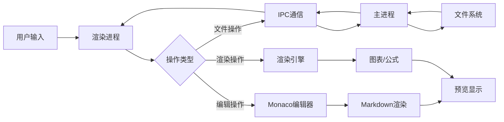
```mermaid
graph LR
    A[用户输入] --> B[渲染进程]
    B --> C{操作类型}

    C -->|文件操作| D[IPC通信]
    D --> E[主进程]
    E --> F[文件系统]
    F --> E
    E --> D
    D --> B

    C -->|编辑操作| G[Monaco编辑器]
    G --> H[Markdown渲染]
    H --> I[预览显示]

    C -->|渲染操作| J[渲染引擎]
    J --> K[图表/公式]
    K --> I
```

#### 2.3.2 文件操作数据流

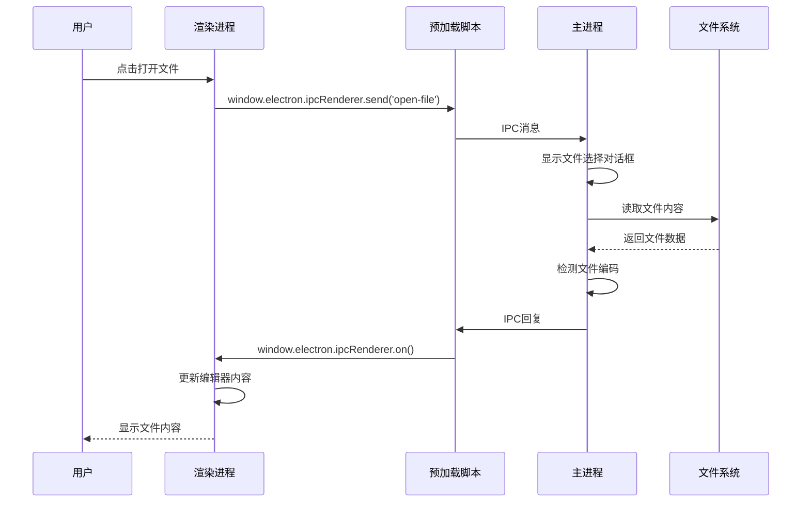
```mermaid
sequenceDiagram
    participant U as 用户
    participant R as 渲染进程
    participant P as 预加载脚本
    participant M as 主进程
    participant F as 文件系统

    U->>R: 点击打开文件
    R->>P: window.electron.ipcRenderer.send('open-file')
    P->>M: IPC消息
    M->>M: 显示文件选择对话框
    M->>F: 读取文件内容
    F-->>M: 返回文件数据
    M->>M: 检测文件编码
    M->>P: IPC回复
    P->>R: window.electron.ipcRenderer.on()
    R->>R: 更新编辑器内容
    R-->>U: 显示文件内容
```

#### 2.3.3 Markdown渲染数据流

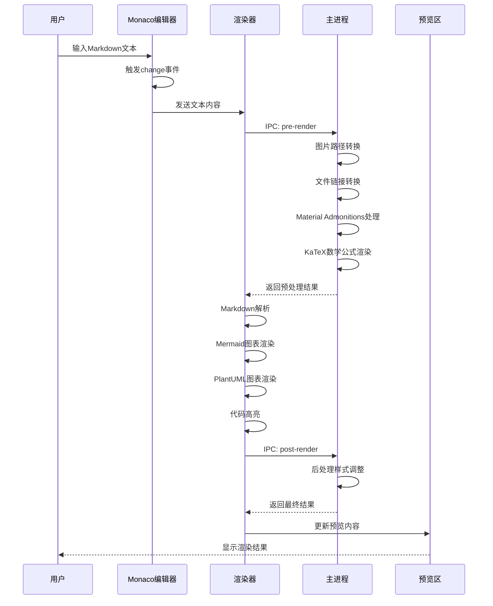
```mermaid
sequenceDiagram
    participant U as 用户
    participant E as Monaco编辑器
    participant R as 渲染器
    participant M as 主进程
    participant P as 预览区

    U->>E: 输入Markdown文本
    E->>E: 触发change事件
    E->>R: 发送文本内容

    R->>M: IPC: pre-render
    M->>M: 图片路径转换
    M->>M: 文件链接转换
    M->>M: Material Admonitions处理
    M->>M: KaTeX数学公式渲染
    M-->>R: 返回预处理结果

    R->>R: Markdown解析
    R->>R: Mermaid图表渲染
    R->>R: PlantUML图表渲染
    R->>R: 代码高亮

    R->>M: IPC: post-render
    M->>M: 后处理样式调整
    M-->>R: 返回最终结果

    R->>P: 更新预览内容
    P-->>U: 显示渲染结果
```

## 3. 模块架构

### 3.1 主进程模块架构

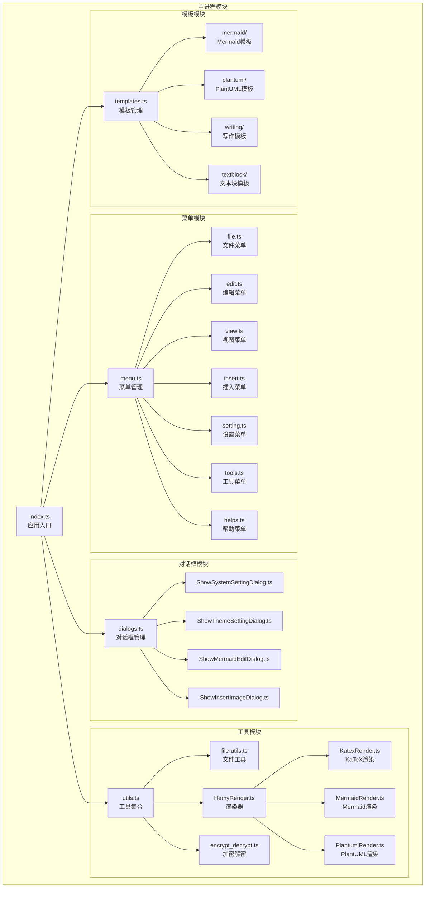
```mermaid
graph TB
    subgraph "主进程模块"
        A[index.ts<br/>应用入口]

        subgraph "菜单模块"
            B1[menu.ts<br/>菜单管理]
            B2[file.ts<br/>文件菜单]
            B3[edit.ts<br/>编辑菜单]
            B4[view.ts<br/>视图菜单]
            B5[insert.ts<br/>插入菜单]
            B6[setting.ts<br/>设置菜单]
            B7[tools.ts<br/>工具菜单]
            B8[helps.ts<br/>帮助菜单]
        end

        subgraph "对话框模块"
            C1[dialogs.ts<br/>对话框管理]
            C2[ShowSystemSettingDialog.ts]
            C3[ShowThemeSettingDialog.ts]
            C4[ShowMermaidEditDialog.ts]
            C5[ShowInsertImageDialog.ts]
        end

        subgraph "工具模块"
            D1[utils.ts<br/>工具集合]
            D2[file-utils.ts<br/>文件工具]
            D3[HemyRender.ts<br/>渲染器]
            D4[KatexRender.ts<br/>KaTeX渲染]
            D5[MermaidRender.ts<br/>Mermaid渲染]
            D6[PlantumlRender.ts<br/>PlantUML渲染]
            D7[encrypt_decrypt.ts<br/>加密解密]
        end

        subgraph "模板模块"
            E1[templates.ts<br/>模板管理]
            E2[mermaid/<br/>Mermaid模板]
            E3[plantuml/<br/>PlantUML模板]
            E4[writing/<br/>写作模板]
            E5[textblock/<br/>文本块模板]
        end
    end

    A --> B1
    B1 --> B2
    B1 --> B3
    B1 --> B4
    B1 --> B5
    B1 --> B6
    B1 --> B7
    B1 --> B8

    A --> C1
    C1 --> C2
    C1 --> C3
    C1 --> C4
    C1 --> C5

    A --> D1
    D1 --> D2
    D1 --> D3
    D3 --> D4
    D3 --> D5
    D3 --> D6
    D1 --> D7

    A --> E1
    E1 --> E2
    E1 --> E3
    E1 --> E4
    E1 --> E5
```

### 3.2 渲染进程模块架构

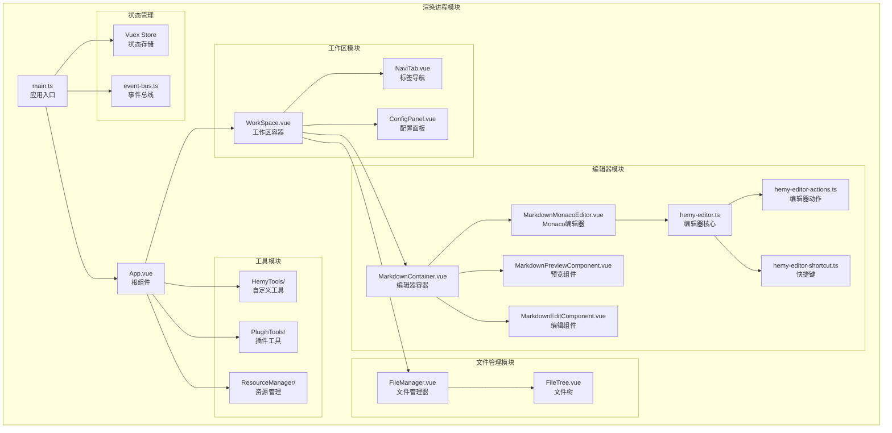
```mermaid
graph TB
    subgraph "渲染进程模块"
        A[main.ts<br/>应用入口]
        B[App.vue<br/>根组件]

        subgraph "工作区模块"
            C1[WorkSpace.vue<br/>工作区容器]
            C2[NaviTab.vue<br/>标签导航]
            C3[ConfigPanel.vue<br/>配置面板]
        end

        subgraph "编辑器模块"
            D1[MarkdownContainer.vue<br/>编辑器容器]
            D2[MarkdownMonacoEditor.vue<br/>Monaco编辑器]
            D3[MarkdownPreviewComponent.vue<br/>预览组件]
            D4[MarkdownEditComponent.vue<br/>编辑组件]
            D5[hemy-editor.ts<br/>编辑器核心]
            D6[hemy-editor-actions.ts<br/>编辑器动作]
            D7[hemy-editor-shortcut.ts<br/>快捷键]
        end

        subgraph "文件管理模块"
            E1[FileManager.vue<br/>文件管理器]
            E2[FileTree.vue<br/>文件树]
        end

        subgraph "工具模块"
            F1[HemyTools/<br/>自定义工具]
            F2[PluginTools/<br/>插件工具]
            F3[ResourceManager/<br/>资源管理]
        end

        subgraph "状态管理"
            G1[Vuex Store<br/>状态存储]
            G2[event-bus.ts<br/>事件总线]
        end
    end

    A --> B
    B --> C1
    C1 --> C2
    C1 --> C3
    C1 --> D1
    D1 --> D2
    D1 --> D3
    D1 --> D4
    D2 --> D5
    D5 --> D6
    D5 --> D7

    C1 --> E1
    E1 --> E2

    B --> F1
    B --> F2
    B --> F3

    A --> G1
    A --> G2
```

### 3.3 模块依赖关系

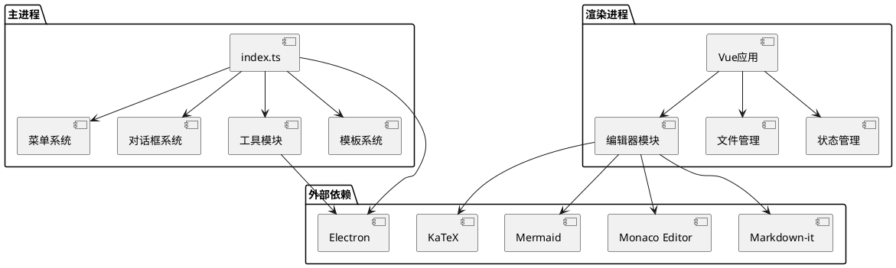
```plantuml
@startuml
package "主进程" {
    [index.ts] as Main
    [菜单系统] as Menu
    [对话框系统] as Dialogs
    [工具模块] as Utils
    [模板系统] as Templates
}

package "渲染进程" {
    [Vue应用] as VueApp
    [编辑器模块] as Editor
    [文件管理] as FileManager
    [状态管理] as State
}

package "外部依赖" {
    [Electron] as Electron
    [Monaco Editor] as Monaco
    [Mermaid] as Mermaid
    [KaTeX] as KaTeX
    [Markdown-it] as MD
}

Main --> Menu
Main --> Dialogs
Main --> Utils
Main --> Templates

Main --> Electron

VueApp --> Editor
VueApp --> FileManager
VueApp --> State

Editor --> Monaco
Editor --> Mermaid
Editor --> KaTeX
Editor --> MD

Utils --> Electron
@enduml
```

## 4. 技术架构

### 4.1 前端技术栈

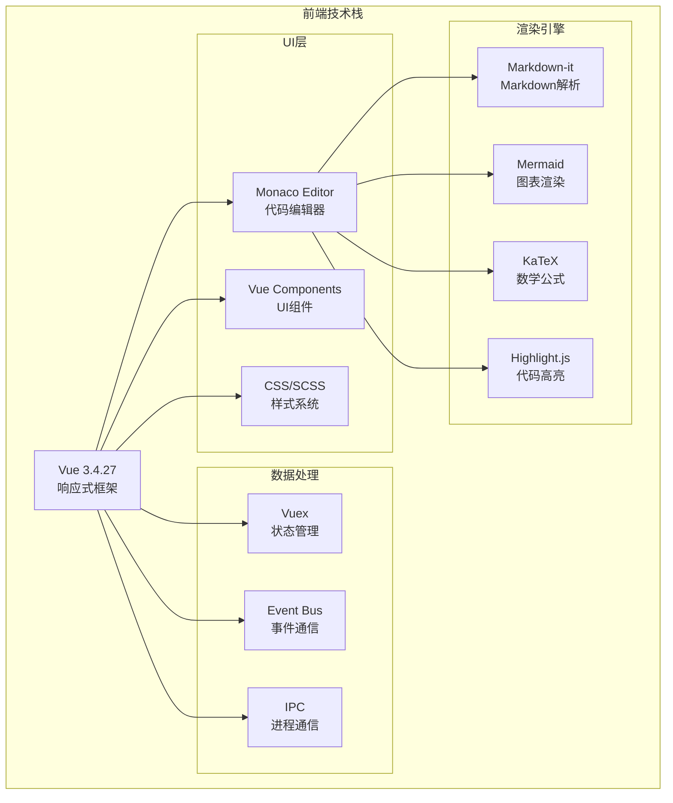
```mermaid
graph TB
    subgraph "前端技术栈"
        A[Vue 3.4.27<br/>响应式框架]

        subgraph "UI层"
            B1[Monaco Editor<br/>代码编辑器]
            B2[Vue Components<br/>UI组件]
            B3[CSS/SCSS<br/>样式系统]
        end

        subgraph "数据处理"
            C1[Vuex<br/>状态管理]
            C2[Event Bus<br/>事件通信]
            C3[IPC<br/>进程通信]
        end

        subgraph "渲染引擎"
            D1[Markdown-it<br/>Markdown解析]
            D2[Mermaid<br/>图表渲染]
            D3[KaTeX<br/>数学公式]
            D4[Highlight.js<br/>代码高亮]
        end
    end

    A --> B1
    A --> B2
    A --> B3
    A --> C1
    A --> C2
    A --> C3

    B1 --> D1
    B1 --> D2
    B1 --> D3
    B1 --> D4
```

### 4.2 后端技术栈

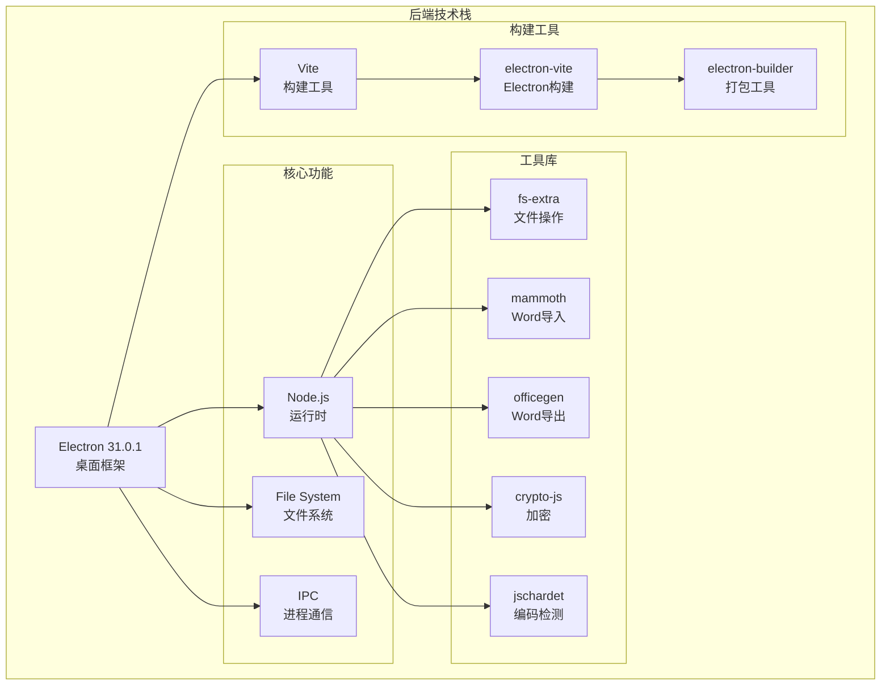
```mermaid
graph TB
    subgraph "后端技术栈"
        A[Electron 31.0.1<br/>桌面框架]

        subgraph "核心功能"
            B1[Node.js<br/>运行时]
            B2[File System<br/>文件系统]
            B3[IPC<br/>进程通信]
        end

        subgraph "工具库"
            C1[fs-extra<br/>文件操作]
            C2[mammoth<br/>Word导入]
            C3[officegen<br/>Word导出]
            C4[crypto-js<br/>加密]
            C5[jschardet<br/>编码检测]
        end

        subgraph "构建工具"
            D1[Vite<br/>构建工具]
            D2[electron-vite<br/>Electron构建]
            D3[electron-builder<br/>打包工具]
        end
    end

    A --> B1
    A --> B2
    A --> B3

    B1 --> C1
    B1 --> C2
    B1 --> C3
    B1 --> C4
    B1 --> C5

    A --> D1
    D1 --> D2
    D2 --> D3
```

### 4.3 构建架构

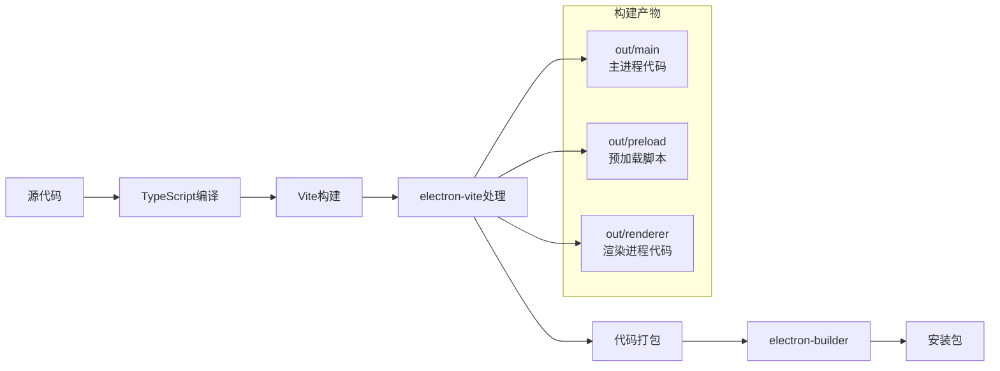
```mermaid
graph LR
    A[源代码] --> B[TypeScript编译]
    B --> C[Vite构建]
    C --> D[electron-vite处理]
    D --> E[代码打包]
    E --> F[electron-builder]
    F --> G[安装包]

    subgraph "构建产物"
        H1[out/main<br/>主进程代码]
        H2[out/preload<br/>预加载脚本]
        H3[out/renderer<br/>渲染进程代码]
    end

    D --> H1
    D --> H2
    D --> H3
```

## 5. 部署架构

### 5.1 应用部署结构

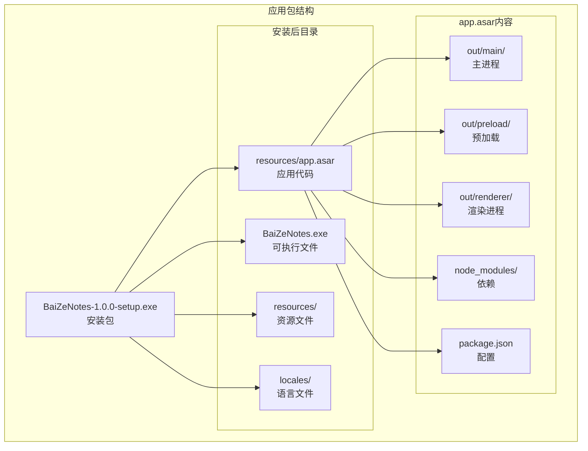
```mermaid
graph TB
    subgraph "应用包结构"
        A[BaiZeNotes-1.0.0-setup.exe<br/>安装包]

        subgraph "安装后目录"
            B1[resources/app.asar<br/>应用代码]
            B2[BaiZeNotes.exe<br/>可执行文件]
            B3[resources/<br/>资源文件]
            B4[locales/<br/>语言文件]
        end

        subgraph "app.asar内容"
            C1[out/main/<br/>主进程]
            C2[out/preload/<br/>预加载]
            C3[out/renderer/<br/>渲染进程]
            C4[node_modules/<br/>依赖]
            C5[package.json<br/>配置]
        end
    end

    A --> B1
    A --> B2
    A --> B3
    A --> B4

    B1 --> C1
    B1 --> C2
    B1 --> C3
    B1 --> C4
    B1 --> C5
```

### 5.2 运行时架构

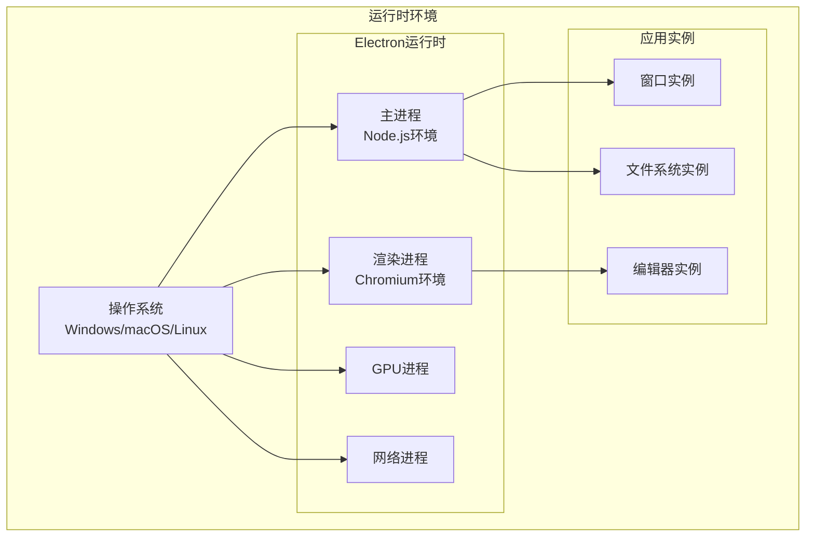
```mermaid
graph TB
    subgraph "运行时环境"
        A[操作系统<br/>Windows/macOS/Linux]

        subgraph "Electron运行时"
            B1[主进程<br/>Node.js环境]
            B2[渲染进程<br/>Chromium环境]
            B3[GPU进程]
            B4[网络进程]
        end

        subgraph "应用实例"
            C1[窗口实例]
            C2[编辑器实例]
            C3[文件系统实例]
        end
    end

    A --> B1
    A --> B2
    A --> B3
    A --> B4

    B1 --> C1
    B2 --> C2
    B1 --> C3
```

## 6. 安全架构

### 6.1 安全模型

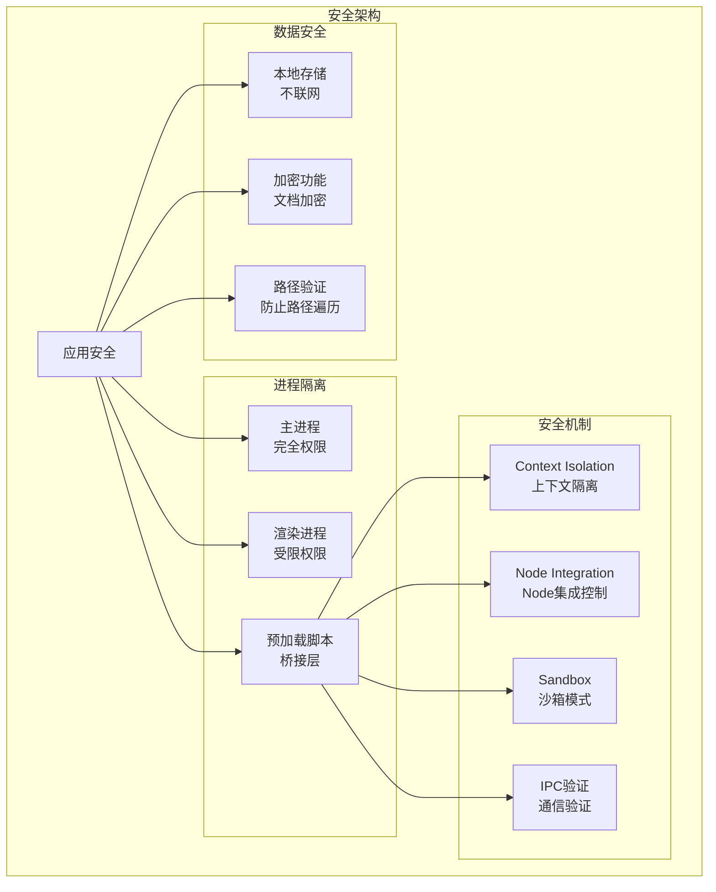
```mermaid
graph TB
    subgraph "安全架构"
        A[应用安全]

        subgraph "进程隔离"
            B1[主进程<br/>完全权限]
            B2[渲染进程<br/>受限权限]
            B3[预加载脚本<br/>桥接层]
        end

        subgraph "安全机制"
            C1[Context Isolation<br/>上下文隔离]
            C2[Node Integration<br/>Node集成控制]
            C3[Sandbox<br/>沙箱模式]
            C4[IPC验证<br/>通信验证]
        end

        subgraph "数据安全"
            D1[本地存储<br/>不联网]
            D2[加密功能<br/>文档加密]
            D3[路径验证<br/>防止路径遍历]
        end
    end

    A --> B1
    A --> B2
    A --> B3

    B3 --> C1
    B3 --> C2
    B3 --> C3
    B3 --> C4

    A --> D1
    A --> D2
    A --> D3
```

### 6.2 IPC安全

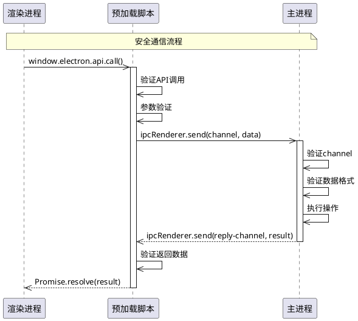
```plantuml
@startuml
participant "渲染进程" as Renderer
participant "预加载脚本" as Preload
participant "主进程" as Main

note over Renderer, Main: 安全通信流程

Renderer ->> Preload: window.electron.api.call()
activate Preload

Preload ->> Preload: 验证API调用
Preload ->> Preload: 参数验证
Preload ->> Main: ipcRenderer.send(channel, data)
activate Main

Main ->> Main: 验证channel
Main ->> Main: 验证数据格式
Main ->> Main: 执行操作

Main -->> Preload: ipcRenderer.send(reply-channel, result)
deactivate Main

Preload ->> Preload: 验证返回数据
Preload -->> Renderer: Promise.resolve(result)
deactivate Preload

@enduml
```

## 7. 性能架构

### 7.1 性能优化策略

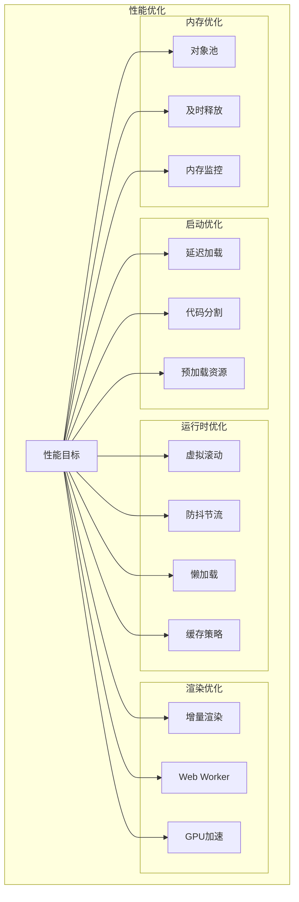
```mermaid
graph TB
    subgraph "性能优化"
        A[性能目标]

        subgraph "启动优化"
            B1[延迟加载]
            B2[代码分割]
            B3[预加载资源]
        end

        subgraph "运行时优化"
            C1[虚拟滚动]
            C2[防抖节流]
            C3[懒加载]
            C4[缓存策略]
        end

        subgraph "渲染优化"
            D1[增量渲染]
            D2[Web Worker]
            D3[GPU加速]
        end

        subgraph "内存优化"
            E1[对象池]
            E2[及时释放]
            E3[内存监控]
        end
    end

    A --> B1
    A --> B2
    A --> B3

    A --> C1
    A --> C2
    A --> C3
    A --> C4

    A --> D1
    A --> D2
    A --> D3

    A --> E1
    A --> E2
    A --> E3
```

### 7.2 渲染性能流程

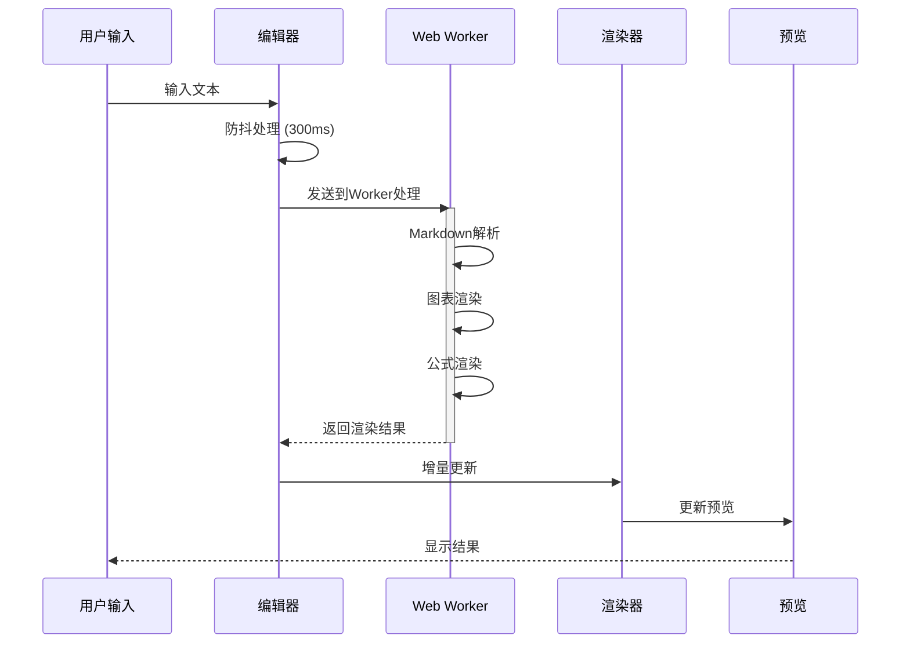
```mermaid
sequenceDiagram
    participant U as 用户输入
    participant E as 编辑器
    participant W as Web Worker
    participant R as 渲染器
    participant P as 预览

    U->>E: 输入文本
    E->>E: 防抖处理 (300ms)

    E->>W: 发送到Worker处理
    activate W

    W->>W: Markdown解析
    W->>W: 图表渲染
    W->>W: 公式渲染

    W-->>E: 返回渲染结果
    deactivate W

    E->>R: 增量更新
    R->>P: 更新预览
    P-->>U: 显示结果
```

## 8. 扩展架构

### 8.1 插件系统架构

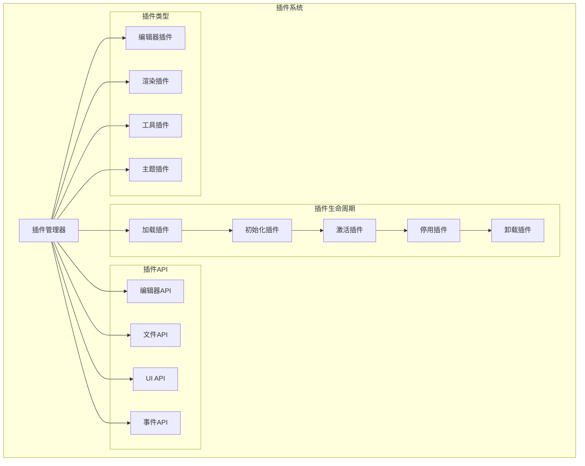
```mermaid
graph TB
    subgraph "插件系统"
        A[插件管理器]

        subgraph "插件生命周期"
            B1[加载插件]
            B2[初始化插件]
            B3[激活插件]
            B4[停用插件]
            B5[卸载插件]
        end

        subgraph "插件API"
            C1[编辑器API]
            C2[文件API]
            C3[UI API]
            C4[事件API]
        end

        subgraph "插件类型"
            D1[编辑器插件]
            D2[渲染插件]
            D3[工具插件]
            D4[主题插件]
        end
    end

    A --> B1
    B1 --> B2
    B2 --> B3
    B3 --> B4
    B4 --> B5

    A --> C1
    A --> C2
    A --> C3
    A --> C4

    A --> D1
    A --> D2
    A --> D3
    A --> D4
```

### 8.2 模板系统架构

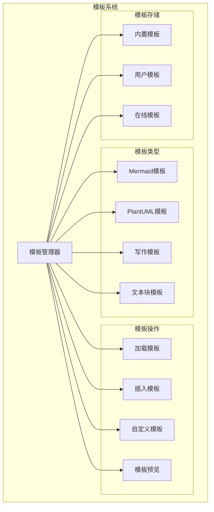
```mermaid
graph TB
    subgraph "模板系统"
        A[模板管理器]

        subgraph "模板类型"
            B1[Mermaid模板]
            B2[PlantUML模板]
            B3[写作模板]
            B4[文本块模板]
        end

        subgraph "模板操作"
            C1[加载模板]
            C2[插入模板]
            C3[自定义模板]
            C4[模板预览]
        end

        subgraph "模板存储"
            D1[内置模板]
            D2[用户模板]
            D3[在线模板]
        end
    end

    A --> B1
    A --> B2
    A --> B3
    A --> B4

    A --> C1
    A --> C2
    A --> C3
    A --> C4

    A --> D1
    A --> D2
    A --> D3
```

## 9. 架构决策记录

### 9.1 关键架构决策

#### ADR-001: 选择Electron作为桌面框架
**状态**: 已采纳
**背景**: 需要开发跨平台桌面应用
**决策**: 使用Electron框架
**理由**:
- 跨平台支持 (Windows, macOS, Linux)
- 使用Web技术栈 (JavaScript/TypeScript, HTML, CSS)
- 丰富的生态系统和社区支持
- 与Vue 3良好集成
**影响**:
- 应用体积较大
- 内存占用相对较高
- 开发效率高

#### ADR-002: 选择Monaco Editor作为编辑器
**状态**: 已采纳
**背景**: 需要专业的代码编辑体验
**决策**: 使用Monaco Editor
**理由**:
- VS Code同款编辑器，功能强大
- 原生支持TypeScript
- 丰富的API和扩展能力
- 性能优秀
**影响**:
- 增加应用体积
- 学习曲线较陡

#### ADR-003: 采用多进程架构
**状态**: 已采纳
**背景**: Electron应用架构选择
**决策**: 采用主进程+渲染进程+预加载脚本的多进程架构
**理由**:
- 符合Electron最佳实践
- 提高应用稳定性和安全性
- 便于职责分离
**影响**:
- IPC通信复杂度增加
- 需要处理进程间同步

#### ADR-004: 使用Vuex进行状态管理
**状态**: 已采纳
**背景**: Vue应用状态管理方案选择
**决策**: 使用Vuex进行全局状态管理
**理由**:
- Vue官方推荐
- 简单易用
- 满足当前需求
**影响**:
- 状态管理相对简单
- 未来可能需要迁移到Pinia

### 9.2 架构演进计划

#### 短期计划 (v1.x)
- 优化启动性能
- 完善插件系统
- 增强模板功能

#### 中期计划 (v2.x)
- 重构状态管理 (迁移到Pinia)
- 优化渲染性能
- 增强扩展能力

#### 长期计划 (v3.x)
- 微前端架构探索
- 云同步功能
- 协作编辑功能

## 10. 附录

### 10.1 架构图例说明
- **Mermaid图**: 用于展示流程和关系
- **PlantUML图**: 用于展示类图和组件关系
- **颜色说明**:
  - 蓝色: 核心模块
  - 绿色: 功能模块
  - 橙色: 外部依赖
  - 灰色: 辅助模块

### 10.2 架构文档维护
- **更新频率**: 每个主要版本更新时
- **维护责任**: 架构师和核心开发团队
- **审核流程**: 技术评审委员会审核

### 10.3 参考资源
- [Electron架构文档](https://www.electronjs.org/docs/latest/tutorial/process-model)
- [Vue 3架构指南](https://vuejs.org/guide/scaling-up/architecture.html)
- [Monaco Editor集成指南](https://github.com/microsoft/monaco-editor)
# 白泽笔记 - 架构文档

## 更新历史
- **2024-03-08**: 新增快速链接配置模块架构说明

## 新增模块架构

### 快速链接配置模块

#### 模块概述
快速链接配置模块负责管理NaviTab中的快速链接配置,提供配置的存储、读取、更新和删除功能。

#### 模块架构图

```mermaid
graph TB
    subgraph "快速链接配置模块"
        A[配置存储层<br/>quick-link-config.ts]
        B[配置管理对话框<br/>ShowQuickLinkSettingDialog.ts]
        C[IPC通信层<br/>utils.ts]
        D[UI展示层<br/>NaviTab.vue]
    end

    subgraph "数据存储"
        E[electron-store<br/>quick-links-config.json]
    end

    A --> E
    B --> C
    C --> A
    D --> C
```

#### 模块职责

**1. 配置存储层 (quick-link-config.ts)**
- 提供配置的CRUD操作接口
- 管理配置的持久化存储
- 提供默认配置
- 配置数据验证

**2. 配置管理对话框 (ShowQuickLinkSettingDialog.ts)**
- 提供图形化配置界面
- 处理用户交互
- 表单验证
- 配置预览

**3. IPC通信层**
- 主进程与渲染进程通信
- 配置数据传输
- 事件处理

**4. UI展示层**
- 动态渲染快速链接
- 处理链接点击事件
- 响应配置更新

#### 数据流

```mermaid
sequenceDiagram
    participant U as 用户
    participant D as 配置对话框
    participant M as 主进程
    participant S as 配置存储
    participant N as NaviTab

    U->>D: 打开配置对话框
    D->>M: IPC: get-quick-links
    M->>S: 读取配置
    S-->>M: 返回配置
    M-->>D: 返回配置
    D-->>U: 显示配置

    U->>D: 修改配置
    D->>M: IPC: save-quick-links
    M->>S: 保存配置
    S-->>M: 保存成功
    M-->>D: 保存成功

    N->>M: IPC: get-quick-links
    M->>S: 读取配置
    S-->>M: 返回配置
    M-->>N: 返回配置
    N-->>U: 更新显示
```

#### 接口设计

**配置存储接口**
```typescript
// 获取快速链接配置
export function getQuickLinks(): QuickLinkItem[]

// 保存快速链接配置
export function saveQuickLinks(links: QuickLinkItem[]): void

// 添加快速链接
export function addQuickLink(link: QuickLinkItem): void

// 更新快速链接
export function updateQuickLink(link: QuickLinkItem): void

// 删除快速链接
export function deleteQuickLink(id: string): void

// 重置为默认配置
export function resetToDefault(): void
```

**IPC通信接口**
```typescript
// 获取快速链接配置
ipcMain.on('get-quick-links', (event) => {
    const links = getQuickLinks()
    event.returnValue = links
})

// 保存快速链接配置
ipcMain.on('save-quick-links', (_, links: QuickLinkItem[]) => {
    saveQuickLinks(links)
})

// 重置快速链接配置
ipcMain.on('reset-quick-links', () => {
    resetToDefault()
})
```

#### 配置数据结构

```typescript
interface QuickLinkItem {
    id: string              // 唯一标识
    name: string            // 显示名称
    type: 'url' | 'exe'     // 类型: 网页或本地程序
    path: string            // URL或程序路径
    icon: 'svg' | 'img' | 'emoji'  // 图标类型
    iconContent: string     // 图标内容
    enabled: boolean        // 是否启用
    order: number           // 排序
}

interface QuickLinkConfig {
    links: QuickLinkItem[]
}
```

#### 技术选型

**配置存储**: electron-store
- 优点: 简单易用,自动持久化,支持加密
- 适用场景: 应用配置存储

**IPC通信**: Electron IPC
- 优点: 安全可靠,支持同步和异步
- 适用场景: 主进程与渲染进程通信

**UI框架**: 原生HTML + CSS + JavaScript
- 优点: 无需额外依赖,性能好
- 适用场景: 简单对话框界面

#### 扩展性设计

1. **配置扩展**
   - 支持添加新的链接类型
   - 支持添加新的图标类型
   - 支持配置分组

2. **功能扩展**
   - 支持配置导入导出
   - 支持配置同步
   - 支持配置模板

3. **UI扩展**
   - 支持自定义主题
   - 支持拖拽排序
   - 支持图标预览
