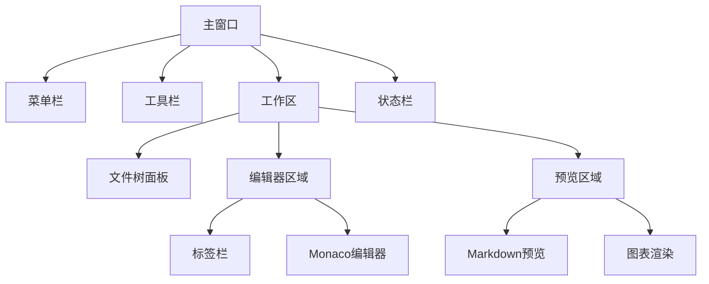
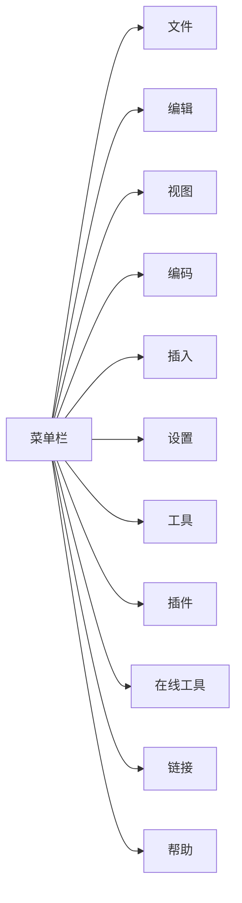
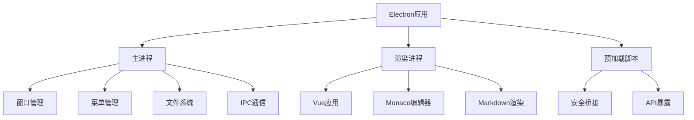
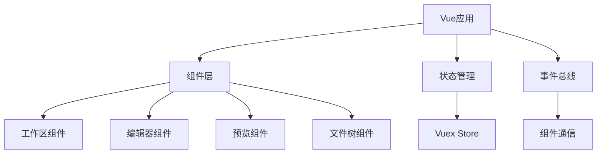
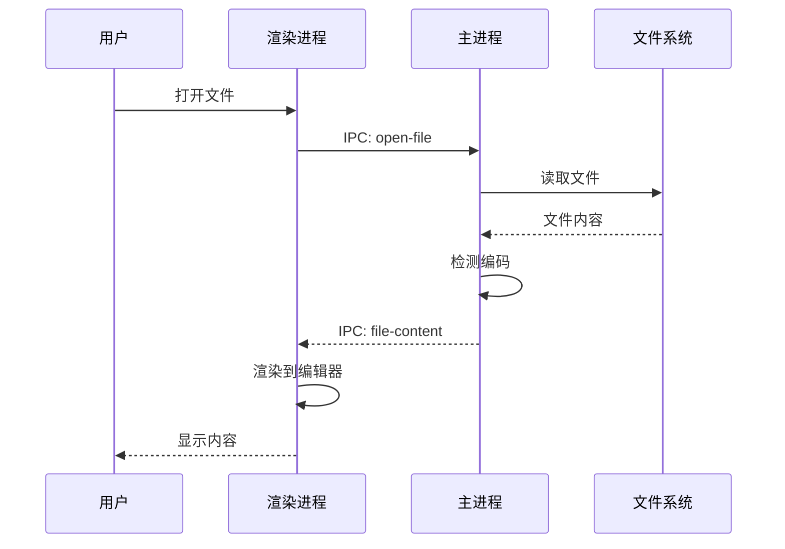
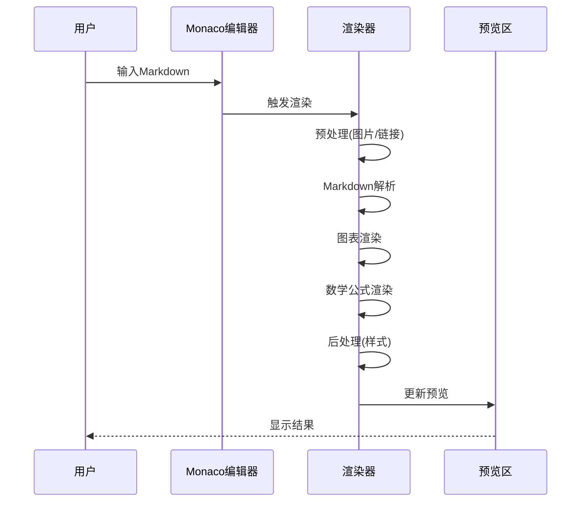

# 白泽笔记 - 产品规格文档

## 1. 产品概述

### 1.1 产品简介
白泽笔记是一款基于Electron和Vue 3构建的桌面Markdown编辑器，旨在为用户提供强大、灵活的文档编辑和管理体验。产品名称来源于中国古代神话中的神兽"白泽"，寓意智慧与知识的汇聚。

### 1.2 产品定位
- **目标用户**: 开发者、技术写作者、学生、研究人员
- **核心价值**: 提供专业的Markdown编辑体验，支持丰富的图表绘制和文档管理功能
- **竞争优势**: 集成Monaco编辑器、支持多种图表语法、丰富的模板系统

### 1.3 版本信息
- **当前版本**: 1.0.0
- **发布日期**: 2024年
- **支持平台**: Windows (主要), macOS, Linux (理论支持)

## 2. 功能规格

### 2.1 核心功能模块

#### 2.1.1 Markdown编辑器
**功能描述**: 提供专业的Markdown编辑环境

**功能特性**:
- 基于Monaco Editor的代码编辑器
- 实时预览功能
- 语法高亮
- 自动补全
- 快捷键支持
- 多标签编辑

**用户故事**:
```
作为一名技术写作者，
我希望能够在一个专业的编辑器中编写Markdown文档，
以便高效地创建格式化的文档。
```

#### 2.1.2 图表绘制
**功能描述**: 支持在Markdown中嵌入多种图表

**支持的图表类型**:

**Mermaid图表**:
- 流程图 (Flowchart)
- 时序图 (Sequence Diagram)
- 类图 (Class Diagram)
- 状态图 (State Diagram)
- 甘特图 (Gantt Chart)
- 饼图 (Pie Chart)
- 思维导图 (Mindmap)
- 时间线 (Timeline)
- 象限图 (Quadrant Chart)
- 用户旅程图 (User Journey)
- ER图 (Entity Relationship Diagram)
- Git图 (Git Graph)
- 数据包图 (Packet Diagram)
- 需求图 (Requirement Diagram)
- C4架构图 (C4 Context Diagram)
- 桑基图 (Sankey Diagram)
- XY图表 (XY Chart)
- 块图 (Block Diagram)
- ZenUML

**PlantUML图表**:
- 用例图 (Use Case Diagram)
- 类图 (Class Diagram)
- 活动图 (Activity Diagram)
- 组件图 (Component Diagram)
- 部署图 (Deployment Diagram)
- 状态图 (State Diagram)
- 时序图 (Sequence Diagram)
- 对象图 (Object Diagram)
- ER图 (Entity Relationship Diagram)
- 甘特图 (Gantt Diagram)
- 思维导图 (Mindmap Diagram)
- 网络图 (Network Diagram - nwdiag)
- JSON图 (JSON Diagram)
- YAML图 (YAML Diagram)
- 盐线图 (Salt/Wireframe)
- 正则表达式图 (Regular Expression)
- 扩展巴科斯范式 (Extended Backus-Naur Form)
- 架构图 (ArchiMate Diagram)
- WBS图 (Work Breakdown Structure)
- DITAA图 (Ditaa Diagram)
- 信息工程图 (Information Engineering)
- 时序图 (Timing Diagram)

**用户故事**:
```
作为一名系统架构师，
我希望能够在文档中直接绘制UML图和流程图，
以便更好地表达系统设计思路。
```

#### 2.1.3 数学公式支持
**功能描述**: 支持LaTeX数学公式渲染

**功能特性**:
- 行内公式支持
- 块级公式支持
- KaTeX渲染引擎
- 丰富的数学符号库

#### 2.1.4 文件管理
**功能描述**: 提供完整的文件管理功能

**功能特性**:
- 文件树浏览
- 文件创建、重命名、删除
- 文件夹管理
- 文件搜索
- 文件编码检测
- 多种编码支持 (UTF-8, GBK, GB2312等)
- 文件拖拽操作
- 右键菜单操作

**用户故事**:
```
作为一名项目管理者，
我希望能够方便地管理项目文档，
以便高效地组织和维护文档结构。
```

#### 2.1.5 文档转换
**功能描述**: 支持多种文档格式的导入导出

**支持格式**:
- **导入**: Word文档 (.docx)
- **导出**: Word文档 (.docx)
- **支持**: CSV文件处理

#### 2.1.6 模板系统
**功能描述**: 提供丰富的文档模板

**模板类型**:
- **Mermaid模板**: 20+种图表模板
- **PlantUML模板**: 15+种UML图模板
- **写作模板**:
  - 论文模板
  - 问题解决模板
  - LeetCode题解模板
- **文本块模板**: 代码块模板

**用户故事**:
```
作为一名学生，
我希望能够使用预定义的模板快速创建文档，
以便节省时间并保持文档格式的一致性。
```

### 2.2 辅助功能模块

#### 2.2.1 主题系统
**功能描述**: 支持界面主题切换

**功能特性**:
- 亮色主题
- 暗色主题
- 自定义主题配置

#### 2.2.2 字体设置
**功能描述**: 支持编辑器字体配置

**功能特性**:
- 字体选择
- 字号调整
- 行高设置

#### 2.2.3 快捷链接
**功能描述**: 提供快速访问常用资源的功能

**功能特性**:
- 在线工具链接
- GitHub项目链接
- 自定义链接管理

#### 2.2.4 加密功能
**功能描述**: 提供文档加密功能

**功能特性**:
- RSA密钥对生成
- 文档加密/解密
- 哈希计算
- HMAC计算

#### 2.2.5 插件系统
**功能描述**: 支持插件扩展

**功能特性**:
- 插件加载机制
- 插件管理界面

### 2.3 界面规格

#### 2.3.1 主界面布局



#### 2.3.2 窗口规格
- **默认窗口大小**: 1280 x 800 像素
- **最小窗口大小**: 800 x 600 像素
- **启动行为**: 最大化启动
- **窗口标题**: "白泽笔记 -- Markdown Editor Powered By Electron and Vue"

#### 2.3.3 菜单结构



**菜单详细功能**:

**文件菜单**:
- 新建文件
- 新建文件夹
- 打开文件
- 打开文件夹
- 保存
- 另存为
- 导出
- 退出

**编辑菜单**:
- 撤销
- 重做
- 剪切
- 复制
- 粘贴
- 查找
- 替换
- 全选

**视图菜单**:
- 切换文件树
- 切换预览
- 切换全屏
- 开发者工具

**插入菜单**:
- 插入图片
- 插入链接
- 插入表格
- 插入代码块
- 插入Mermaid图表
- 插入PlantUML图表
- 插入数学公式
- 插入Emoji
- 插入特殊符号

**设置菜单**:
- 系统设置
- 主题设置
- 字体设置
- 快捷键设置

**工具菜单**:
- 加密工具
- 解密工具
- 哈希计算
- 文档转换

**帮助菜单**:
- 关于
- 文档
- 检查更新
- GitHub仓库

### 2.4 性能规格

#### 2.4.1 响应时间
- **应用启动时间**: < 3秒
- **文件打开时间**: < 1秒 (普通文档)
- **文档保存时间**: < 500毫秒
- **图表渲染时间**: < 2秒 (复杂图表)
- **搜索响应时间**: < 500毫秒

#### 2.4.2 资源占用
- **内存占用**: < 500MB (正常使用)
- **CPU占用**: < 10% (空闲状态)
- **磁盘占用**: < 300MB (应用本身)

#### 2.4.3 文件支持
- **最大文件大小**: 10MB
- **最大标签数量**: 20个
- **支持文件编码**: UTF-8, GBK, GB2312, GB18030, Big5等

### 2.5 安全规格

#### 2.5.1 数据安全
- 本地文件存储，不上传云端
- 支持文档加密功能
- 敏感信息保护

#### 2.5.2 应用安全
- 禁用远程脚本加载
- 文件路径验证
- 输入数据验证

### 2.6 兼容性规格

#### 2.6.1 操作系统
- **Windows**: Windows 10/11 (主要支持)
- **macOS**: macOS 10.14+ (理论支持)
- **Linux**: 主流发行版 (理论支持)

#### 2.6.2 文件格式
- **Markdown**: .md, .markdown
- **文本**: .txt
- **Word**: .docx (导入/导出)
- **CSV**: .csv (查看/编辑)

## 3. 技术规格

### 3.1 技术栈

#### 3.1.1 前端技术
- **框架**: Vue 3.4.27
- **语言**: TypeScript 5.4.5
- **编辑器**: Monaco Editor 0.55.0
- **Markdown解析**:
  - markdown-it 14.1.0
  - marked 12.0.2
  - remarkable 2.0.1
- **图表渲染**:
  - Mermaid 10.9.1
  - PlantUML (通过plantuml-cli)
- **数学公式**: KaTeX 0.16.10
- **语法高亮**:
  - highlight.js 11.9.0
  - prismjs 1.29.0

#### 3.1.2 桌面技术
- **框架**: Electron 31.0.1
- **构建工具**:
  - Vite 5.2.11
  - electron-vite 2.2.0
  - electron-builder 24.13.3

#### 3.1.3 工具库
- **文件处理**: fs-extra 11.2.0, mammoth 1.8.0, officegen 0.6.5
- **加密**: crypto-js 4.2.0, node-forge 1.3.1
- **编码检测**: jschardet 3.1.3, iconv-lite 0.6.3
- **数据存储**: electron-store 9.0.0
- **自动更新**: electron-updater 6.1.8

### 3.2 架构模式

#### 3.2.1 Electron架构


#### 3.2.2 Vue架构


### 3.3 数据流

#### 3.3.1 文件操作流程


#### 3.3.2 Markdown渲染流程


### 3.4 接口规格

#### 3.4.1 IPC通信接口

**文件操作接口**:
```typescript
// 打开文件选择对话框
ipcMain.on('open-select-file', (event, message) => void)

// 文件保存
ipcMain.on('save-file', (event, filePath, content) => void)

// 文件重命名
ipcMain.on('file-manager-context-menu-rename', (event, path, name) => void)

// 文件删除
ipcMain.on('file-manager-context-menu-delete', (event, path, isFile) => void)
```

**渲染接口**:
```typescript
// 预渲染
ipcMain.on('pre-render-monaco-editor-content', (event, content) => void)

// 后渲染
ipcMain.on('post-render-monaco-editor-content', (event, content) => void)

// 返回渲染结果
mainWindow.webContents.send('pre-render-monaco-editor-content-result', result)
mainWindow.webContents.send('post-render-monaco-editor-content-result', result)
```

**加密接口**:
```typescript
// 创建RSA密钥对
ipcMain.on('create-rsa-key-pair', (event) => void)

// 加密
ipcMain.on('crypto-encrypt', (event, data, key) => void)

// 解密
ipcMain.on('crypto-decrypt', (event, data, key) => void)
```

#### 3.4.2 组件接口

**编辑器组件接口**:
```typescript
interface EditorOptions {
  theme: string
  fontSize: number
  fontFamily: string
  lineNumbers: 'on' | 'off' | 'relative'
  minimap: boolean
  wordWrap: 'on' | 'off'
}

interface EditorActions {
  insertText(text: string): void
  getSelectedText(): string
  setSelection(start: number, end: number): void
  formatDocument(): void
}
```

**文件树组件接口**:
```typescript
interface FileTreeNode {
  path: string
  name: string
  isFile: boolean
  children?: FileTreeNode[]
  expanded?: boolean
}

interface FileTreeActions {
  refresh(): void
  createFile(path: string, name: string): void
  createFolder(path: string, name: string): void
  deleteNode(path: string): void
  renameNode(path: string, newName: string): void
}
```

## 4. 质量属性

### 4.1 可用性
- **学习曲线**: 提供直观的界面和丰富的帮助文档
- **操作便捷性**: 支持快捷键、右键菜单、拖拽操作
- **错误提示**: 提供清晰的错误信息和解决建议
- **帮助系统**: 内置文档和在线帮助

### 4.2 可靠性
- **数据持久化**: 自动保存机制
- **错误恢复**: 异常处理和状态恢复
- **日志记录**: 关键操作日志记录

### 4.3 可维护性
- **代码规范**: ESLint + Prettier
- **类型检查**: TypeScript严格模式
- **模块化**: 清晰的模块划分
- **文档完善**: 代码注释和文档

### 4.4 可扩展性
- **插件系统**: 支持功能扩展
- **模板系统**: 支持自定义模板
- **主题系统**: 支持自定义主题
- **配置系统**: 支持自定义配置

## 5. 约束条件

### 5.1 技术约束
- 必须基于Electron框架
- 必须使用TypeScript开发
- 必须支持Windows平台
- 文件大小限制在10MB以内

### 5.2 业务约束
- 个人项目，非商业用途
- 开源项目，遵循MIT协议
- 社区驱动开发

### 5.3 资源约束
- 单人开发团队
- 有限的测试资源
- 社区贡献支持

## 6. 验收标准

### 6.1 功能验收
- [ ] 所有核心功能正常运行
- [ ] 所有图表类型正确渲染
- [ ] 文件操作功能完整
- [ ] 模板系统可用
- [ ] 加密功能正常

### 6.2 性能验收
- [ ] 启动时间 < 3秒
- [ ] 文件打开 < 1秒
- [ ] 内存占用 < 500MB
- [ ] 无明显卡顿

### 6.3 兼容性验收
- [ ] Windows 10/11正常运行
- [ ] 支持多种文件编码
- [ ] 支持多种Markdown语法

### 6.4 用户体验验收
- [ ] 界面美观、操作流畅
- [ ] 错误提示清晰
- [ ] 帮助文档完善
- [ ] 快捷键功能正常

## 7. 发布计划

### 7.1 版本规划
- **v1.0.0**: 基础功能完整版本
- **v1.1.0**: 性能优化和Bug修复
- **v1.2.0**: 新增功能和用户体验改进
- **v2.0.0**: 架构升级和重大功能更新

### 7.2 发布渠道
- GitHub Releases
- 自动更新机制
- 安装包下载

## 8. 附录

### 8.1 术语表
- **Electron**: 跨平台桌面应用开发框架
- **Monaco Editor**: VS Code使用的代码编辑器
- **Mermaid**: 基于JavaScript的图表绘制工具
- **PlantUML**: 基于文本的UML图绘制工具
- **KaTeX**: 高性能的数学公式渲染库
- **IPC**: Inter-Process Communication，进程间通信

### 8.2 参考文档
- [Electron官方文档](https://www.electronjs.org/)
- [Vue 3官方文档](https://vuejs.org/)
- [Monaco Editor文档](https://microsoft.github.io/monaco-editor/)
- [Mermaid文档](https://mermaid.js.org/)
- [PlantUML文档](https://plantuml.com/)
- [KaTeX文档](https://katex.org/)

### 8.3 更新历史
- **2024-09-13**: 创建初始版本规格文档
# 白泽笔记 - 产品规格文档

## 更新历史
- **2024-03-08**: 新增快速链接动态配置功能

## 新增功能说明

### 快速链接动态配置功能

#### 功能概述
用户可以通过"设置->快速链接设置"菜单动态管理NaviTab中的快速链接,无需修改代码即可自定义快速访问的工具和网站。

#### 功能特性
1. **动态配置管理**
   - 添加新的快速链接
   - 编辑现有快速链接
   - 删除不需要的快速链接
   - 调整链接显示顺序
   - 启用/禁用链接

2. **多种链接类型支持**
   - 网页链接(URL): 在浏览器中打开
   - 本地程序(EXE): 启动本地应用程序

3. **多种图标类型支持**
   - SVG代码: 自定义SVG图标
   - 图片URL: 使用网络图片作为图标
   - Emoji: 使用表情符号作为图标

4. **配置持久化**
   - 配置自动保存到本地
   - 应用重启后配置保持
   - 支持重置为默认配置

#### 用户操作流程
1. 打开应用,点击菜单 "设置" -> "快速链接设置"
2. 在配置对话框中可以:
   - 点击"添加链接"创建新的快速链接
   - 点击"编辑"修改现有链接
   - 点击"删除"移除链接
   - 使用"⬆️⬇️"按钮调整链接顺序
   - 点击"重置为默认"恢复默认配置
   - 点击"保存配置"保存所有更改
3. 配置保存后,NaviTab会自动显示新的快速链接

#### 技术实现
- **配置存储**: 使用electron-store实现配置的持久化存储
- **配置文件**: 存储在用户数据目录的`quick-links-config.json`
- **数据结构**: 
  ```typescript
  interface QuickLinkItem {
      id: string              // 唯一标识
      name: string            // 显示名称
      type: 'url' | 'exe'     // 类型: 网页或本地程序
      path: string            // URL或程序路径
      icon: 'svg' | 'img' | 'emoji'  // 图标类型
      iconContent: string     // 图标内容
      enabled: boolean        // 是否启用
      order: number           // 排序
  }
  ```

#### 默认配置
系统预置了以下快速链接:
- QQ (本地程序)
- 文心一言 (网页链接)
- 豆包 (本地程序)
- DeepSeek (网页链接)

#### 相关文件
- `src/main/utils/quick-link-config.ts` - 配置存储模块
- `src/main/dialogs/ShowQuickLinkSettingDialog.ts` - 配置管理对话框
- `src/main/utils/utils.ts` - IPC通信处理
- `src/renderer/src/components/WorkSpaceArea/NaviTab.vue` - 快速链接显示组件
