# 白泽笔记 - 设计文档

## 1. 设计概述

### 1.1 设计目标
白泽笔记的设计目标是创建一个功能强大、易于使用、视觉美观的Markdown编辑器。设计遵循"简洁而不简单"的理念，在保持界面清爽的同时，提供丰富的功能和良好的用户体验。

### 1.2 设计原则
- **简洁性**: 界面简洁，操作直观
- **一致性**: 设计风格统一，交互模式一致
- **可用性**: 功能易发现，操作易记忆
- **美观性**: 视觉舒适，配色和谐
- **响应性**: 界面流畅，反馈及时

### 1.3 设计范围
本文档涵盖以下设计内容:
- 用户界面设计
- 交互设计
- 视觉设计
- 组件设计
- 数据模型设计
- API设计

## 2. 用户界面设计

### 2.1 整体布局设计

#### 2.1.1 主界面布局

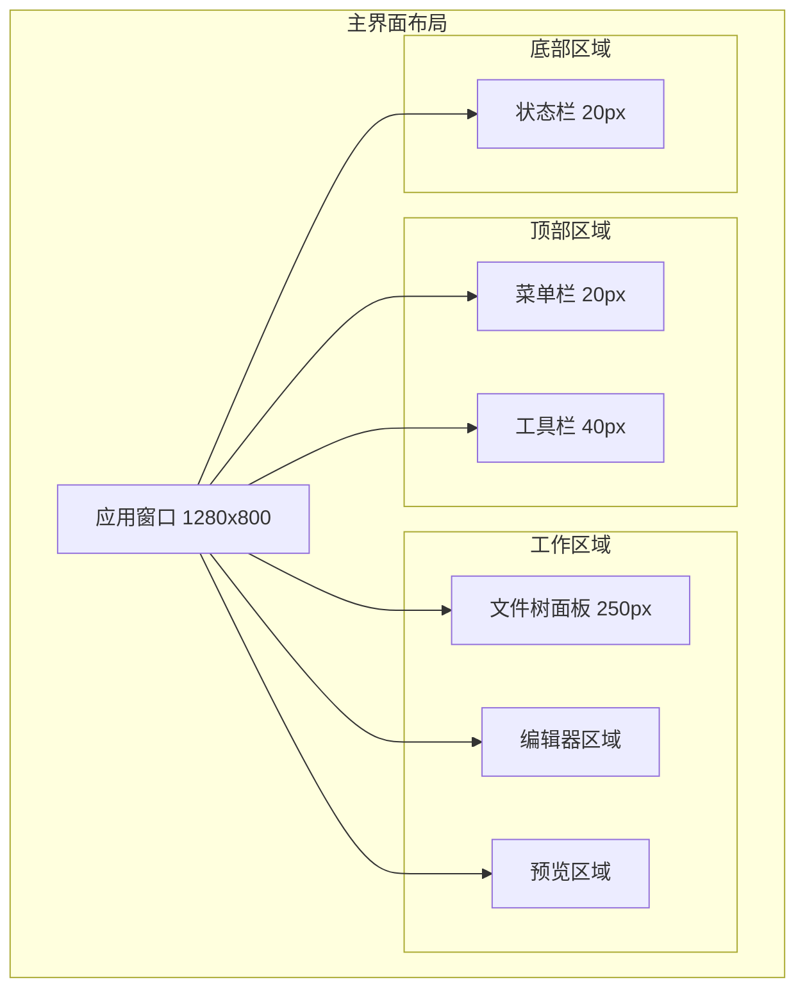

#### 2.1.2 布局规格

| 区域 | 宽度 | 高度 | 说明 |
|------|------|------|------|
| 菜单栏 | 100% | 20px | 应用菜单 |
| 工具栏 | 100% | 40px | 快捷工具按钮 |
| 文件树面板 | 250px | 自适应 | 文件管理 |
| 编辑器区域 | 50% | 自适应 | Monaco编辑器 |
| 预览区域 | 50% | 自适应 | Markdown预览 |
| 状态栏 | 100% | 20px | 状态信息 |

#### 2.1.3 响应式设计

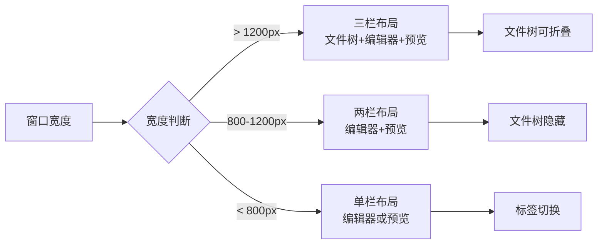

### 2.2 菜单设计

#### 2.2.1 菜单结构

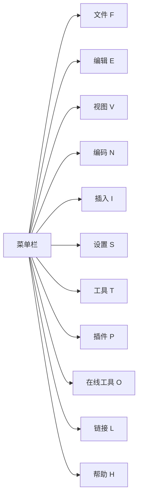

#### 2.2.2 菜单项详细设计

**文件菜单**:
```
文件(F)
├── 新建文件(N)          Ctrl+N
├── 新建文件夹(D)         Ctrl+Shift+N
├── 打开文件(O)          Ctrl+O
├── 打开文件夹(F)        Ctrl+K Ctrl+O
├── ---
├── 保存(S)             Ctrl+S
├── 另存为(A)           Ctrl+Shift+S
├── 全部保存            Ctrl+K S
├── ---
├── 导出为Word          Ctrl+Shift+E
├── 导出为PDF           Ctrl+Shift+P
├── ---
└── 退出(X)             Alt+F4
```

**编辑菜单**:
```
编辑(E)
├── 撤销(U)             Ctrl+Z
├── 重做(R)             Ctrl+Y
├── ---
├── 剪切(T)             Ctrl+X
├── 复制(C)             Ctrl+C
├── 粘贴(P)             Ctrl+V
├── 全选(A)             Ctrl+A
├── ---
├── 查找(F)             Ctrl+F
├── 替换(R)             Ctrl+H
├── ---
├── 格式化文档          Shift+Alt+F
└── 插入时间戳          Ctrl+Shift+T
```

**视图菜单**:
```
视图(V)
├── 切换文件树          Ctrl+B
├── 切换预览            Ctrl+Shift+V
├── 切换全屏            F11
├── ---
├── 放大                Ctrl++
├── 缩小                Ctrl+-
├── 重置缩放            Ctrl+0
├── ---
└── 开发者工具          F12
```

**插入菜单**:
```
插入(I)
├── 图片(I)             Ctrl+Shift+I
├── 链接(L)             Ctrl+K
├── 表格(T)             Ctrl+Shift+T
├── ---
├── 代码块(C)           Ctrl+Alt+C
├── Mermaid图表(M)      Ctrl+Alt+M
├── PlantUML图表(P)     Ctrl+Alt+P
├── 数学公式(E)         Ctrl+Alt+E
├── ---
├── Emoji               Ctrl+Shift+E
└── 特殊符号(S)         Ctrl+Shift+S
```

### 2.3 工具栏设计

#### 2.3.1 工具栏布局

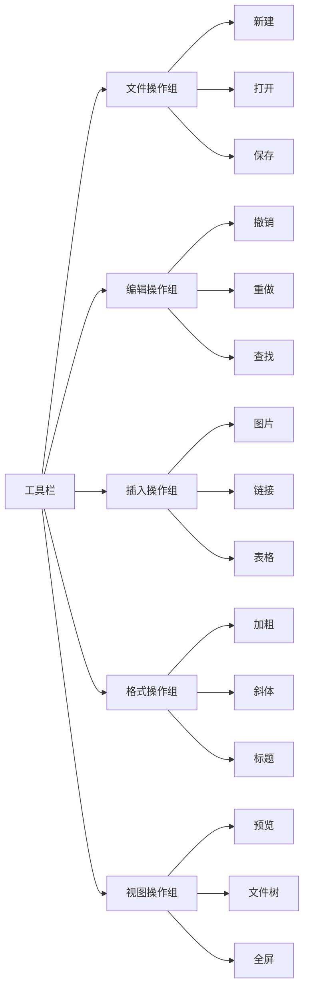

#### 2.3.2 工具栏图标设计

| 功能 | 图标 | 快捷键 | 提示文本 |
|------|------|--------|----------|
| 新建文件 | 📄 | Ctrl+N | 新建Markdown文件 |
| 打开文件 | 📂 | Ctrl+O | 打开文件 |
| 保存文件 | 💾 | Ctrl+S | 保存当前文件 |
| 撤销 | ↩️ | Ctrl+Z | 撤销上一步操作 |
| 重做 | ↪️ | Ctrl+Y | 重做上一步操作 |
| 加粗 | **B** | Ctrl+B | 加粗选中文字 |
| 斜体 | *I* | Ctrl+I | 斜体选中文字 |
| 插入链接 | 🔗 | Ctrl+K | 插入超链接 |
| 插入图片 | 🖼️ | Ctrl+Shift+I | 插入图片 |
| 插入代码 | `</>` | Ctrl+Alt+C | 插入代码块 |
| 切换预览 | 👁️ | Ctrl+Shift+V | 切换预览显示 |

### 2.4 文件树设计

#### 2.4.1 文件树结构

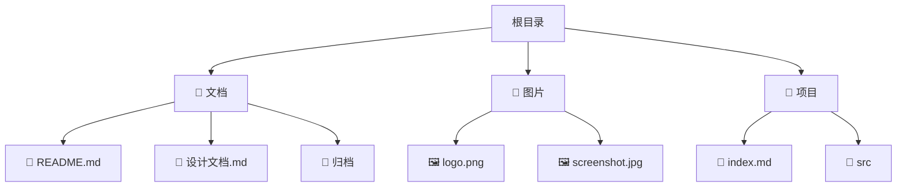

#### 2.4.2 文件树交互设计

**右键菜单**:
```
文件右键菜单:
├── 打开
├── ---
├── 重命名              F2
├── 删除                Delete
├── ---
├── 复制路径
├── 复制相对路径
├── ---
├── 在资源管理器中显示
└── 属性

文件夹右键菜单:
├── 新建文件
├── 新建文件夹
├── ---
├── 重命名              F2
├── 删除                Delete
├── ---
├── 复制路径
├── ---
├── 在资源管理器中显示
└── 刷新
```

**拖拽操作**:
- 支持文件/文件夹拖拽移动
- 支持从外部拖入文件
- 拖拽时显示视觉反馈

### 2.5 编辑器设计

#### 2.5.1 编辑器布局

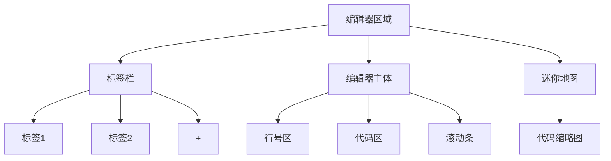

#### 2.5.2 编辑器功能设计

**基础功能**:
- 语法高亮
- 行号显示
- 代码折叠
- 自动补全
- 括号匹配
- 缩进辅助线

**高级功能**:
- 多光标编辑
- 列选择模式
- 代码片段
- 快速修复
- 定义跳转

**Monaco编辑器配置**:
```typescript
{
  theme: 'vs',
  fontSize: 14,
  fontFamily: 'Consolas, Monaco, monospace',
  lineNumbers: 'on',
  minimap: { enabled: true },
  wordWrap: 'on',
  automaticLayout: true,
  scrollBeyondLastLine: false,
  renderWhitespace: 'selection',
  tabSize: 2,
  insertSpaces: true
}
```

### 2.6 预览区设计

#### 2.6.1 预览区布局

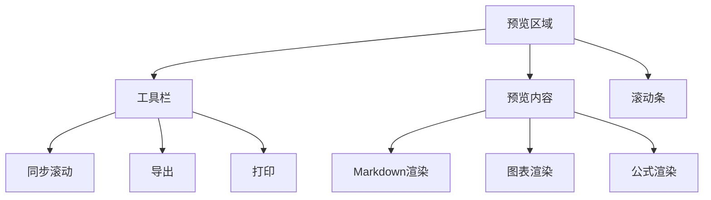

#### 2.6.2 预览样式设计

**Markdown样式**:
```css
/* 标题样式 */
h1 { font-size: 2em; border-bottom: 1px solid #eaecef; }
h2 { font-size: 1.5em; border-bottom: 1px solid #eaecef; }
h3 { font-size: 1.25em; }

/* 代码块样式 */
pre {
  background-color: #f6f8fa;
  border-radius: 3px;
  padding: 16px;
  overflow: auto;
}

code {
  background-color: rgba(27,31,35,.05);
  border-radius: 3px;
  font-size: 85%;
  padding: .2em .4em;
}

/* 引用样式 */
blockquote {
  border-left: 4px solid #dfe2e5;
  color: #6a737d;
  padding: 0 1em;
}

/* 表格样式 */
table {
  border-collapse: collapse;
  width: 100%;
}

th, td {
  border: 1px solid #dfe2e5;
  padding: 6px 13px;
}

th {
  background-color: #f6f8fa;
  font-weight: 600;
}
```

### 2.7 状态栏设计

#### 2.7.1 状态栏布局

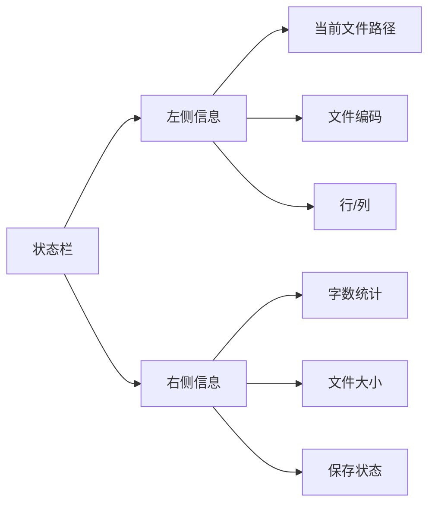

#### 2.7.2 状态栏信息

| 位置 | 信息项 | 示例 | 说明 |
|------|--------|------|------|
| 左侧 | 文件路径 | E:/docs/README.md | 当前文件完整路径 |
| 左侧 | 文件编码 | UTF-8 | 文件编码格式 |
| 左侧 | 光标位置 | 行 10, 列 5 | 当前光标位置 |
| 右侧 | 字数统计 | 1234 字 | 文档总字数 |
| 右侧 | 文件大小 | 12.5 KB | 文件大小 |
| 右侧 | 保存状态 | ✓ 已保存 | 文件保存状态 |

## 3. 交互设计

### 3.1 核心交互流程

#### 3.1.1 文件打开流程

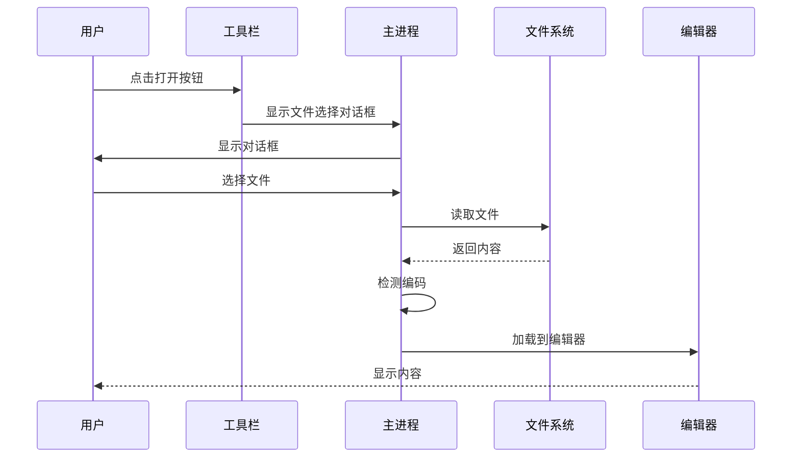

#### 3.1.2 文档保存流程

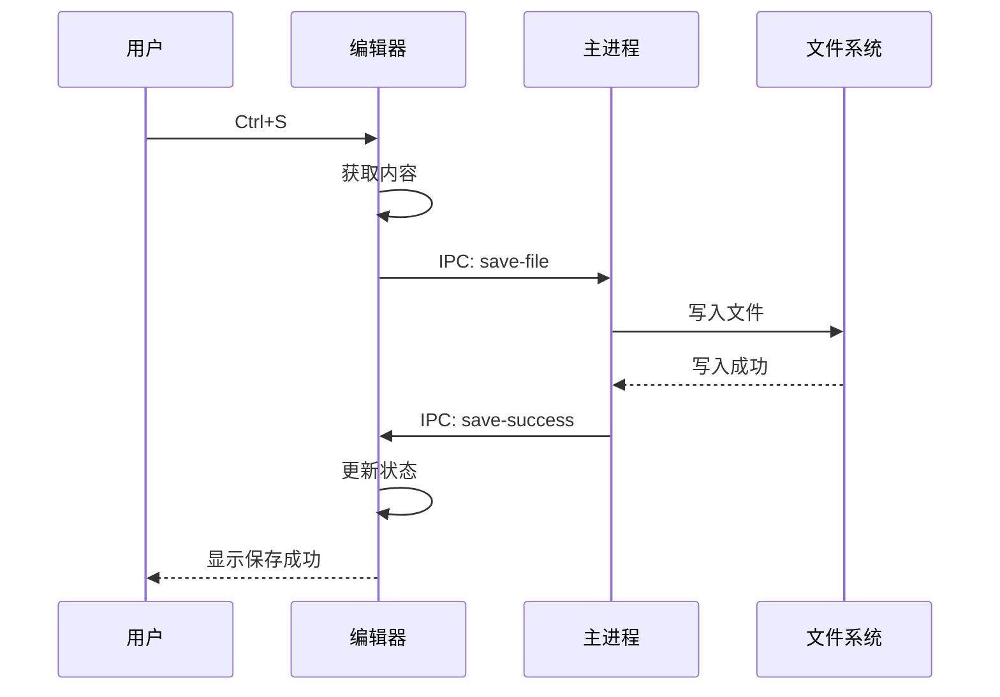

#### 3.1.3 Markdown渲染流程

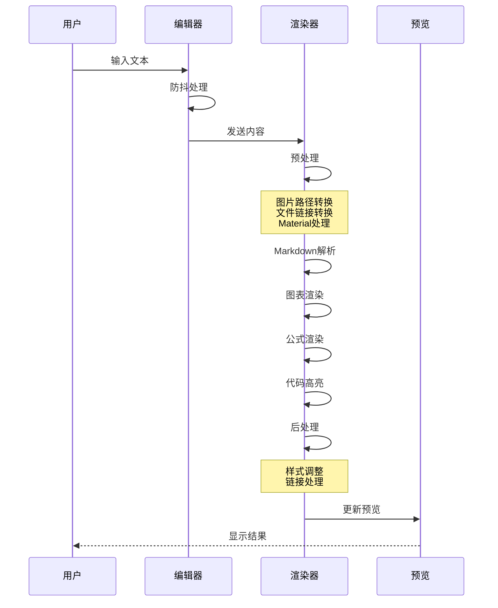

### 3.2 快捷键设计

#### 3.2.1 全局快捷键

| 快捷键 | 功能 | 说明 |
|--------|------|------|
| Ctrl+N | 新建文件 | 创建新的Markdown文件 |
| Ctrl+O | 打开文件 | 打开文件选择对话框 |
| Ctrl+S | 保存文件 | 保存当前文件 |
| Ctrl+Shift+S | 另存为 | 另存为新文件 |
| Ctrl+W | 关闭标签 | 关闭当前标签页 |
| Ctrl+Tab | 切换标签 | 切换到下一个标签 |
| Ctrl+Shift+Tab | 切换标签 | 切换到上一个标签 |
| F11 | 全屏 | 切换全屏模式 |
| F12 | 开发者工具 | 打开开发者工具 |

#### 3.2.2 编辑快捷键

| 快捷键 | 功能 | 说明 |
|--------|------|------|
| Ctrl+B | 加粗 | **加粗** |
| Ctrl+I | 斜体 | *斜体* |
| Ctrl+K | 插入链接 | [链接](url) |
| Ctrl+Shift+I | 插入图片 |  |
| Ctrl+` | 行内代码 | `代码` |
| Ctrl+Shift+` | 代码块 | ```代码块``` |
| Ctrl+1~6 | 标题 | # ~ ###### |
| Ctrl+Shift+T | 插入表格 | 插入表格模板 |
| Ctrl+Shift+M | 插入Mermaid | 插入Mermaid图表 |
| Ctrl+Shift+P | 插入PlantUML | 插入PlantUML图表 |

#### 3.2.3 导航快捷键

| 快捷键 | 功能 | 说明 |
|--------|------|------|
| Ctrl+F | 查找 | 打开查找对话框 |
| Ctrl+H | 替换 | 打开替换对话框 |
| Ctrl+G | 跳转行 | 跳转到指定行 |
| Ctrl+Home | 文档开头 | 跳转到文档开头 |
| Ctrl+End | 文档结尾 | 跳转到文档结尾 |
| Ctrl+B | 切换文件树 | 显示/隐藏文件树 |
| Ctrl+Shift+V | 切换预览 | 显示/隐藏预览 |

### 3.3 对话框设计

#### 3.3.1 系统设置对话框

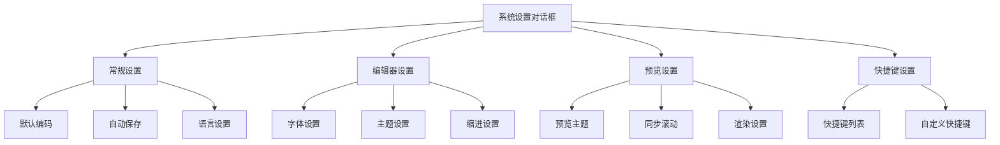

**对话框规格**:
- 宽度: 600px
- 高度: 500px
- 布局: 左侧导航 + 右侧内容
- 按钮: 确定 / 取消 / 应用

#### 3.3.2 插入图片对话框

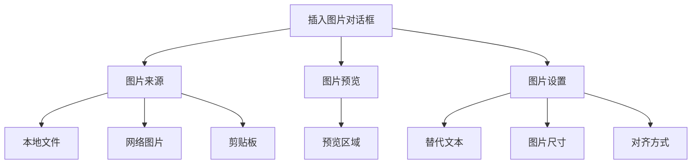

**对话框规格**:
- 宽度: 500px
- 高度: 400px
- 支持: 拖拽上传、粘贴上传

#### 3.3.3 Mermaid编辑对话框

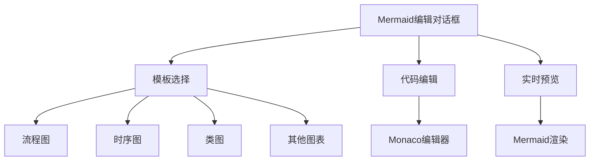

**对话框规格**:
- 宽度: 900px
- 高度: 600px
- 布局: 左侧模板 + 中间编辑 + 右侧预览

### 3.4 反馈设计

#### 3.4.1 操作反馈

**成功反馈**:
- 保存成功: 状态栏显示 "✓ 已保存"
- 导出成功: 弹出成功提示，显示文件位置
- 操作完成: 短暂的高亮提示

**错误反馈**:
- 文件打开失败: 弹出错误对话框，显示错误原因
- 保存失败: 弹出错误对话框，提供重试选项
- 网络错误: 显示离线提示

**进度反馈**:
- 文件加载: 显示加载动画
- 图表渲染: 显示渲染进度
- 导出操作: 显示进度条

#### 3.4.2 视觉反馈

**悬停效果**:
```css
/* 按钮悬停 */
.button:hover {
  background-color: #e1e4e8;
  transition: background-color 0.2s;
}

/* 文件项悬停 */
.file-item:hover {
  background-color: #f6f8fa;
  cursor: pointer;
}
```

**选中效果**:
```css
/* 标签选中 */
.tab.active {
  border-bottom: 2px solid #0366d6;
  color: #0366d6;
}

/* 文件选中 */
.file-item.selected {
  background-color: #0366d6;
  color: white;
}
```

**禁用状态**:
```css
/* 按钮禁用 */
.button:disabled {
  opacity: 0.5;
  cursor: not-allowed;
}
```

## 4. 视觉设计

### 4.1 色彩系统

#### 4.1.1 主色调

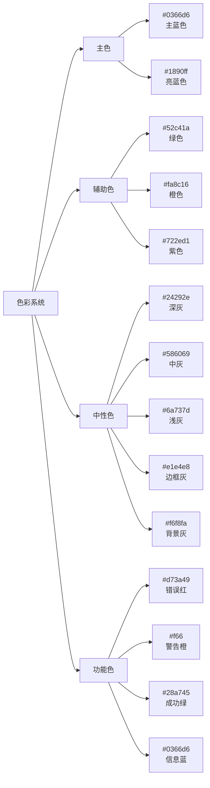

#### 4.1.2 色彩应用

| 元素 | 颜色 | 用途 |
|------|------|------|
| 主按钮背景 | #0366d6 | 主要操作按钮 |
| 主按钮文字 | #ffffff | 主要操作按钮文字 |
| 链接文字 | #0366d6 | 超链接 |
| 成功提示 | #28a745 | 成功状态 |
| 错误提示 | #d73a49 | 错误状态 |
| 警告提示 | #f66 | 警告状态 |
| 信息提示 | #0366d6 | 信息状态 |
| 边框 | #e1e4e8 | 分割线、边框 |
| 背景 | #f6f8fa | 页面背景 |
| 文字 | #24292e | 主要文字 |
| 次要文字 | #586069 | 次要文字 |

### 4.2 字体系统

#### 4.2.1 字体家族

**界面字体**:
```css
font-family: -apple-system, BlinkMacSystemFont, "Segoe UI", Helvetica, Arial, sans-serif;
```

**代码字体**:
```css
font-family: Consolas, Monaco, "Courier New", monospace;
```

#### 4.2.2 字体大小

| 元素 | 大小 | 行高 | 用途 |
|------|------|------|------|
| 标题1 | 32px | 1.25 | H1标题 |
| 标题2 | 24px | 1.25 | H2标题 |
| 标题3 | 20px | 1.25 | H3标题 |
| 正文 | 14px | 1.5 | 正文内容 |
| 小字 | 12px | 1.5 | 辅助文字 |
| 代码 | 14px | 1.5 | 代码内容 |

### 4.3 图标系统

#### 4.3.1 图标来源
- **主要来源**: 内置SVG图标
- **次要来源**: Emoji表情
- **图标库**: 可考虑集成Font Awesome或Material Icons

#### 4.3.2 图标规格

| 尺寸 | 用途 | 示例 |
|------|------|------|
| 16px | 菜单图标、状态图标 | 📄 📁 ✏️ |
| 20px | 工具栏图标 | 💾 📂 ✂️ |
| 24px | 大图标、对话框图标 | 🖼️ 🔗 📊 |
| 32px | 应用图标、启动图标 | 🎨 |

### 4.4 间距系统

#### 4.4.1 间距规范

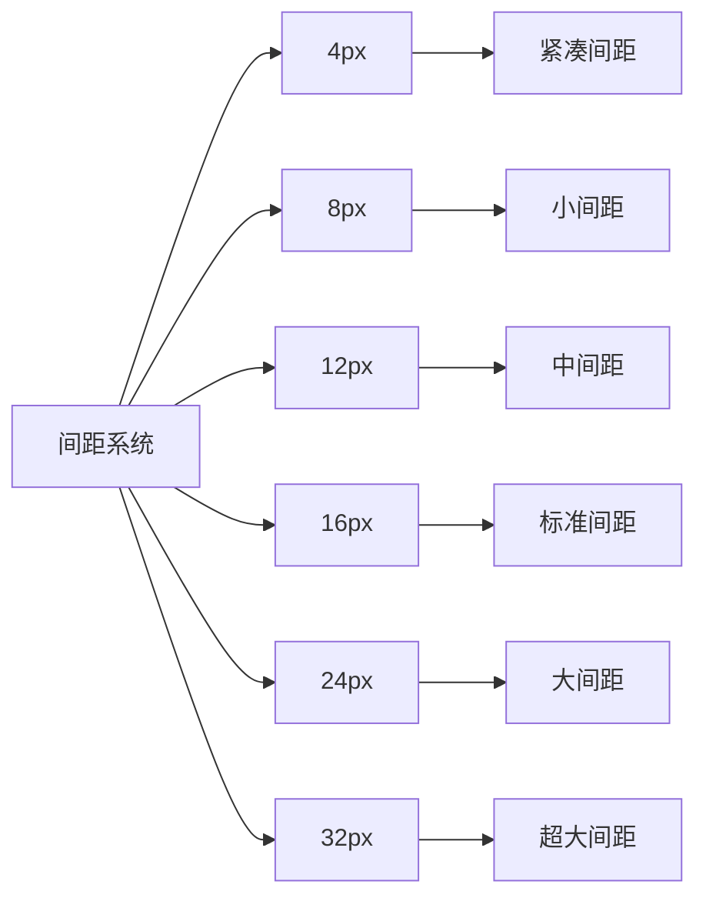

#### 4.4.2 间距应用

| 元素 | 间距 | 说明 |
|------|------|------|
| 按钮内边距 | 8px 16px | 上下8px，左右16px |
| 输入框内边距 | 8px 12px | 上下8px，左右12px |
| 卡片内边距 | 16px | 四边16px |
| 列表项间距 | 8px | 项与项之间 |
| 模块间距 | 24px | 模块与模块之间 |

### 4.5 阴影系统

```css
/* 轻微阴影 - 卡片、下拉菜单 */
box-shadow: 0 1px 3px rgba(0,0,0,0.12), 0 1px 2px rgba(0,0,0,0.24);

/* 中等阴影 - 对话框、浮动面板 */
box-shadow: 0 3px 6px rgba(0,0,0,0.16), 0 3px 6px rgba(0,0,0,0.23);

/* 强烈阴影 - 模态框 */
box-shadow: 0 10px 20px rgba(0,0,0,0.19), 0 6px 6px rgba(0,0,0,0.23);
```

## 5. 组件设计

### 5.1 基础组件

#### 5.1.1 按钮组件

**按钮类型**:
```typescript
enum ButtonType {
  Primary = 'primary',    // 主要按钮
  Default = 'default',    // 默认按钮
  Dashed = 'dashed',      // 虚线按钮
  Text = 'text',          // 文本按钮
  Link = 'link'           // 链接按钮
}

enum ButtonSize {
  Small = 'small',        // 小按钮
  Middle = 'middle',      // 中按钮
  Large = 'large'         // 大按钮
}
```

**按钮样式**:
```css
/* 主要按钮 */
.btn-primary {
  background-color: #0366d6;
  color: #ffffff;
  border: 1px solid #0366d6;
  padding: 8px 16px;
  border-radius: 4px;
  cursor: pointer;
}

.btn-primary:hover {
  background-color: #0257c5;
}

/* 默认按钮 */
.btn-default {
  background-color: #ffffff;
  color: #24292e;
  border: 1px solid #e1e4e8;
  padding: 8px 16px;
  border-radius: 4px;
  cursor: pointer;
}

.btn-default:hover {
  background-color: #f6f8fa;
}
```

#### 5.1.2 输入框组件

**输入框类型**:
```typescript
enum InputType {
  Text = 'text',          // 文本输入
  Password = 'password',  // 密码输入
  Number = 'number',      // 数字输入
  TextArea = 'textarea'   // 多行文本
}

enum InputSize {
  Small = 'small',        // 小输入框
  Middle = 'middle',      // 中输入框
  Large = 'large'         // 大输入框
}
```

**输入框样式**:
```css
.input {
  width: 100%;
  padding: 8px 12px;
  border: 1px solid #e1e4e8;
  border-radius: 4px;
  font-size: 14px;
  line-height: 1.5;
  color: #24292e;
  background-color: #ffffff;
}

.input:focus {
  border-color: #0366d6;
  outline: none;
  box-shadow: 0 0 0 3px rgba(3, 102, 214, 0.1);
}

.input:disabled {
  background-color: #f6f8fa;
  cursor: not-allowed;
}
```

#### 5.1.3 下拉选择组件

**下拉选择接口**:
```typescript
interface SelectOption {
  label: string
  value: string | number
  disabled?: boolean
}

interface SelectProps {
  options: SelectOption[]
  value?: string | number
  placeholder?: string
  disabled?: boolean
  clearable?: boolean
  searchable?: boolean
  onChange?: (value: string | number) => void
}
```

### 5.2 业务组件

#### 5.2.1 文件树组件

**文件树节点接口**:
```typescript
interface FileTreeNode {
  id: string
  name: string
  path: string
  isFile: boolean
  isExpanded?: boolean
  isSelected?: boolean
  children?: FileTreeNode[]
  icon?: string
}

interface FileTreeProps {
  rootPath: string
  onFileSelect?: (node: FileTreeNode) => void
  onFileCreate?: (parentPath: string, name: string) => void
  onFileDelete?: (path: string) => void
  onFileRename?: (path: string, newName: string) => void
}
```

**文件树样式**:
```css
.file-tree {
  font-size: 14px;
  user-select: none;
}

.file-tree-node {
  padding: 4px 8px;
  cursor: pointer;
  display: flex;
  align-items: center;
}

.file-tree-node:hover {
  background-color: #f6f8fa;
}

.file-tree-node.selected {
  background-color: #0366d6;
  color: #ffffff;
}

.file-tree-icon {
  margin-right: 6px;
  width: 16px;
  height: 16px;
}
```

#### 5.2.2 标签页组件

**标签页接口**:
```typescript
interface Tab {
  id: string
  title: string
  path: string
  isModified: boolean
  icon?: string
}

interface TabBarProps {
  tabs: Tab[]
  activeTabId: string
  onTabSelect: (id: string) => void
  onTabClose: (id: string) => void
  onTabReorder: (tabs: Tab[]) => void
}
```

**标签页样式**:
```css
.tab-bar {
  display: flex;
  background-color: #f6f8fa;
  border-bottom: 1px solid #e1e4e8;
  height: 35px;
  overflow-x: auto;
}

.tab {
  padding: 8px 16px;
  border-right: 1px solid #e1e4e8;
  cursor: pointer;
  display: flex;
  align-items: center;
  min-width: 120px;
  max-width: 200px;
}

.tab.active {
  background-color: #ffffff;
  border-bottom: 2px solid #0366d6;
}

.tab.modified::after {
  content: '●';
  color: #0366d6;
  margin-left: 4px;
}

.tab-close {
  margin-left: auto;
  opacity: 0;
}

.tab:hover .tab-close {
  opacity: 1;
}
```

#### 5.2.3 Markdown编辑器组件

**编辑器接口**:
```typescript
interface MarkdownEditorProps {
  value: string
  onChange?: (value: string) => void
  onSave?: (value: string) => void
  theme?: 'vs' | 'vs-dark'
  fontSize?: number
  language?: string
}

interface MarkdownEditorActions {
  insertText: (text: string) => void
  getSelectedText: () => string
  setSelection: (start: number, end: number) => void
  formatText: (format: 'bold' | 'italic' | 'code') => void
  undo: () => void
  redo: () => void
}
```

#### 5.2.4 Markdown预览组件

**预览接口**:
```typescript
interface MarkdownPreviewProps {
  content: string
  theme?: 'light' | 'dark'
  syncScroll?: boolean
  onLinkClick?: (url: string) => void
}

interface MarkdownPreviewState {
  renderedHTML: string
  mermaidCharts: Map<string, string>
  plantumlCharts: Map<string, string>
  mathFormulas: Map<string, string>
}
```

### 5.3 布局组件

#### 5.3.1 分割面板组件

**分割面板接口**:
```typescript
interface SplitPaneProps {
  direction: 'horizontal' | 'vertical'
  initialSize?: number
  minSize?: number
  maxSize?: number
  leftPane: React.ReactNode
  rightPane: React.ReactNode
  onResize?: (size: number) => void
}
```

#### 5.3.2 工作区组件

**工作区接口**:
```typescript
interface WorkSpaceProps {
  layout: 'three-column' | 'two-column' | 'one-column'
  showFileTree: boolean
  showPreview: boolean
  onLayoutChange?: (layout: string) => void
}

interface WorkSpaceState {
  fileTreeWidth: number
  previewWidth: number
  activeFile: string | null
  openFiles: string[]
}
```

## 6. 数据模型设计

### 6.1 文件模型

```typescript
interface FileModel {
  id: string              // 文件唯一标识
  path: string            // 文件路径
  name: string            // 文件名
  extension: string       // 文件扩展名
  size: number            // 文件大小(字节)
  encoding: string        // 文件编码
  content: string         // 文件内容
  lastModified: Date      // 最后修改时间
  isModified: boolean     // 是否已修改
  isReadOnly: boolean     // 是否只读
}

interface FolderModel {
  id: string              // 文件夹唯一标识
  path: string            // 文件夹路径
  name: string            // 文件夹名
  children: (FileModel | FolderModel)[]  // 子项
  isExpanded: boolean     // 是否展开
}
```

### 6.2 编辑器模型

```typescript
interface EditorState {
  content: string         // 编辑器内容
  cursorPosition: {       // 光标位置
    line: number
    column: number
  }
  selection: {            // 选区
    start: number
    end: number
  }
  scrollPosition: {       // 滚动位置
    top: number
    left: number
  }
  undoStack: string[]     // 撤销栈
  redoStack: string[]     // 重做栈
}

interface EditorConfig {
  theme: string           // 主题
  fontSize: number        // 字体大小
  fontFamily: string      // 字体
  lineNumbers: boolean    // 显示行号
  minimap: boolean        // 显示迷你地图
  wordWrap: boolean       // 自动换行
  tabSize: number         // Tab大小
}
```

### 6.3 应用状态模型

```typescript
interface AppState {
  // 文件状态
  currentFile: FileModel | null
  openFiles: FileModel[]
  recentFiles: string[]

  // 编辑器状态
  editorStates: Map<string, EditorState>
  editorConfig: EditorConfig

  // UI状态
  showFileTree: boolean
  showPreview: boolean
  showStatusBar: boolean
  activeTabId: string | null

  // 设置
  settings: AppSettings
}

interface AppSettings {
  // 常规设置
  autoSave: boolean
  autoSaveDelay: number
  defaultEncoding: string
  language: string

  // 编辑器设置
  editorTheme: string
  editorFontSize: number
  editorFontFamily: string
  editorLineNumbers: boolean
  editorMinimap: boolean
  editorWordWrap: boolean
  editorTabSize: number

  // 预览设置
  previewTheme: string
  previewSyncScroll: boolean
  previewMermaid: boolean
  previewPlantuml: boolean
  previewKatex: boolean

  // 快捷键设置
  keybindings: Map<string, string>
}
```

## 7. API设计

### 7.1 主进程API

#### 7.1.1 文件操作API

```typescript
// 文件选择
ipcMain.on('open-select-file', (event, options) => {
  // 显示文件选择对话框
  // 返回选中的文件路径
})

// 文件读取
ipcMain.on('read-file', (event, filePath) => {
  // 读取文件内容
  // 检测文件编码
  // 返回文件内容和编码
})

// 文件保存
ipcMain.on('save-file', (event, filePath, content, encoding) => {
  // 保存文件
  // 返回保存结果
})

// 文件删除
ipcMain.on('delete-file', (event, filePath) => {
  // 删除文件
  // 返回删除结果
})

// 文件重命名
ipcMain.on('rename-file', (event, oldPath, newPath) => {
  // 重命名文件
  // 返回重命名结果
})
```

#### 7.1.2 渲染API

```typescript
// 预渲染
ipcMain.on('pre-render-monaco-editor-content', (event, content) => {
  // 图片路径转换
  // 文件链接转换
  // Material Admonitions处理
  // KaTeX数学公式渲染
  // 返回预处理结果
})

// 后渲染
ipcMain.on('post-render-monaco-editor-content', (event, content) => {
  // 后处理样式调整
  // 返回最终结果
})
```

#### 7.1.3 加密API

```typescript
// 创建RSA密钥对
ipcMain.on('create-rsa-key-pair', (event) => {
  // 生成RSA密钥对
  // 返回公钥和私钥
})

// 加密
ipcMain.on('crypto-encrypt', (event, data, publicKey) => {
  // 使用公钥加密数据
  // 返回加密结果
})

// 解密
ipcMain.on('crypto-decrypt', (event, encryptedData, privateKey) => {
  // 使用私钥解密数据
  // 返回解密结果
})
```

### 7.2 渲染进程API

#### 7.2.1 编辑器API

```typescript
class MarkdownEditor {
  // 内容操作
  getContent(): string
  setContent(content: string): void
  insertText(text: string): void

  // 选区操作
  getSelectedText(): string
  setSelection(start: number, end: number): void
  replaceSelection(text: string): void

  // 格式化
  formatBold(): void
  formatItalic(): void
  formatCode(): void
  formatHeading(level: number): void

  // 编辑操作
  undo(): void
  redo(): void
  find(query: string): void
  replace(query: string, replacement: string): void

  // 事件监听
  onChange(callback: (content: string) => void): void
  onSave(callback: (content: string) => void): void
}
```

#### 7.2.2 文件树API

```typescript
class FileTree {
  // 树操作
  refresh(): void
  expandAll(): void
  collapseAll(): void

  // 文件操作
  createFile(parentPath: string, name: string): void
  createFolder(parentPath: string, name: string): void
  deleteNode(path: string): void
  renameNode(path: string, newName: string): void

  // 查找
  findFiles(query: string): string[]

  // 事件监听
  onFileSelect(callback: (path: string) => void): void
  onFileCreate(callback: (path: string) => void): void
  onFileDelete(callback: (path: string) => void): void
}
```

#### 7.2.3 预览API

```typescript
class MarkdownPreview {
  // 渲染
  render(content: string): void
  scrollToLine(line: number): void

  // 导出
  exportToHTML(): string
  exportToPDF(): Promise<Blob>

  // 事件监听
  onLinkClick(callback: (url: string) => void): void
  onImageClick(callback: (src: string) => void): void
}
```

## 8. 性能设计

### 8.1 性能优化策略

#### 8.1.1 启动优化

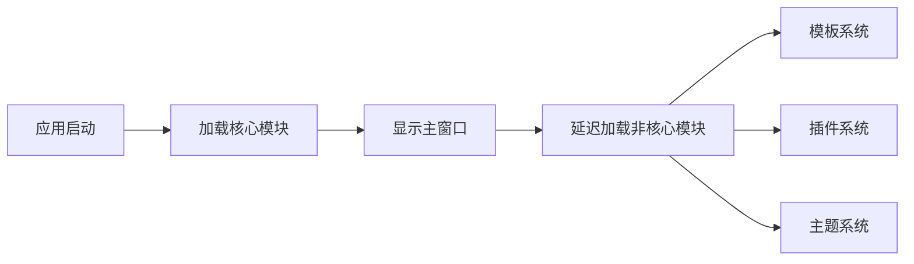

**优化措施**:
- 代码分割: 按功能模块分割代码
- 延迟加载: 非核心功能延迟加载
- 预加载: 预加载常用资源
- 缓存: 缓存编译结果

#### 8.1.2 运行时优化

**编辑器优化**:
```typescript
// 防抖处理
const debouncedRender = debounce((content: string) => {
  renderMarkdown(content)
}, 300)

// 增量更新
function updatePreview(changes: TextChange[]) {
  // 只更新变化的部分
  // 而不是重新渲染整个文档
}

// Web Worker
const worker = new Worker('markdown-renderer.js')
worker.postMessage({ content })
worker.onmessage = (e) => {
  updatePreview(e.data)
}
```

**文件树优化**:
```typescript
// 虚拟滚动
function renderVisibleNodes(scrollTop: number, viewportHeight: number) {
  // 只渲染可见区域的节点
  // 减少DOM节点数量
}

// 懒加载
async function loadNodeChildren(node: FileTreeNode) {
  // 展开时才加载子节点
  // 而不是一次性加载所有节点
}
```

### 8.2 内存管理

```typescript
// 对象池
class EditorInstancePool {
  private pool: Editor[] = []

  acquire(): Editor {
    return this.pool.pop() || new Editor()
  }

  release(editor: Editor) {
    editor.reset()
    this.pool.push(editor)
  }
}

// 及时释放
function closeTab(tabId: string) {
  const editor = editors.get(tabId)
  if (editor) {
    editor.dispose()
    editors.delete(tabId)
  }
}

// 内存监控
setInterval(() => {
  const usage = process.memoryUsage()
  if (usage.heapUsed > 500 * 1024 * 1024) { // 500MB
    // 触发垃圾回收或警告
  }
}, 60000) // 每分钟检查一次
```

## 9. 安全设计

### 9.1 安全措施

#### 9.1.1 进程隔离

```typescript
// 主进程
const mainWindow = new BrowserWindow({
  webPreferences: {
    nodeIntegration: false,      // 禁用Node集成
    contextIsolation: true,      // 启用上下文隔离
    sandbox: true,               // 启用沙箱
    preload: path.join(__dirname, 'preload.js')
  }
})
```

#### 9.1.2 IPC安全

```typescript
// 预加载脚本
const { contextBridge, ipcRenderer } = require('electron')

// 只暴露必要的API
contextBridge.exposeInMainWorld('electron', {
  openFile: () => ipcRenderer.invoke('open-file'),
  saveFile: (content) => ipcRenderer.invoke('save-file', content)
})

// 主进程验证
ipcMain.handle('save-file', (event, content) => {
  // 验证来源
  if (!isTrustedSender(event.senderFrame)) {
    throw new Error('Untrusted sender')
  }

  // 验证数据
  if (!isValidContent(content)) {
    throw new Error('Invalid content')
  }

  // 执行操作
  return saveFile(content)
})
```

#### 9.1.3 文件路径验证

```typescript
function validateFilePath(filePath: string): boolean {
  // 防止路径遍历攻击
  const normalizedPath = path.normalize(filePath)
  const allowedDirectory = getAllowedDirectory()

  if (!normalizedPath.startsWith(allowedDirectory)) {
    throw new Error('Access denied: path outside allowed directory')
  }

  return true
}
```

## 10. 可访问性设计

### 10.1 键盘导航

- 所有功能可通过键盘访问
- Tab键顺序合理
- 快捷键清晰明确
- 焦点管理正确

### 10.2 屏幕阅读器支持

- 语义化HTML标签
- ARIA标签完整
- 图片alt文本
- 状态变化通知

### 10.3 视觉辅助

- 高对比度模式支持
- 字体大小可调整
- 颜色不作为唯一信息传达方式
- 焦点指示清晰

## 11. 国际化设计

### 11.1 语言支持

```typescript
interface I18nConfig {
  locale: string
  messages: {
    [key: string]: string
  }
}

// 语言文件示例
const messages = {
  'en-US': {
    'app.title': 'BaiZe Notes',
    'menu.file': 'File',
    'menu.edit': 'Edit',
    'button.save': 'Save',
    'message.saved': 'File saved successfully'
  },
  'zh-CN': {
    'app.title': '白泽笔记',
    'menu.file': '文件',
    'menu.edit': '编辑',
    'button.save': '保存',
    'message.saved': '文件保存成功'
  }
}
```

### 11.2 日期时间格式

```typescript
// 根据locale格式化日期
function formatDate(date: Date, locale: string): string {
  return new Intl.DateTimeFormat(locale, {
    year: 'numeric',
    month: '2-digit',
    day: '2-digit',
    hour: '2-digit',
    minute: '2-digit',
    second: '2-digit'
  }).format(date)
}
```

## 12. 测试设计

### 12.1 单元测试

```typescript
describe('MarkdownEditor', () => {
  it('should insert text correctly', () => {
    const editor = new MarkdownEditor()
    editor.setContent('Hello ')
    editor.insertText('World')
    expect(editor.getContent()).toBe('Hello World')
  })

  it('should format bold text', () => {
    const editor = new MarkdownEditor()
    editor.setContent('Hello World')
    editor.setSelection(0, 5)
    editor.formatBold()
    expect(editor.getContent()).toBe('**Hello** World')
  })
})
```

### 12.2 集成测试

```typescript
describe('File Operations', () => {
  it('should open and save file', async () => {
    const app = await launchApp()

    // 打开文件
    await app.openFile('test.md')
    expect(app.editor.getContent()).toContain('Test content')

    // 修改内容
    app.editor.insertText('Modified')
    expect(app.editor.isModified()).toBe(true)

    // 保存文件
    await app.saveFile()
    expect(app.editor.isModified()).toBe(false)
  })
})
```

### 12.3 E2E测试

```typescript
describe('User Workflow', () => {
  it('should create and edit markdown file', async () => {
    await page.goto('app://-/')

    // 创建新文件
    await page.click('[data-testid="new-file-button"]')
    await page.fill('[data-testid="file-name-input"]', 'test.md')
    await page.click('[data-testid="create-button"]')

    // 编辑内容
    await page.type('[data-testid="editor"]', '# Hello World')
    await page.waitForSelector('[data-testid="preview"] h1')

    // 验证预览
    const previewText = await page.textContent('[data-testid="preview"] h1')
    expect(previewText).toBe('Hello World')
  })
})
```

## 13. 部署设计

### 13.1 构建流程

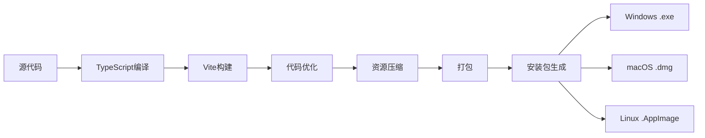

### 13.2 自动更新

```typescript
import { autoUpdater } from 'electron-updater'

// 检查更新
autoUpdater.checkForUpdatesAndNotify()

// 更新事件
autoUpdater.on('update-available', () => {
  // 显示更新可用提示
})

autoUpdater.on('update-downloaded', () => {
  // 显示更新已下载，提示用户安装
})

autoUpdater.on('error', (error) => {
  // 处理更新错误
})
```

## 14. 附录

### 14.1 设计资源

**图标资源**:
- [Feather Icons](https://feathericons.com/)
- [Material Design Icons](https://materialdesignicons.com/)
- [Font Awesome](https://fontawesome.com/)

**设计工具**:
- Figma - UI设计
- Sketch - UI设计
- Adobe XD - UI设计
- Zeplin - 设计协作

**参考设计**:
- VS Code - 编辑器设计
- Typora - Markdown编辑器设计
- Notion - 笔记应用设计

### 14.2 设计检查清单

**界面设计**:
- [ ] 布局合理，层次清晰
- [ ] 色彩和谐，对比度合适
- [ ] 字体大小适中，易于阅读
- [ ] 图标清晰，含义明确
- [ ] 间距统一，对齐整齐

**交互设计**:
- [ ] 操作流程顺畅
- [ ] 反馈及时明确
- [ ] 快捷键合理
- [ ] 错误处理完善
- [ ] 帮助文档齐全

**可用性**:
- [ ] 学习曲线平缓
- [ ] 操作效率高
- [ ] 容错性好
- [ ] 可访问性佳
- [ ] 国际化支持

### 14.3 更新历史

- **2024-09-13**: 创建初始版本设计文档
# 白泽笔记 - 设计文档

## 更新历史
- **2024-03-08**: 新增快速链接配置功能设计说明

## 新增功能设计

### 快速链接配置功能设计

#### 1. 用户界面设计

##### 1.1 配置对话框设计

**窗口规格**:
- 宽度: 900px
- 高度: 600px
- 标题: "快速链接设置"
- 可调整大小: 是
- 模态: 是

**布局设计**:
```
┌─────────────────────────────────────────┐
│  快速链接设置                             │
├─────────────────────────────────────────┤
│  [➕ 添加链接] [🔄 重置为默认] [💾 保存配置] │
├─────────────────────────────────────────┤
│  ┌─────────────────────────────────────┐│
│  │ [图标] QQ                           ││
│  │        D:\Tencent\QQ\QQ.exe         ││
│  │        [⬆️][⬇️][✏️ 编辑][🗑️ 删除]    ││
│  ├─────────────────────────────────────┤│
│  │ [图标] 文心一言                      ││
│  │        https://yiyan.baidu.com/     ││
│  │        [⬆️][⬇️][✏️ 编辑][🗑️ 删除]    ││
│  └─────────────────────────────────────┘│
└─────────────────────────────────────────┘
```

##### 1.2 编辑表单设计

**表单字段**:
- 名称 (必填): 文本输入框
- 类型 (必填): 下拉选择 (网页链接/本地程序)
- 路径 (必填): 文本输入框
- 图标类型 (必填): 下拉选择 (SVG代码/图片URL/Emoji)
- 图标内容 (必填): 文本域
- 启用 (可选): 复选框

**表单布局**:
```
┌─────────────────────────────────┐
│  添加快速链接                     │
├─────────────────────────────────┤
│  名称 *                          │
│  [___________________________]   │
│                                  │
│  类型 *                          │
│  [网页链接 ▼]                     │
│                                  │
│  路径 *                          │
│  [___________________________]   │
│                                  │
│  图标类型 *                       │
│  [SVG代码 ▼]                      │
│                                  │
│  图标内容 *                       │
│  [                           ]   │
│  [                           ]   │
│  [___________________________]   │
│                                  │
│  [✓] 启用                        │
│                                  │
│         [取消] [保存]             │
└─────────────────────────────────┘
```

#### 2. 交互设计

##### 2.1 配置管理流程

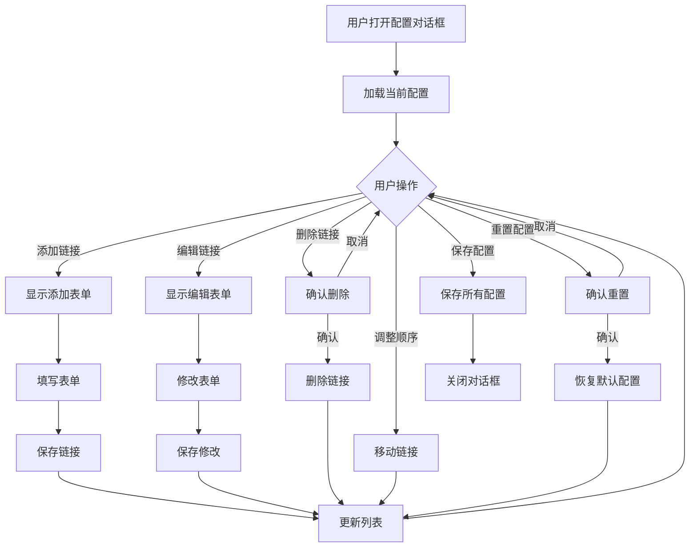

##### 2.2 表单验证规则

**名称验证**:
- 必填项
- 长度: 1-50字符
- 不能包含特殊字符

**路径验证**:
- 必填项
- URL类型: 必须是有效的URL格式
- EXE类型: 必须是有效的文件路径

**图标内容验证**:
- 必填项
- SVG类型: 必须是有效的SVG代码
- 图片URL类型: 必须是有效的URL
- Emoji类型: 必须是有效的Emoji字符

##### 2.3 操作反馈

**成功反馈**:
- 保存成功: 显示Toast提示 "保存成功!"
- 添加成功: 列表自动刷新,显示新添加的项
- 删除成功: 列表自动刷新,移除对应项

**错误反馈**:
- 表单验证失败: 显示错误提示,高亮错误字段
- 保存失败: 显示错误对话框,提供重试选项

**确认对话框**:
- 删除操作: "确定要删除这个快速链接吗?"
- 重置操作: "确定要重置为默认配置吗? 这将丢失所有自定义配置!"

#### 3. 视觉设计

##### 3.1 色彩方案

**主色调**:
- 主按钮背景: #0366d6
- 主按钮文字: #ffffff
- 危险按钮背景: #d73a49
- 危险按钮文字: #ffffff

**辅助色**:
- 边框: #e1e4e8
- 背景: #f6f8fa
- 文字: #24292e
- 次要文字: #586069

**状态色**:
- 成功: #28a745
- 错误: #d73a49
- 警告: #f66
- 信息: #0366d6

##### 3.2 字体规范

**字体家族**:
```css
font-family: -apple-system, BlinkMacSystemFont, "Segoe UI", Roboto, "Helvetica Neue", Arial, sans-serif;
```

**字体大小**:
- 标题: 20px
- 正文: 14px
- 小字: 12px
- 代码: 14px (monospace)

##### 3.3 间距规范

- 容器内边距: 20px
- 表单组间距: 16px
- 按钮间距: 10px
- 列表项间距: 12px
- 列表项内边距: 12px

##### 3.4 阴影效果

**对话框阴影**:
```css
box-shadow: 0 2px 8px rgba(0,0,0,0.1);
```

**模态遮罩**:
```css
background: rgba(0,0,0,0.5);
```

#### 4. 组件设计

##### 4.1 链接列表项组件

**结构**:
```html
<div class="link-item">
    <div class="link-icon">
        <!-- 图标内容 -->
    </div>
    <div class="link-info">
        <div class="link-name">链接名称</div>
        <div class="link-path">链接路径</div>
    </div>
    <div class="link-actions">
        <button>⬆️</button>
        <button>⬇️</button>
        <button>✏️ 编辑</button>
        <button>🗑️ 删除</button>
    </div>
</div>
```

**样式**:
```css
.link-item {
    display: flex;
    align-items: center;
    padding: 12px;
    border-bottom: 1px solid #e1e4e8;
}

.link-item:hover {
    background: #f6f8fa;
}

.link-item.disabled {
    opacity: 0.5;
}
```

##### 4.2 表单组件

**输入框**:
```css
input[type="text"], select, textarea {
    width: 100%;
    padding: 8px 12px;
    border: 1px solid #e1e4e8;
    border-radius: 4px;
    font-size: 14px;
}

input:focus, select:focus, textarea:focus {
    border-color: #0366d6;
    outline: none;
    box-shadow: 0 0 0 3px rgba(3, 102, 214, 0.1);
}
```

**按钮**:
```css
button {
    padding: 8px 16px;
    border: 1px solid #d1d5da;
    border-radius: 4px;
    background: white;
    cursor: pointer;
    font-size: 14px;
}

button:hover {
    background: #f6f8fa;
    border-color: #0366d6;
}

button.primary {
    background: #0366d6;
    color: white;
    border-color: #0366d6;
}

button.danger {
    background: #d73a49;
    color: white;
    border-color: #d73a49;
}
```

#### 5. 响应式设计

**窗口大小调整**:
- 最小宽度: 600px
- 最小高度: 400px
- 列表区域自动滚动

**表单适配**:
- 表单宽度固定500px
- 居中显示
- 超出高度自动滚动

#### 6. 可访问性设计

**键盘导航**:
- Tab键: 在表单元素间切换
- Enter键: 提交表单
- Esc键: 关闭对话框

**屏幕阅读器支持**:
- 所有表单元素都有label
- 按钮都有明确的文字说明
- 图标有alt属性

**焦点管理**:
- 对话框打开时自动聚焦第一个输入框
- 表单验证失败时聚焦错误字段
- 关闭对话框时恢复焦点

#### 7. 性能优化

**渲染优化**:
- 使用虚拟滚动处理大量链接
- 图标懒加载
- 防抖处理用户输入

**内存优化**:
- 及时清理DOM元素
- 避免内存泄漏
- 合理使用事件监听

#### 8. 安全设计

**输入验证**:
- 防止XSS攻击
- 路径验证
- URL验证

**数据安全**:
- 配置文件权限控制
- 敏感信息加密
- 数据备份机制
